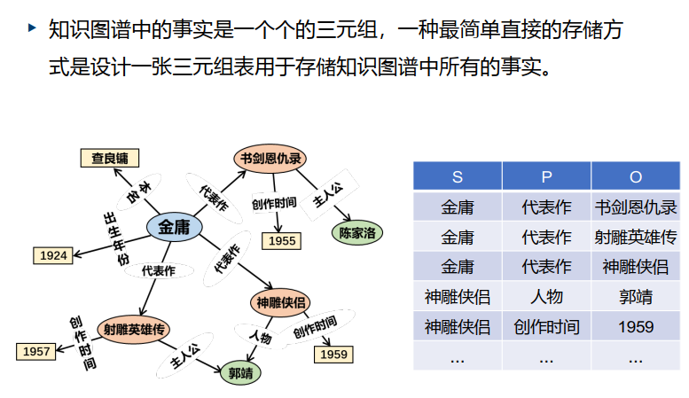
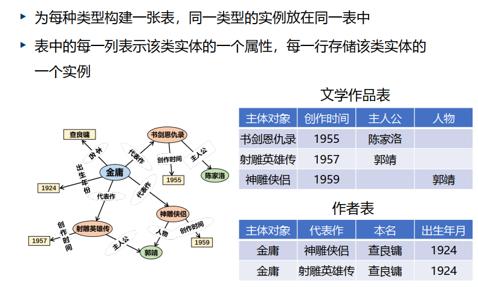
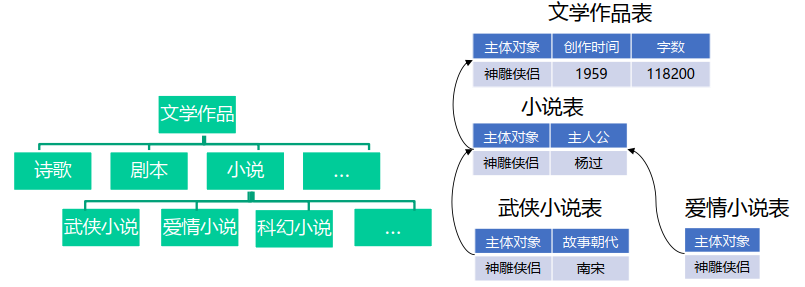
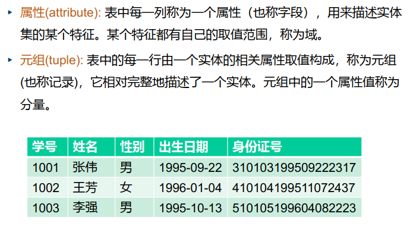
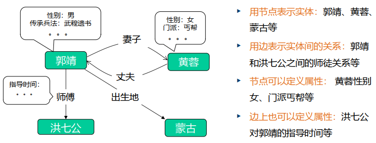
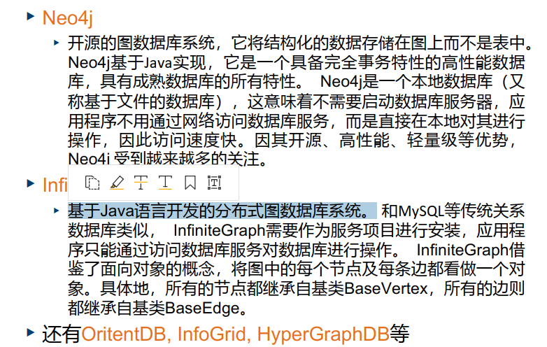

知识图谱中的知识是通过RDF的结构进行表示的，其基本构成单元是事实，每个事实被表示为一个形如<subject, predicate, object>的三元组。

- subject: 主语，其取值通常是实体、时间或概念
- predicate: 谓语，其取值通常是关系或者属性
- object: 宾语，取值既可以是实体、事件、概念，也可以是普通的值（如数字、字符串等）

## 知识图谱的存储

#### 基于表结构的存储：利用二维的数据表对知识图谱中的数据进行存储

1. 三元组表
  - 优点：简单直接、易于理解
  - 缺点：
  	- 整个知识图谱都存储在一张表中，导致单表的规模太大。对大表进行查询、插入、删除、修改等操作的开销很大，这将导致知识图谱的实用性大打折扣
  	- 复杂查询在这种存储结构上的开销巨大。由于数据表只包括三个字段，因此复杂的查询只能拆分成若干简单查询的复合操作，大大降低了查询的效率。例如，查询“神雕侠侣的人物和创作时间”需要拆分成“神雕侠侣的人物”和“神雕侠侣的创作时间”
2. 类型表
  - 不足：
  	- 大量的数据列为空值。通常知识图谱中并非每个实体在所有属性或关系上都有值，这种存储方式会导致表中存在大量的空值
  	- 大量数据字段的冗余存储。假设知识图谱中既有“武侠小说“也有“爱情小说”，那么同属于这两个类别的实例将会被同时储存在这两个表里，其中它们的共有的属性会被重复存储
  - 解决方案：构建数据表时，将知识图谱的类别体系考虑进来。具体来说，每个类型的数据表只记录属于该类型的特有属性，不同类别的公共属性保存在上一级类型对应的数据表中，下级表继承上级表的所有属性。
  - 优点：克服了三元组表面临的单表过大和结构简单的问题
  - 缺点：
  	- 由于数据表是和具体类型对应的，不同的数据表具有不同的结构，因此在查询之前必须知道目标对象的类型才能确定查找的数据表。
  	- 当查询涉及到不同类型的实体时，需要进行多表的连接，这一操作开销较大，限制了知识图谱对复杂查询的处理能力。
  	- 知识图谱通常包含丰富的实体类型，因此需要创建大量的数据表，并且这些数据表之间又具有复杂的关系，这为数据的管理增加了很大的难度。
3. 关系数据库-以二维结构对数据进行组织和存储。
  - 
  - 限制：每一属性必须是基本的、不能再拆分的数据类型
  - 基本概念：候选键、主键、外键
  - 常见系统

#### 基于图结构的存储：利用图的方式对知识图谱中的数据进行存储

将实体看作节点，关系看作带有标签的边，那么知识图谱的数据很自然地满足图模型结构。
核心概念：节点、边、属性


常见的图数据库：



## 知识图谱的查询
知识图谱的知识实际上是通过数据库系统进行存储的，大部分数据库系统通过形式化的查询语言为用户提供访问数据的接口

- 关系数据库：标准查询语言SQL 
- 图数据库：标准查询语言SPARQL
	- Simple Protocol and RDF Query Language,是为RDF开发的一种查询语言和数据获取协议

SQL的插入、修改、删除、查询

SPARQL的插入、修改、删除、查询
- 插入 
```SPARQL
INSERT DATA 三元组数据
# 三元组数据可以是多条三元组，不同的三元组通过 ’.’ 分隔，用 ’;’ 可以连续插入与前一个三元组的头实体相同的三元组。
# 如果待插入的三元组在RDF图中已经存在，那么系统就会忽略该三元组。
# 例子
prefix ns: <http://example.org/ns#> .
INSERT DATA {
ns: 金庸 ns: 代表作 ns: 射雕英雄传 .
ns: 射雕英雄传 ns: 创作时间 ns: 1957 ; 
			  ns: 主人公  ns: 郭靖 .
}
```
- 删除
```SPARQL
DELETE DATA 三元组数据
# 三元组数据可以是多条三元组，不同的三元组通过 ’.’ 分隔。
# 对于给定的每个三元组，如果其在RDF图中，则将其从图中删除，否则忽略该三元组。
# 例子
prefix ns: <http://example.org/ns#> 
DELETE DATA {
ns: 射雕英雄传 ns: 主人公 ns: 郭靖 . 
}
prefix ns: <http://example.org/ns#> 
DELETE DATA {
ns: 射雕英雄传 ?p ?o . 
?s ?p ns: 射雕英雄传 .
}
# s——主语 p——谓语 o——宾语 ？——变量
```
- 更新：SPARQL没有定义UPDATE操作，也就是说SPARQL语言没有直接更新已有数据的方法。但是，可以通过组合INSERT DATA语句和DELETE DATA语句来实现该功能
```SPARQL
prefix ns: <http://example.org/ns#>
DELETE DATA {ns: 射雕英雄传 ns: 创作时间 ns: 1957 . } 
INSERT DATA {ns: 射雕英雄传 ns: 创作时间 ns: 1956 . }
```
- 查询
	- SELECT： 最为常用的查询语句，其功能和SQL中的SELECT语句类似，从知识图谱中获取满足条件的数据。
	```SPARQL
	SELECT 变量1 变量2 …
	WHERE 图模式
	[修饰符]
	# SELECT子句中的“变量1 变量2 ...”和SQL中的“列1，列2， ...”的含义类似，表示要查询的目标。不同之处在于，SQL处理的数据存储于结构化的二维表中，语句中的“列1，列2，...”和数据表中的列完全对应，因此查询的目标具有明确的语义；而SPARQL处理的数据则具有更加灵活的存储结构，“变量1 变量2 ...”在知识图谱中没有直接的对应。
	# WHERE子句用于为SELECT子句中的变量提供约束，查询结果必须完全匹配该子句给出的图模式。图模式主要由两类元素组成:
		# 一类是三元组，例如“?x a Person”表示变量 ?x 必须是Person的一个实例
		# 另一类是通过FILTER关键字给出的条件限制，这些条件包括数字大小的限制、字符串格式的限制等。
	# 修饰符是可选项，用于对查询结果做一些特殊处理，例如常见的修饰符有用于表示排序的ORDER子句、用于限制结果数量的Limit子句等
	# 例子
	prefix ns: <http://example.org/ns#> 
	SELECT ?s {
		?s ns: 创作时间 ns: 1959 . 
	}
	```
	- ASK： 用于测试知识图谱中是否存在满足给定条件的数据，如果存在则返回“yes”，否则返回“no”，该查询不会返回具体的匹配数据。
	```SPARQL
	prefix ns: <http://example.org/ns#>
	ASK { ?s ns: 创作时间 ns: 1957 . }
	```
	- DESCRIBE： 用于查询和指定资源相关的RDF数据，这些数据形成了对给定资源的详细描述。
	```SPARQL
	DESCRIBE 资源或变量
	[WHERE 图模式]
	# DESCRIBE后既可以直接跟确定的资源标识符，也可以跟变量；
	# WHERE子句是可选的，用于限定变量需要满足的图模式。
	# 例子
	prefix ns: <http://example.org/ns#>
	DESCRIBE ?s WHERE { ?s ns: 出生年份 ns: 1924 . }
	```
	- CONSTRUCT： 则根据查询图的结果生成RDF
	```SPARQL
	CONSTRUCT RDF图模板
	WHERE 图模式
	# RDF图模板确定了生成的RDF图所包含的三元组类型，它由一组三元组构成，每个三元组既可以是包含变量的三元组模板，也可以是不包含变量的事实三元组；图模式则和上述SELECT 等语句中介绍的相同，用于约束语句中的变量。
	# 该语句产生结果的基本流程为：首先执行WHERE子句，从知识图谱中获取所有满足图模式的变量取值；然后针对每一个变量取值，替换RDF图模板中的变量，生成一组三元组。
	# 例子
	prefix ns: <http://example.org/ns#> 
	CONSTRUCT { 
		?s ns: 本名 ns:查良镛 .
	} 
	WHERE {
		?s ns: 出生年份 ns: 1924 . 
	}
	```