## 什么是推理
#### Deductive Reasoning——演绎推理

一般到特殊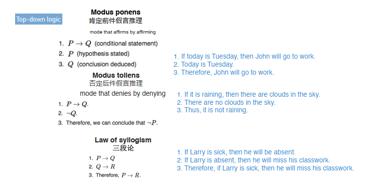

#### Inductive Reasoning——归纳推理

归纳泛化 & 统计推论 -> 从特殊到一般
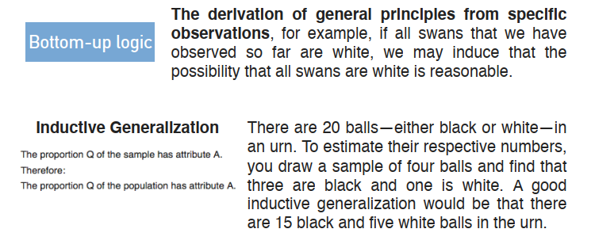
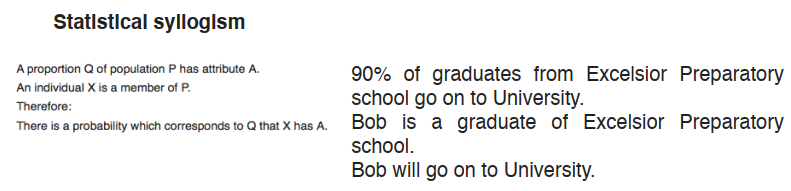

#### Abductive Reasoning——溯因推理

从结果到原因，通过现象推测原因。
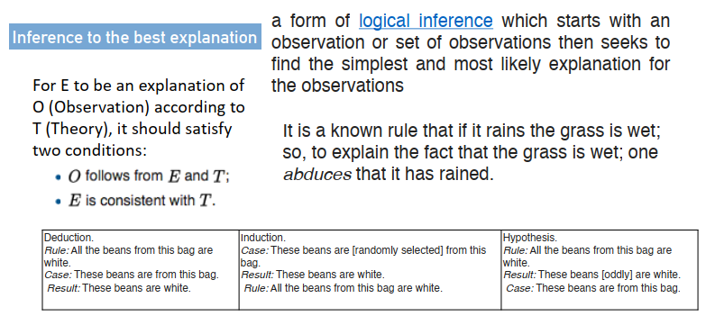

#### Analogical Reasoning——类比推理

特殊到特殊
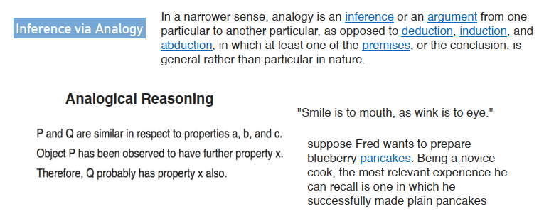

## 知识图谱推理

用KG推理将问题简化为事实预测或关系推理。
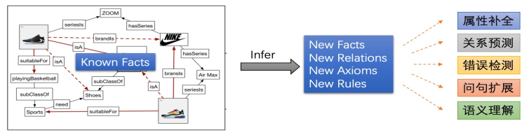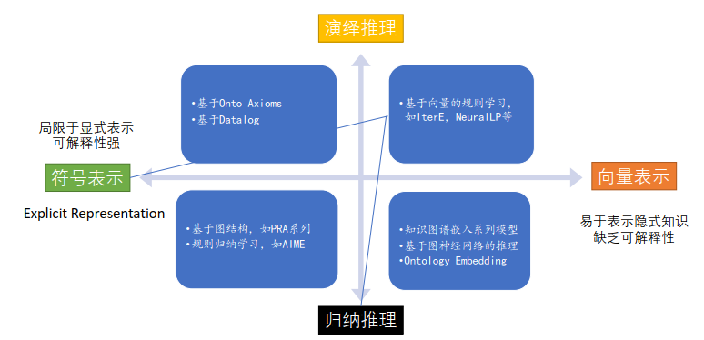

基于符号表示的推理： Deductive Reasoning with Ontological Axioms
显式的路径特征/规则可直接用于对推理结果进行解释
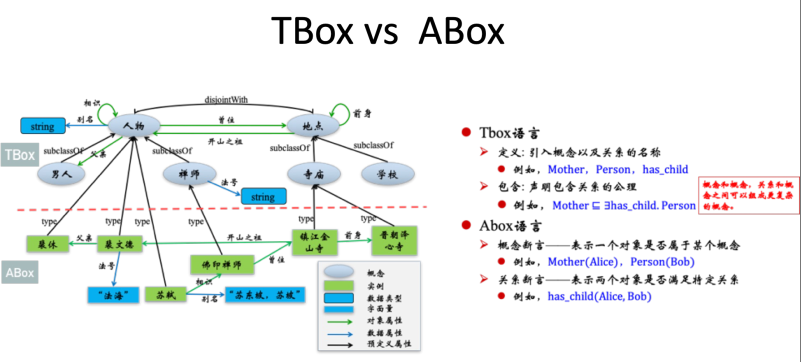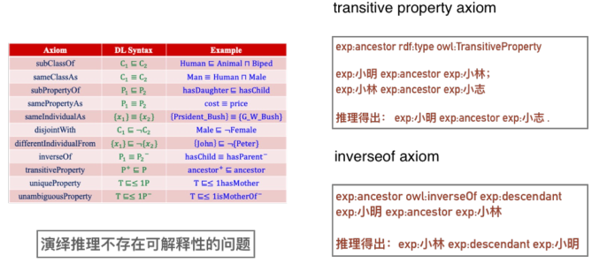
基于向量表示的推理： Inductive Reasoning with Representation Learning
图神经网络可以为图谱推理获得更多的图结构方面的特征，但图谱稀疏性问题更加突出
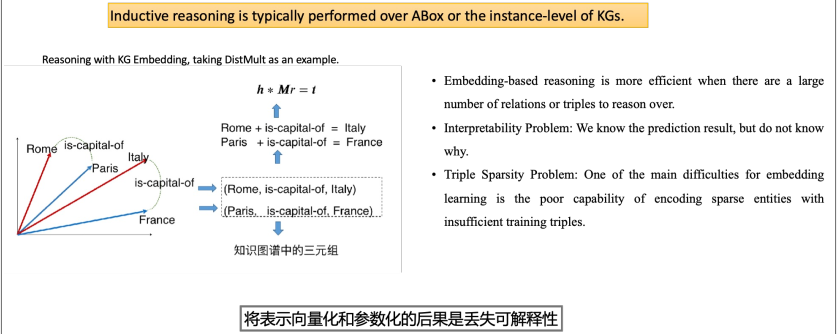

小结：符号逻辑与表示学习的融合

## 基于符号逻辑的知识图谱推理

#### 基于Ontology的推理
基于RDF/RDFS的简单推理
Defines small vocabulary for RDF: Class, subClassOf, type, Property, subPropertyOf, Domain
OWL extends RDF Schema
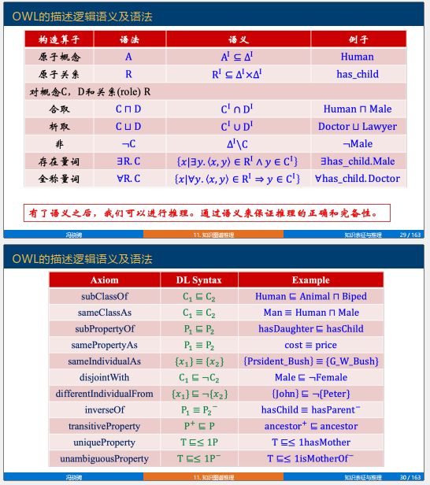
- OWL本体推理：概念包含推理—包含关系推理是定义在Tbox上面的推理，一般基于Tbox中的Axiom推断两个概念之间是否存在**包含关系**。
- OWL本体推理：实例检测推理—主要用于计算符合某个概念或关系定义的所有实例。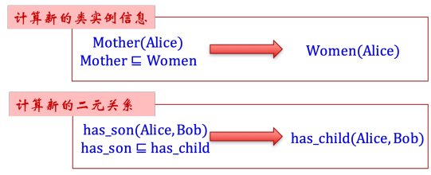

典型本体推理算法：Tableaux算法（类似于**反证法**）
- Tableaux算法的基本思想是通过一系列规则构建Abox，以检测知识库的可满足性；
- OWL本体上实现的各种推理都可以用Tableaux算法来实现；
- Tableaux算法将概念包含、实例检测等推理都转化为可满足性检测问题来实现；
- Tableaux算法检查可满足性的基本思想类似于一阶逻辑的归结反驳。
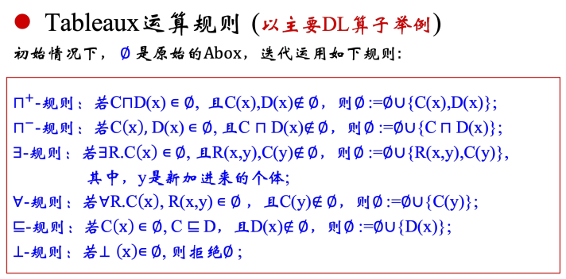
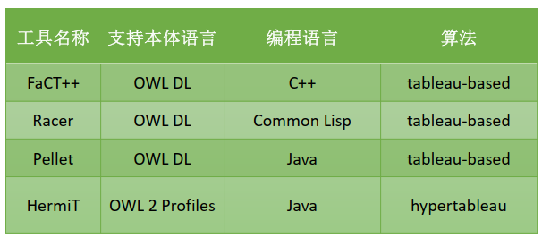
#### 基于规则的推理
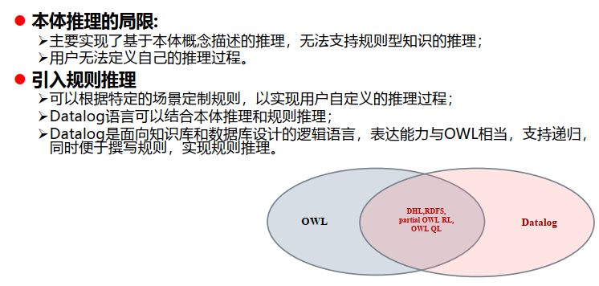
Datalog语法
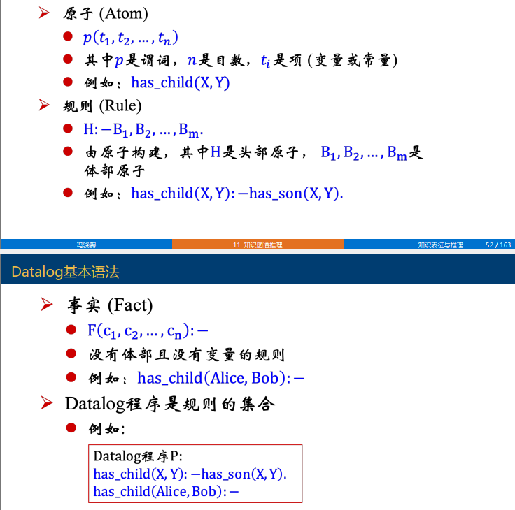
基于产生式规则的推理

一种前向推理系统，可以按照一定机制执行规则从而达到某些目标，与一阶逻辑类似，也有区别
 - 自动规划
 - 专家系统

产生式系统的组成
- 事实集合 (Working Memory)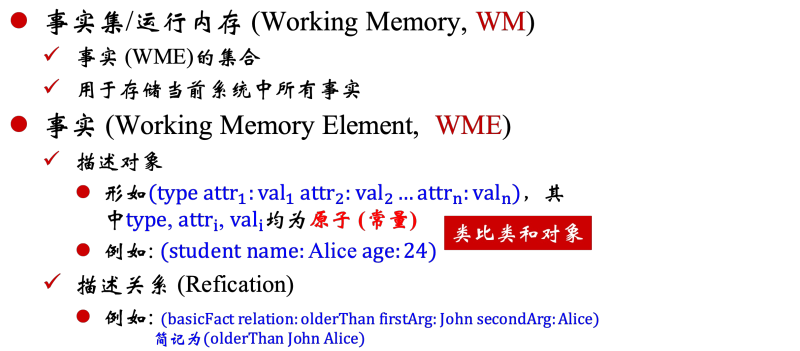
- 产生式/规则集合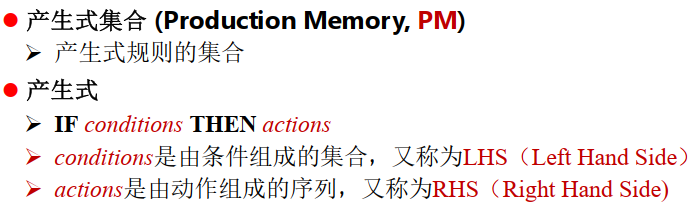
	- 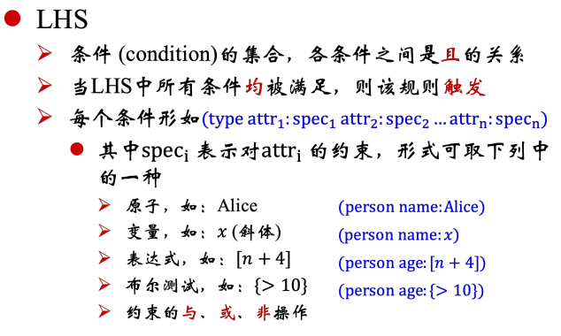
	- 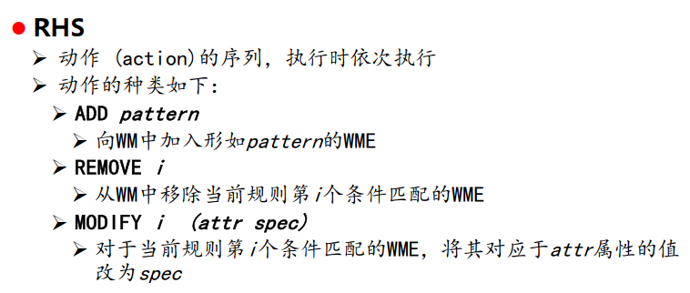
- 推理引擎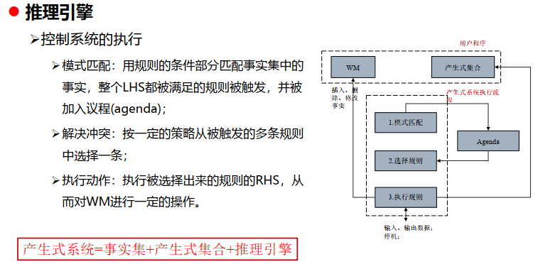
	- 模式匹配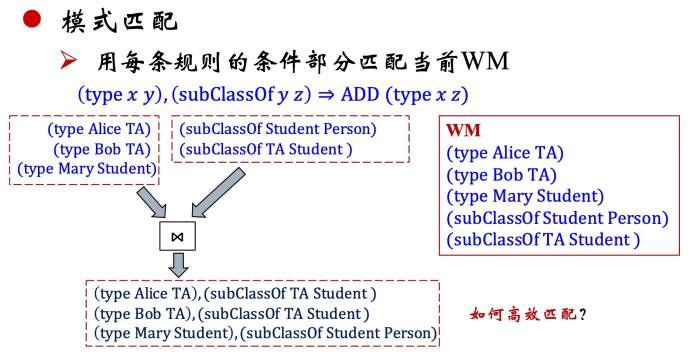
		- RETE算法，将产生式的LHS组织成判别网络形式。其核心思想是用分离的匹配项构造匹配网络，同时缓存中间结果。以空间换时间。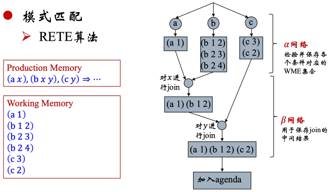
			- 可以共享不同规则的条件部分。如果Rete网络中的某一个条件node 被 N 条规则共享，则算法在此节点上效率会提高 N 倍。
			- 保存在 alpha 和 beta 节点中的状态不需要太多变化，避免了大量的重复计算，提高了匹配效率。
			- Rete 匹配速度与规则数目无直接关系。这是因为事实只有满足本节点才会继续向下沿网络传递。

## 基于表示学习的知识图谱推理

#### 基于嵌入学习的知识图谱推理
**知识图谱嵌入模型：预测问题 与 推理评价**
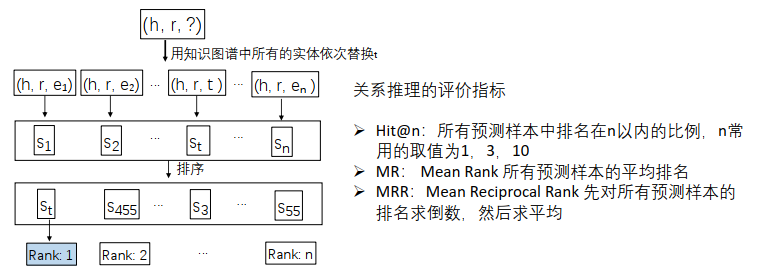
**TransE——Translating Embeddings for Modeling Multi-relational Data**

TransE（Translation Embedding）是一种知识图谱嵌入方法，它将知识图谱中的实体和关系嵌入到低维向量空间中。其基本思想是通过关系向量将头实体向量“平移”到尾实体向量的位置，从而捕捉知识图谱中的语义关系。具体来说，对于一个三元组$（h, r, t）$，其中h是头实体，r是关系，t是尾实体，TransE假设在向量空间中满足如下公式：
$$ \mathbf{h} + \mathbf{r} \approx \mathbf{t} $$
其中，$\mathbf{h}$、$\mathbf{r}$和$\mathbf{t}$分别表示头实体、关系和尾实体的向量表示。

为了训练TransE模型，我们需要一个损失函数来度量模型的好坏。常用的损失函数是基于欧几里得距离或L1距离的Margin-based ranking loss。具体形式如下：
$$ L = \sum_{(h, r, t) \in S} \sum_{(h', r, t') \in S'} [\gamma + d(\mathbf{h} + \mathbf{r}, \mathbf{t}) - d(\mathbf{h'} + \mathbf{r}, \mathbf{t'})]_+ $$
其中：
- $S$ 是所有正确的三元组集合。
- $S'$ 是通过随机替换实体生成的负样本集合。
- $\gamma$ 是一个超参数，表示margin（边界）。
- $d(\cdot, \cdot)$ 表示向量之间的距离，可以是L1距离或L2距离。
- $[\cdot]_+$ 表示取正值，即 $[\cdot]_+ = \max(0, \cdot)$。

TransE通过最小化上述损失函数，使得正确三元组的距离尽量小，而错误三元组的距离尽量大，从而实现知识图谱的有效嵌入。

问题：无法处理一对多、多对一和多对多问题
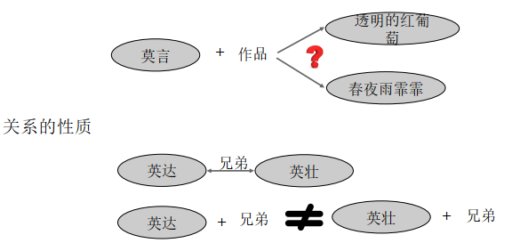

**TransH—Knowledge graph embedding by translating on hyperplanes.**
TransH（Translation Embedding on Hyperplanes）是对TransE方法的改进，旨在处理TransE无法有效解决的一些问题，例如一对多、多对一、多对多的关系。TransH的基本思想是引入超平面，通过在不同的超平面上对实体进行投影，从而更好地表示复杂的关系。
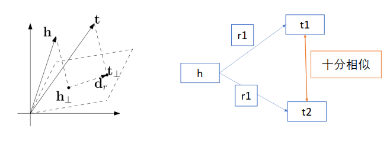
对于一个三元组（h, r, t），TransH的基本假设是头实体和尾实体分别在关系r对应的超平面上进行投影后，满足以下公式：
$$ \mathbf{h}_{\perp} + \mathbf{r} \approx \mathbf{t}_{\perp} $$
其中，$\mathbf{h}_{\perp}$和$\mathbf{t}_{\perp}$分别是头实体和尾实体在关系r对应的超平面上的投影，$\mathbf{r}$是关系的向量表示。

定义一个关系r对应的超平面，其法向量为$\mathbf{w}_r$，则头实体h和尾实体t在该超平面上的投影可以表示为：
$$ \mathbf{h}_{\perp} = \mathbf{h} - \mathbf{w}_r^{\top} \mathbf{h} \mathbf{w}_r $$
$$ \mathbf{t}_{\perp} = \mathbf{t} - \mathbf{w}_r^{\top} \mathbf{t} \mathbf{w}_r $$
在这种情况下，TransH模型假设以下等式成立：
$$ \mathbf{h}_{\perp} + \mathbf{r} \approx \mathbf{t}_{\perp} $$
TransH的目标是最小化以下损失函数：
$$ \mathcal{L} = \sum_{(h,r,t) \in \mathcal{S}} \left[ \gamma + d(\mathbf{h}_{\perp} + \mathbf{r}, \mathbf{t}_{\perp}) - d(\mathbf{h}_{\perp}^{\prime} + \mathbf{r}, \mathbf{t}_{\perp}^{\prime}) \right]_+ + \lambda \|\mathbf{w}_r\|^2 $$
其中：
- $\mathcal{S}$是训练数据集。
- $(h, r, t)$是正样本，$(h^{\prime}, r, t^{\prime})$是负样本。
- $\gamma$是边际值（margin）。
- $d(\cdot, \cdot)$是距离函数，通常为L2距离。
- $\lambda$是正则化参数。
- $[\cdot]_+$表示取正部分，即$\max(0, \cdot)$。

TransH通过在超平面上的投影操作，使得模型能够更好地处理复杂的关系结构，提升知识图谱嵌入的表示能力。

负样例生成方法

- unif：原始的采样方法，使用随机采样，随机替换头实体和尾实体，可能会出现假阳性的问题，即替换的实体是正确实体
- bern：在采样时，对于N-1的问题，更高概率替换尾实体，1-N更高概率替换头实体

**TransR——Learning Entity and Relation Embeddings for Knowledge Graph Completion**
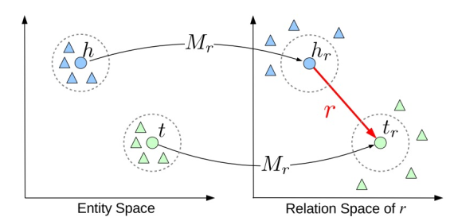
TransR的核心思想是实体和关系应该在不同的空间中表示，因此它通过关系特定的映射矩阵将实体从实体空间映射到关系空间。在关系空间中，关系的平移操作可以更好地反映实体之间的关系。

对于一个三元组$（h, r, t）$，其中h是头实体，r是关系，t是尾实体，TransR假设在关系空间中满足以下公式：
$$ \mathbf{h}_r + \mathbf{r} \approx \mathbf{t}_r $$
其中，$\mathbf{h}_r$和$\mathbf{t}_r$分别是头实体和尾实体在关系r对应的关系空间中的表示。它们通过关系特定的映射矩阵$\mathbf{M}_r$从实体空间映射到关系空间：
$$ \mathbf{h}_r = \mathbf{M}_r \mathbf{h} $$
$$ \mathbf{t}_r = \mathbf{M}_r \mathbf{t} $$
TransR的目标是最小化以下损失函数：
$$ \mathcal{L} = \sum_{(h, r, t) \in \mathcal{S}} \left[ \gamma + d(\mathbf{M}_r \mathbf{h} + \mathbf{r}, \mathbf{M}_r \mathbf{t}) - d(\mathbf{M}_r \mathbf{h'} + \mathbf{r}, \mathbf{M}_r \mathbf{t'}) \right]_+ + \lambda \|\mathbf{M}_r\|^2 $$
其中：

- $\mathcal{S}$是训练数据集。
- $(h, r, t)$是正样本，$(h', r, t')$是负样本。
- $\gamma$是边际值（margin）。
- $d(\cdot, \cdot)$是距离函数，$f_r(h,t)=||h_{r,c}+r_c-t_{r,c}||_2^2+\alpha||r_c-r||_2^2$
- $\lambda$是正则化参数。
- $[\cdot]_+$表示取正部分，即$\max(0, \cdot)$。

 
**优点**
1. **关系特定空间**：TransR通过关系特定的映射矩阵，使得实体在不同关系中具有不同的表示，从而更好地捕捉关系的多样性和复杂性。
2. **灵活性**：与TransE和TransH相比，TransR能够更灵活地处理不同类型的关系，提升模型的表示能力。

**TransD—Knowledge Graph Embedding via Dynamic Mapping Matrix.**

定义了两个向量来表示实体或关系的语义：

- $\mathbf{M}_{rh}$ 和 $\mathbf{M}_{rt}$ 是分别用于实体 $h$ 和 $t$ 的映射矩阵，其中 $\mathbf{h}_{ip}$ 和 $\mathbf{t}_{ip}$ （$i = 1, 2, 3$）表示投影向量，$\mathbf{r}_p$ 是关系 $r$ 的投影向量。
- $\mathbf{h}_{\perp}$ 和 $\mathbf{t}_{\perp}$ 分别是头实体和尾实体的投影向量。因此有：
$$ \mathbf{M}_{rh} = \mathbf{r}_p \mathbf{h}_{p}^{\mathbf{T}} + \mathbf{I}^{m \times n} $$
$$ \mathbf{M}_{rt} = \mathbf{r}_p \mathbf{t}_{p}^{\mathbf{T}} + \mathbf{I}^{m \times n} $$
其中，$\mathbf{I}^{m \times n}$ 表示 $m \times n$ 的单位矩阵。

损失函数定义为：

$$ L = \sum_{(h, r, t) \in \mathcal{S}} \sum_{(h', r, t') \in \mathcal{S}'} [\gamma + f_r(h, t) - f_r(h', t')]_+ $$

其中，$f_r(h, t) = -||\mathbf{h}_{\perp} + \mathbf{r} - \mathbf{t}_{\perp}||_2^2$ 是模型的目标函数。负采样策略与TransH和TransR相同。

这种模型的设计使得每个实体对都有其独特的投影空间，相较于TransR模型，能更有效地捕捉实体和关系之间的复杂性和多样性。

TransR为每个 r  都分配了一个矩阵, 而TransD为每个实体和关系分配一个向量, 以向量的乘积代替矩阵, 有效减少了模型的参数量。

**DistMult——Embedding Entities and Relations for Learning and Inference in Knowledge Bases.**
通过这个得分函数，DistMult模型可以评估一个三元组的合理性：得分越高，三元组越有可能是合理的
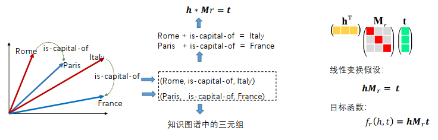

**Analogy**
利用类比推理的思想做知识图谱推理

**RotaE**
- 旋转建模
- 选择当前最难区分的负样本
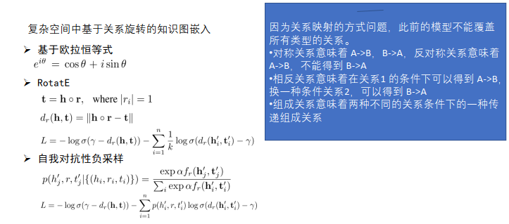

**记忆推理：KNN—Reasoning Through Memorization: Nearest Neighbor Knowledge Graph Embeddings**

   - **实体词表扩充（Entity Vocabulary Expansion）** 的目的是通过扩展语言模型的词汇表来包含知识图谱中的实体，从而将链接预测任务转化为掩码实体预测任务。
   - **掩码实体建模（Masked Entity Modeling）**：
     - 将链接预测任务转化为掩码实体预测任务。给定一个三元组 $(e_i, r_j, ?)$ ，模型通过预测被掩码的实体来完成任务。
     - 使用 BERT 模型作为实体预测器，通过对输入序列中的 [MASK] 位置进行预测，得到目标实体。
   - **知识存储（Knowledge Store）**：
     - 构建一个知识库，用于存储实体及其嵌入。知识库从实体描述和训练集中的三元组构建而成。
   - **记忆推理（Memorized Inference）**：
     - 在推理过程中，利用 [MASK] 输出的表示作为预测的锚定实体嵌入，并在知识库中查找最近邻。
     - 使用最近邻的分布与模型的实体预测进行插值，得到最终的实体预测分布。

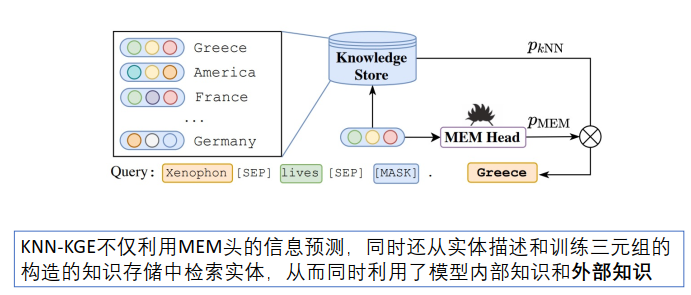
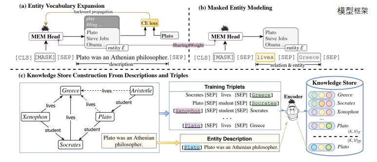

**多模态类比推理**
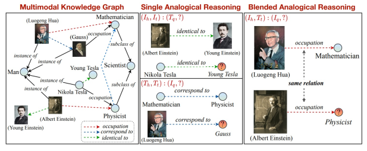
#### 基于规则学习的知识图谱推理
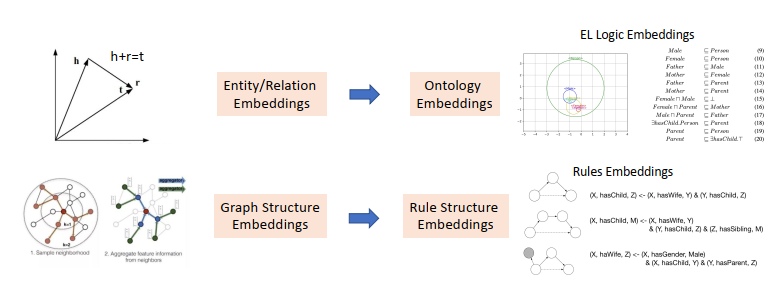
**PRA—Path Ranking Algorithm**
路径排序打分加权 -> 逻辑回归

可微规则学习：NeuralLP

- 借助表示学习来学习规则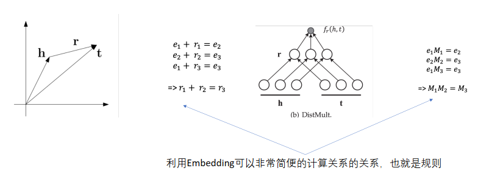

- 一阶谓词逻辑的右部可以看成`规则置信度 * 规则M_r的连续乘积`的累和，推理过程即可视作转移
- 但是这样规定规则长度均为T，因此提出注意力机制选择合适的长度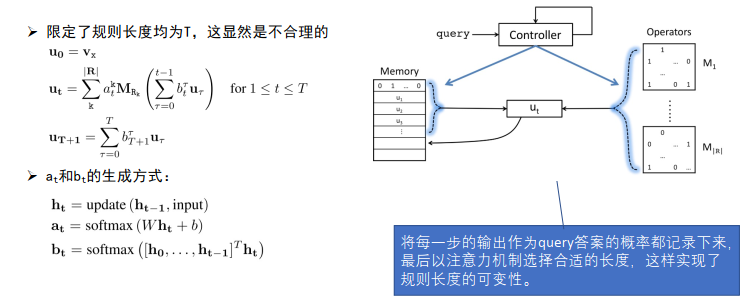
- NeuralLP会学到置信度很⾼的错误规则，所以DRUM引⼊了confidence value tensor来解决这个问题。

**规则与嵌入表示的迭代学习：IterE**

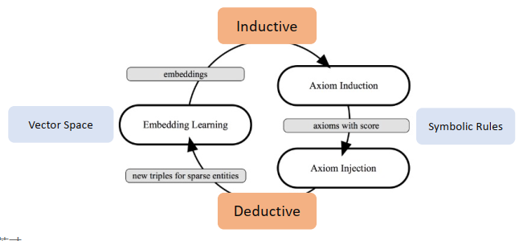
#### Ontology Embedding—本体概念层推理
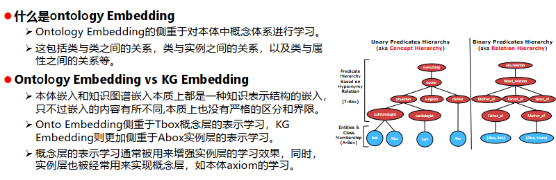

EL embedding — 全部转为包含关系
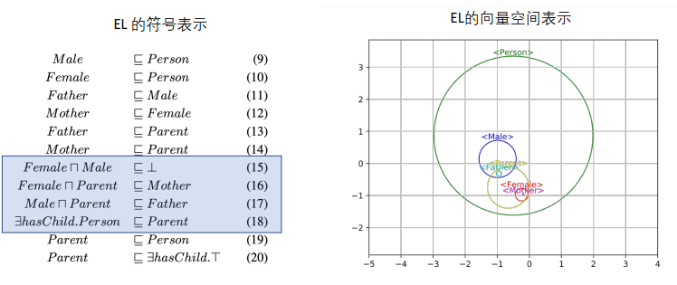
核心是两个映射函数：f(x)和r(x)

- f(x)函数的作用是完成符号空间到向量空间的映射，即将一个类映射到向量空间中的某个球心，并将关系映射为一个向量

- r(x)函数的作用是将某个类映射到某个球的半径。
- 损失函数：以C属于D为例

$$\begin{aligned}
loss_{C\sqsubseteq D}(c,d)=
\max(0,\|f_\eta(c)-f_\eta(d)\|+r_\eta(c)-r_\eta(d)-\gamma) 
+\mid\|f_\eta(c)\|-1|+\mid\|f_\eta(d)\|-1|)
\end{aligned}$$