从多种异构数据源中抽取实体和关系，并形成完整的大规模知识图谱。

文本一般不作为知识图谱构建的初始来源，而多用来进行知识图谱补全。
- 利用计算机自动地从大规模文本中抽取出某些预先定义好类型的事实信息，并形成结构化的数据输出，丰富知识库
- 理解文本的内在结构、整合碎片化知识、为逻辑推理服务
- 涉及到的技术
	- 命名实体识别
	- 术语抽取
	- 关系抽取
	- 事件抽取
## 1.实体识别

从文本中识别出代表实体的边界，并进一步判断其类别，是进一步实现关系抽取、事件抽取等任务的基础
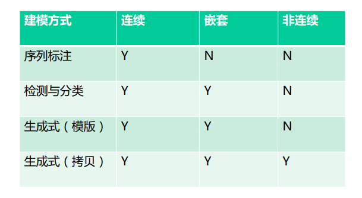
#### 评价指标：
1. 正确的边界划分
2. 正确的实体类别标签
	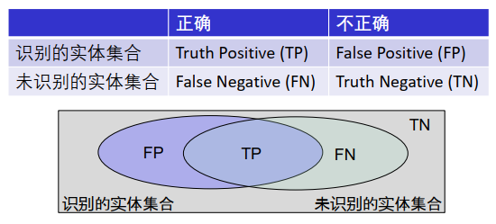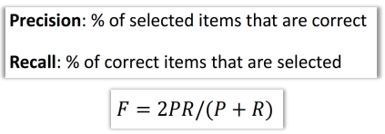
#### 经典模型

**基于模板和规则的方法**-正则表达式
- 将文本与规则进行匹配来识别出命名实体(e.g “xxx说”、“xxx老师、“位于xxx”、“出生于xxx”)
- 优点：准确，且有些实体识别只能依靠规则抽取
- 缺点：需要大量的语言学知识；需要谨慎处理规则之间的冲突问题；构建规则的过程费时费力、可移植性不好
- 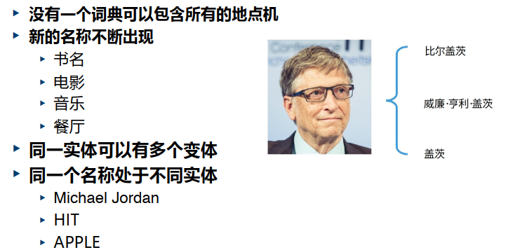

**基于统计模型的方法**-将命名实体识别看成序列标注任务，利用HMM、CRF等统计模型进行序列标注
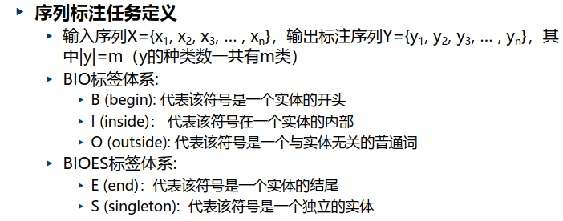
- 命名实体识别简单的分类问题：忽略相邻状态之间的关系，对每个单词独立进行分类
	- KNN-学习只存储训练示例的表示，选择大多数邻居的类别
	- 决策树-每个内部节点测试一个属性，每个叶节点代表一个分类
- 基于统计模型的方法——HMM（隐马尔科夫模型）
	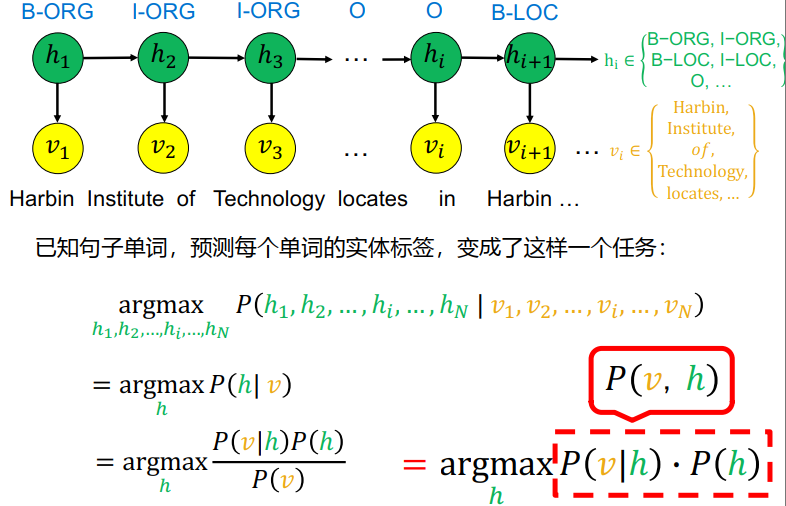
	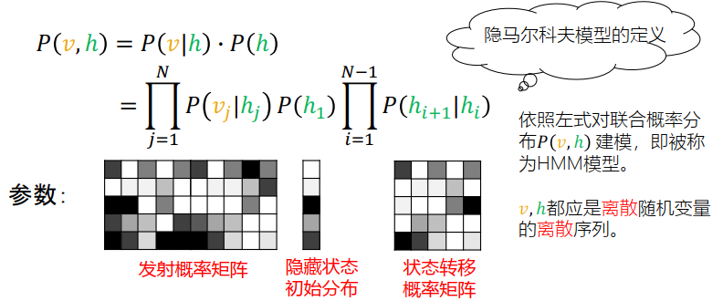
	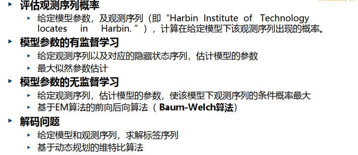

**基于深度学习的方法**
- 通过Bi-LSTM、CNN、BERT等神经网络编码器生成用于实体识别的句子特征
- 通过条件随机场（CRF）、Softmax等解码器生成序列标注标签
	- 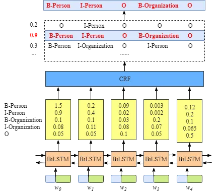
	- 对标签之间的转移(transition)概率进行建模，可学习参数为标签间的转移概率矩阵
	- $𝑓(s, 𝑖, 𝑙_{i-1},𝑙_{i})$：输入序列s； 当前输入的位置信息𝑖； 前一个输入的标签$𝑙_{i-1}$ ；当前输入的标签$𝑙_{i}$ 
	- 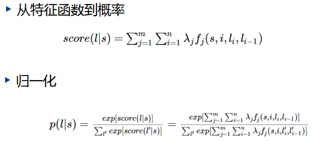
	- [BiLSTM上的CRF，用命名实体识别任务来解释CRF（2）损失函数 (qq.com)](https://mp.weixin.qq.com/s?__biz=Mzg5ODAzMTkyMg==&mid=2247488536&idx=1&sn=59726a10da833929960320fe4163ecee&chksm=c0699c45f71e15538db0c6625b3ecb9cc0c78436a796b0650ebf327359fbe929d61945ecaa40&mpshare=1&scene=1&srcid=&sharer_sharetime=1585896475288&sharer_shareid=d7e53fb485600c389e7965f086d6336c&rd2werd=1#wechat_redirect)

#### 词汇增强
动机：
- 中文没有自然分词，词的概念很模糊，也不具备英文中的字母大小写等形态特征，使得实体边界较难判别。
- 中文多嵌套实体，如“哈尔滨工业大学附属中学”
- 中文用字变化多，有些实体不能脱离上下文语境，同一实体在不同语境可能是不同的实体类型。
- 中文简化表达现象严重，如“哈工大” ，“工附”。
模型：
- Lattice LSTM
	- [一文详解中文实体识别模型 Lattice LSTM-CSDN博客](https://blog.csdn.net/qq_27590277/article/details/126026296)
	- 在**Character-based model里加入词信息**，这样是不是就可以既利用了词信息，又不会因为分词错误影响识别结果
		- **词序列标注**。**词汇的边界决定了实体的边界，因此一旦出现分词错误就会影响实体边界的判定**。
		- **字序列标注**。相比词**单字不具备完整语义**。没有利用句子里的词的信息，**难以应对歧义问题**
	- **在Character-based LSTM+CRF的基础上，将潜在词汇信息融合进去，从而使得模型在获得字信息的同时，也可以有效地利用词的先验信息**。（因为实体识别主要是末尾边界的识别问题，因此把词信息加到最后，利用最大匹配的思想和语义信息能够较为准确识别）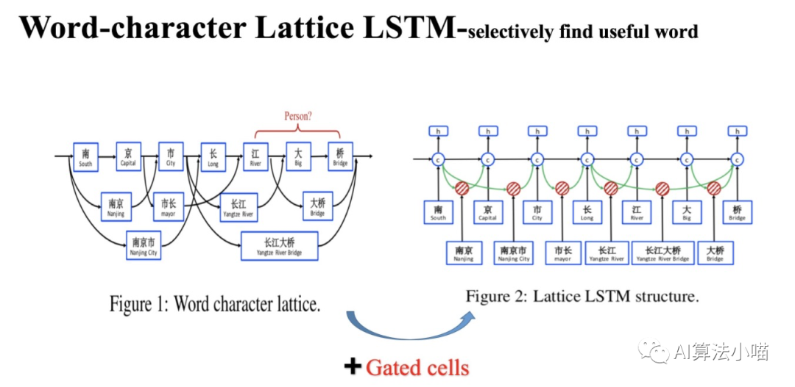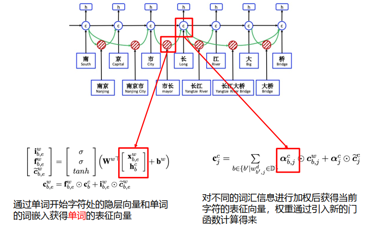
	- **当前字相应的输入门和所有以当前字为尾字的候选词的输入门做归一计算出权重，然后利用计算出的权重进行向量加权融合**。
	- 缺点：
		- 每个字符只能获取以它为结尾的词汇信息，对于其之前的词汇信息也没有持续记忆。如对于「江」，无法获得「长江大桥」的词汇信息。
		- 由于RNN的特性，采用BiLSTM时其前向和后向的词汇信息不能共享
		- 可迁移性差，只适配于LSTM
		- 计算性能低下，由于增加的词汇节点数目不一致，较难并行
- Collaborative Graph Network(CGN)
	- 引入不同层次的图结构来解决 Lattice LSTM中的信息损失问题
		1. 字符之间无连接，词与其内部的字有连接
		2. 相邻字符相连接，词与其前后字符连接
		3. 相邻字符相连接，词与其开始结束字符相连接
		 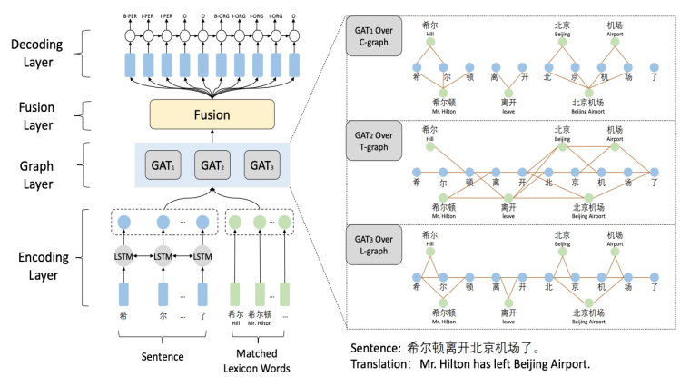
 - 跨语言 - 利用跨语言信息去提高目标语言实体识别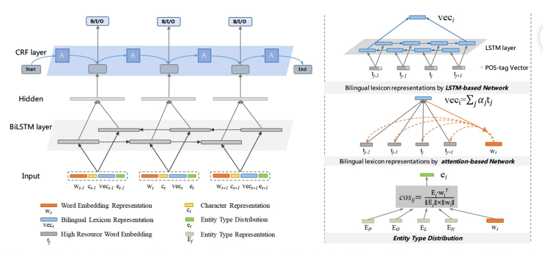

#### 嵌套实体识别
动机：
- 命名实体的嵌套或重叠现象无处不在
- 嵌套命名识别时难以通过序列标注模式解决

模型：
- Multi-Grained Named Entity Recognition(MGNER)
	- 动态词向量预训练模型-ELMo采取对不同层次的向量表示进行加权平均的机制， 为不同的下游任务提供更多的组合自由度
		- 动态（ 上下文相关） ：词的ELMo向量表示由其当前上下文决定； 
		- 鲁棒（ Robust） ： ELMo向量表示使用字符级输入， 对于未登录词具有强鲁棒性； 
		- 层次： ELMo词向量由深度预训练模型中各个层次的向量表示进行组合， 为下游任务提供了较大的使用自由度。
		 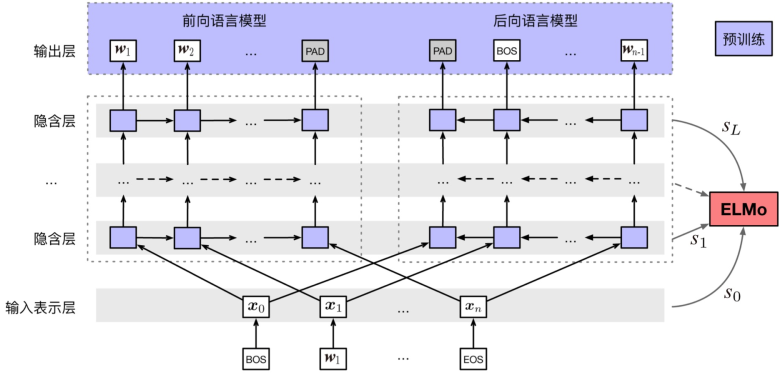
	 - 检测器检测所有可能的实体位置，而分类器旨在将检测出的实体分成预设的类别。
		 - 检测器的目的是检测每个语句中可能的实体位置。它将语句作为输入，并且输出一个备选实体集合。基本上，我们使用PEters等人提到的半监督神经网络来为这个过程建模。在检测器中，主要有三个模块：单词处理器，句子处理器，和检测模块。尤其是，为了生成语义上有意义的单词表示，我们加入了预训练单词embedding，POS标签信息，字符级单词信息。从单词处理器中获取的单词表示回合语言模型embedding ELMo拼接，并产生基于上下文的句子表示。每个可能地单词切分被放入检测网络 ，并被决定是否接受它作为实体。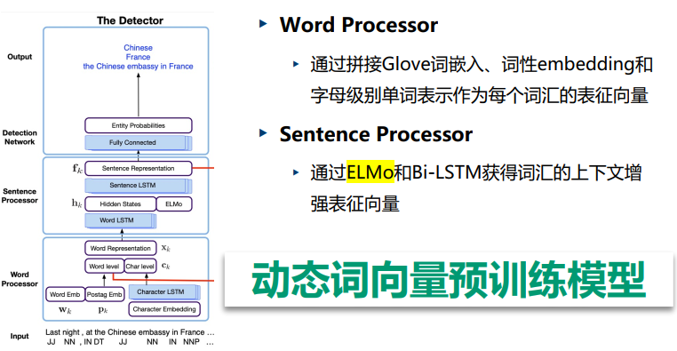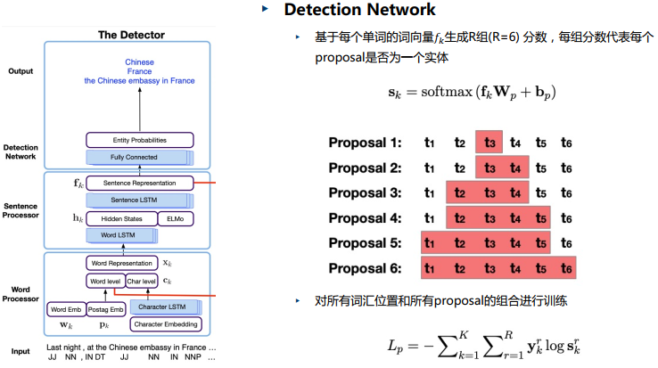
		 - 分类器模块旨在将从检测器中获取到的备选实体分类成预设好的实体类别。对于嵌套NER任务，所有的可能实体都被保存并输入到分类器中。对于非重叠实体NER任务，我们使用非最大抑制（NMS）算法来处理重复，重叠的实体，并输出真实备选实体。NMS的想法简单但是有效：以最大概率挑选实体，删除冲突实体，并重复这一过程直到所有的实体都被处理完。最后，我们获得这些没有冲突的实体作为分类器的输入。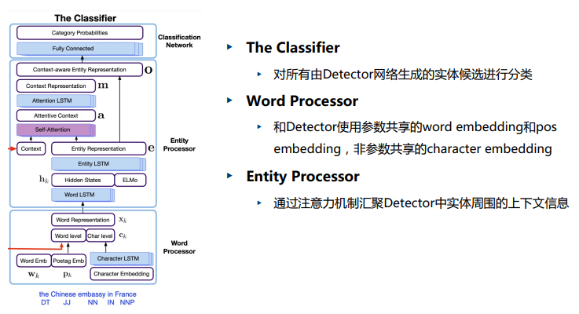

#### 统一模型
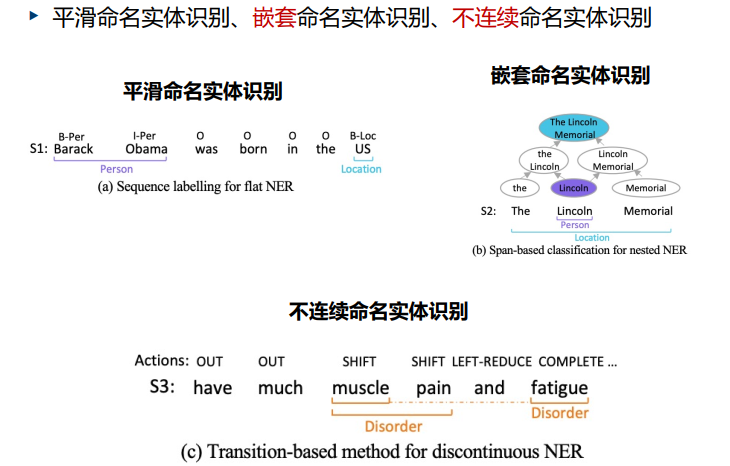
- 基于模版的生成式命名实体识别
	- 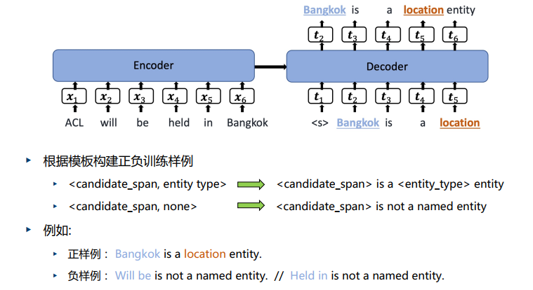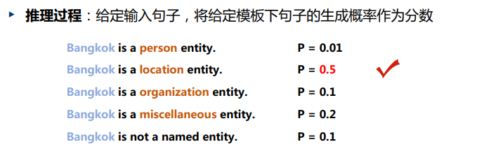
- 基于拷贝机制的生成式命名实体识别
	- 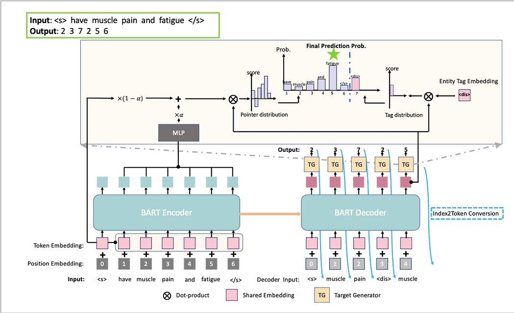
	- 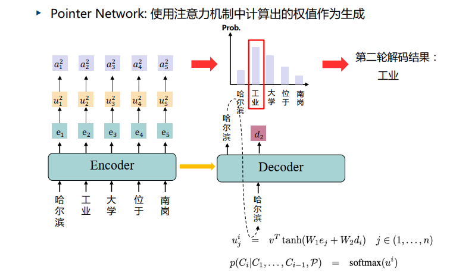
	- 解码策略
		- 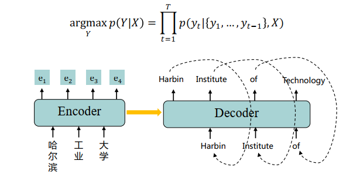
		- 穷举搜索: 计算所有输出序列的概率，取全局概率最大的序列作为解码结果
		- 贪心搜索： 每一步解码时选择局部概率最大的词汇作为输出
		- 集束搜索 Beam Search： 同时保留beam size(e.g., 2)个使得当前解码概率最大化的输出序列
## 2.实体消歧

基于聚类的实体消歧 
- 对于每一个实体指称，构建对应的表征向量
	- 基于检索方法（ e.g. TF-IDF）的向量特征
	- 基于扩展特征（ e.g. 实体的属性）的向量特征
	- 基于社会化网络（实体的社会化关系）的向量特征
	- 基于神经网络（ e.g. BERT）的向量特征
- 计算实体指称项之间的相似度
- 采用某种聚类算法对实体指称项聚类

基于实体链接的实体消歧
- 将某个实体指称链接到知识库中特定的实体
- 可分为链接候选过滤和实体链接两步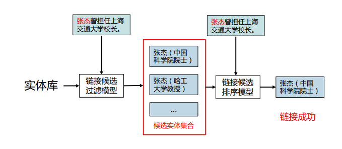
	- 链接候选过滤
		- 根据规则或知识过滤掉大部分指称项不可能指向的实体
		- 常基于实体指称项词典进行过滤
		- 可根据Wikipedia等知识资源来构建实体指称项词典
	- 实体链接
		- 将某个实体指称链接到候选实体列表中的某个实体
		- 分为向量空间模型、主题一致性模型、神经网络模型等方法
			- 将实体指称项上下文与候选实体上下文中特征的共现信息作为两者的一致性分数（ TF-IDF算法）
			- 使用神经网络编码器获得候选实体和待链接实体指称的特征表示并进行匹配打分
## 3. 关系抽取
从文本中抽取出两个或者多个实体之间的语义关系，从文本获取知识图谱三元组的主要技术手段
[【关系抽取】深入浅出讲解实体关系抽取（介绍、常用算法）-CSDN博客](https://blog.csdn.net/kevinjin2011/article/details/124845896)
#### 基于模板的方法——用规则提取丰富的关系
> 特殊的实体之间往往存在着关系，用命名实体识别的标签来帮助关系抽取
- 手写规则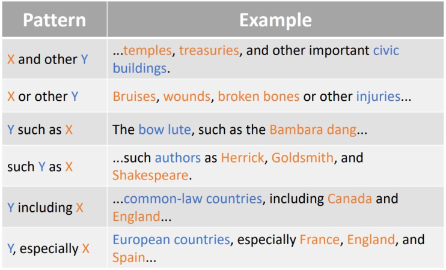
- 基于依存句法分析的Pattern
	- 依存句法分析句子的句法结构
	- 以动词为起点，构建规则，对节点上的词性和边上的依存关系进行限定
	- 根据句子依存句法树结构上匹配规则，每匹配一条规则就生成一个三元组
	- 根据扩展规则对抽取到的三元组进行扩展
	- 对三元组实体和触发词进一步处理抽取出关系
	- 
	优点：在小规模数据集上容易实现，构建简单
	缺点：特定领域的模板需要专家构建；难以维护；可移植性差；规则集合很小的时候，召回率很低

模板获取：
- 人工定义
- 自动学习：主要为自提升方法（ Bootstrapping methods），使用种子直接从无监督文本数据中学习来填充关系
	- 对于实体和模板进行联合迭代式地交替抽取和学习
	- 利用实体对在文本中获得模板信息（观察实体对之间或周围的上下文，并将上下文进行泛化以创建模式）
	- 再利用获取到的模板抽取更多的实体对
	- Snowball：需要X和Y都是命名实体，在提取过程中添加启发式规则，对提取结果进行评分，并选择最佳的结果
	- 问题：
		- 每种关系都需要种子-对于原始的种子集合非常敏感
		- 在每次迭代中， 语义漂移是一个重大问题
		- 准确率不是很高
		- 需要调整很多参数
		- 没有概率解释-很难评估每个结果的置信度
#### 基于机器学习的方法


- 有监督：主要工作在于如何**抽取出表征实体指称间语义关系的有效特征**
	- 基于特征工程的方法：最大熵模型和支持向量机等
	- 基于神经网络的方法：递归神经网络、 基于矩阵空间的递归神经网络、 卷积神经网络等
- 弱监督

**特征提取**
- 轻量级特征：这些特征提取方法通常不需要复杂的预处理步骤，计算简单且快速。

	1. **实体之间、之前和之后的词袋和二元组**：
	   - **词袋（Bag of Words, BoW）**：忽略词的顺序，只考虑文本中各个词出现的频率。例如，一个句子“猫坐在垫子上”可以表示为{“猫”: 1, “坐”: 1, “在”: 1, “垫子”: 1, “上”: 1}。
	   - **二元组（Bigrams）**：考虑相邻两个词的组合。例如，“猫坐在垫子上”可以表示为[“猫坐”, “坐在”, “在垫子”, “垫子上”]。
	   - 这些特征可以用于捕捉实体之间、之前和之后的词的分布情况。

	2. **相同词的词干形式**：
	   - **词干（Stemming）**：将词还原到其基本形式。例如，“running”还原为“run”，以减少词汇的多样性。
	   - 比较实体间词干形式相同的词，以发现相似性。
	
	3. **实体的类型**：
	   - 识别文本中实体的类型（如人名、地点名、组织名等）。
	
	4. **实体之间的距离（词数）**：
	   - 计算两个实体之间的词数，作为特征。

		```markdown
		e.g {American Airlines}, a unit of AMR, immediately matched the move, spokesman {Tim Wagner} said.
		### 词袋特征（Bag of Words Features）
		- **WM1 = {American, Airlines}**: 第一个实体（American Airlines）的词袋。
		- **WM2 = {Tim, Wagner}**: 第二个实体（Tim Wagner）的词袋。
		
		### 首词特征（Head Word Features）
		- **HM1 = Airlines**: 第一个实体的核心词。
		- **HM2 = Wagner**: 第二个实体的核心词。
		- **HM12 = Airlines+Wagner**: 两个实体核心词的连接。
		
		### 中间词（Middle Words）
		- **WBNULL = false**: 两个实体之间存在词。
		- **WBF = a**: 两个实体之间的第一个词。
		- **WBL = spokesman**: 两个实体之间的最后一个词。
		- **WBO = {unit, of, AMR, immediately, matched, the, move}**: 两个实体之间的所有其他词。
		
		### 前词和后词（Before and After Words）
		- **BM1F = NULL**: 第一个实体之前的第一个词（无）。
		- **BM1L = NULL**: 第一个实体之前的最后一个词（无）。
		- **AM2F = said**: 第二个实体之后的第一个词。
		- **AM2L = NULL**: 第二个实体之后的最后一个词（无）。
		
		// 词特征准确率很高(69%)，但是召回率很低(24%)
		
		### 命名实体类型（Named Entity Types） 
		- **ET1 = ORG**: 第一个实体的类型（组织）。 
		- **ET2 = PER**: 第二个实体的类型（人物）。 
		- **ET12 = ORG-PER**: 两个实体类型的组合。 
		// 命名实体类型特征能提高召回率(+8%)
		### 提及程度（Mention Level） —— (NAME, NOMINAL, or PRONOUN)
		- **ML1 = NAME**: 第一个实体的提及程度。 
		- **ML2 = NAME**: 第二个实体的提及程度。 
		- **ML12 = NAME+NAME**: 两个实体提及程度的组合。
		// 提及程度影响很小
		```
- 中等特征：这些特征提取方法需要基本的短语分块（chunking）技术，稍微复杂一些。

	1. **基本短语分块路径**：
	   - 短语分块是将文本分解为有意义的短语组块，例如名词短语（NP）、动词短语（VP）等。
	   - 路径指的是从一个实体到另一个实体的短语序列。例如，“[NP The cat] [VP sat] [PP on [NP the mat]]”，从“cat”到“mat”的路径是“NP-PP-NP”。
- 重量级特征：这些特征提取方法需要完整的句法分析，计算复杂且耗时。

	1. **依存树路径**：
	   - 依存树展示了句子中词语之间的依存关系，例如主谓关系、宾语关系等。
	   - 路径指的是从一个实体到另一个实体的依存关系序列。
	
	2. **实体之间的树距离**：
	   - 计算依存树中两个实体之间的距离，即它们之间的最短路径。

**分类器**
- 机器学习：SVM、MaxEnt逻辑回归多分类、Naïve Bayes朴素贝叶斯
- 基于神经网络的方法：端到端的抽取方法能大幅减少特征工程
	- 用RNN/CNN做有监督关系抽取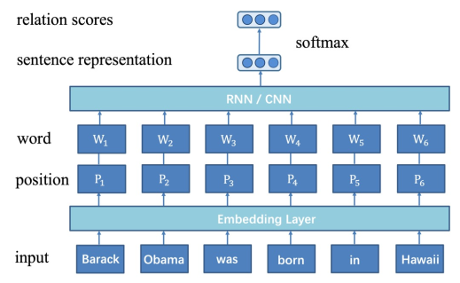
		- Transformer将原始句子转化为低维嵌入向量，每个词都表示为以下部分的连接
			- 词嵌入：编码词语语义
			- 位置嵌入：指定实体的位置（头-尾-上下文嵌入 or 相对距离嵌入）
				- 原因：靠近目标实体的词语通常对确定实体之间的关系具有信息价值
				- 头-尾-上下文嵌入：将单词区分为：头实体▸尾实体▸上下文词语，**对于实体之间的相对距离不加偏见**
				- 相对距离嵌入是相对于头实体、尾实体的相对位置
		- RNN/CNN将与目标实体对相关的语义信息编码到句子表示中
		- Softmax层将句子表示转换为预定义关系类别R的概率分布。
			- 注意， R包括一个特殊的类别-NA。NA表示句子中目标实体对之间没有关系，或者关系不属于预定义的关系集合中

**例子：基于卷积神经网络的关系抽取**
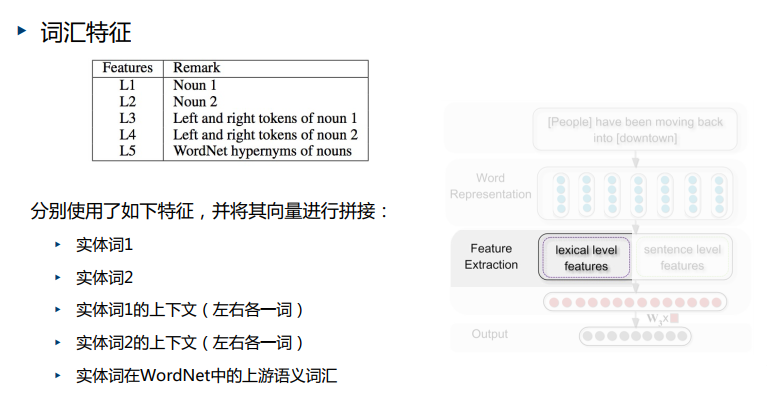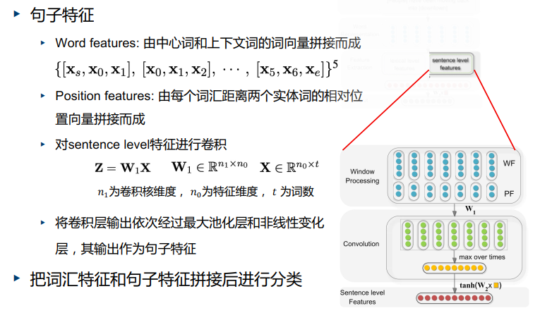
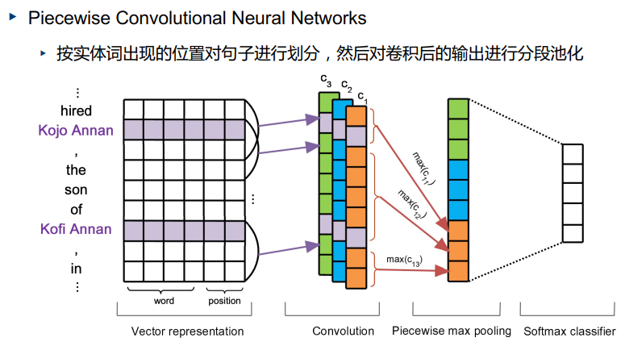

**例子：基于递归神经网络的关系抽取**

该方法基于词向量和句法树本身的结构，有效的考虑了句法和语义信息，但并未考虑实体本身在句子中的位置和语义信息。
- 递归神经网络可以抽取词组之间的修饰关系和逻辑关系
- 每个节点都由一个向量和矩阵组成
- 对包含两个实体句法树中的最小子树进行递归，并使用该子树的根节点对应向量进行分类
	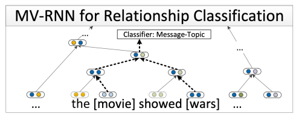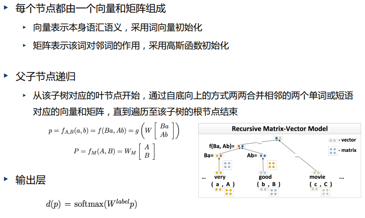
	改进：树状LSTM-沿着两个实体之间的依存树结构对特征进行聚合
	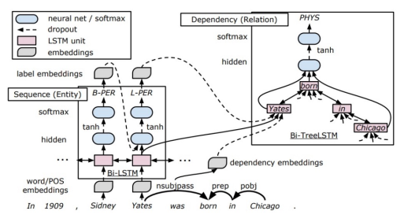
	例子：基于BERT的关系抽取
	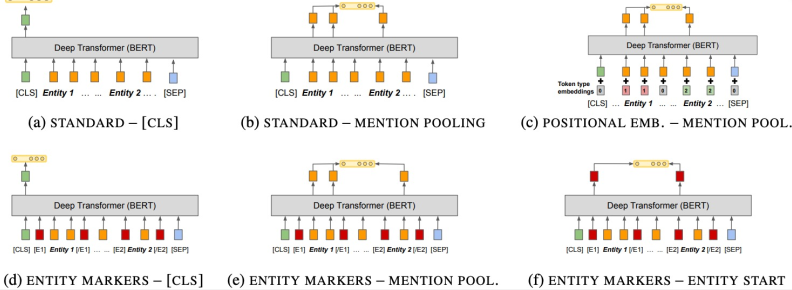
#### 远程监督
假设：如果两个实体属于某个关系，那么包含这两个实体的任何句子很可能表达该关系
关键思想： 使用关系数据库获取大量的噪声训练样本
- 而不是手动创建种子元组（自提升） 
- 而不是使用手动标注的语料库（监督学习）

优点：
- 具有监督学习方法的优点
	- ▸利用丰富可靠的手动创建的知识▸关系具有规范名称▸可以使用丰富的特征（例如句法特征）
- 具有无监督学习方法的优点
	 - ▸利用无限量的文本数据▸允许使用大量弱特征▸对训练语料库不敏感：与文体无关

缺点：
- 假设过于强大，可能导致错误的标注问题（大约80%的关系实例在远程监督下被正确标记）
- 如何解决？-> 可以将远程监督的关系抽取视为多实例问题
	- 多实例问题，从多个实例中选择最有效的实例作为训练样本
		- 数据组织▸训练集由许多包组成▸每个包含许多实例
		- 标签▸包的标签是已知的▸包中实例的标签是未知的
		- 目标▸预测未见包的标签
		- 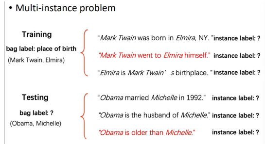
		- 优点：
			- ▸不再在实例级别上监督关系分类器▸因为我们不知道每个实例的确切标签
			- ▸在包级别上设计目标函数▸包的标签是已知的
			- ▸考虑实例标签的不确定性
		- 至少一个多实例学习
			- 假设至少有一句提到两个实体的句子会表达它们之间的关系
			- 在训练和预测中只选择每个实体对应的最有可能的句子
			- 丢失了被忽略句子中的丰富信息
			- 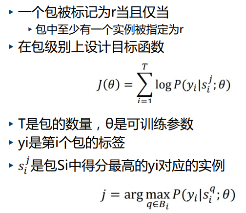
		- 基于多实例的句子级注意力-利用包中的所有信息丰富的句子
			- 不仅仅选择最可能的句子
			- 使用多个实例的句子级别注意力
			- 将关系表示为句子嵌入的语义组合
			- 动态降低那些带有噪声的实例的权重
			- 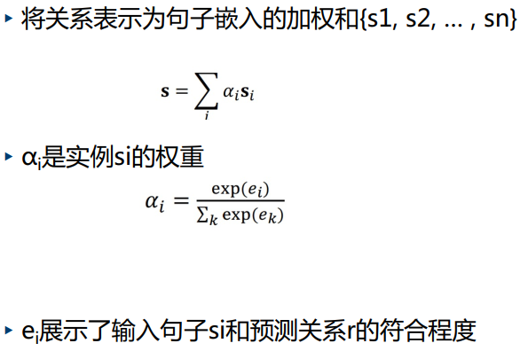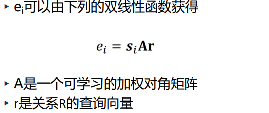
			- 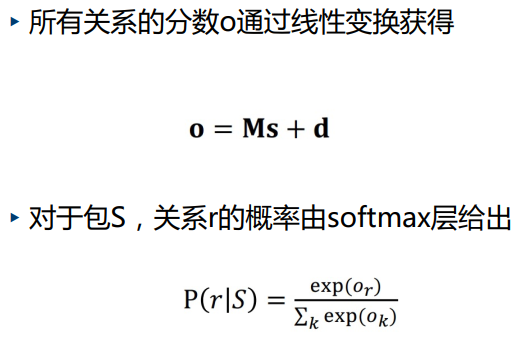
#### 联合模型
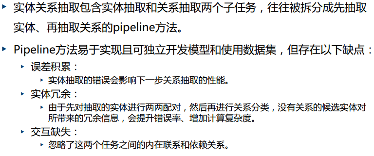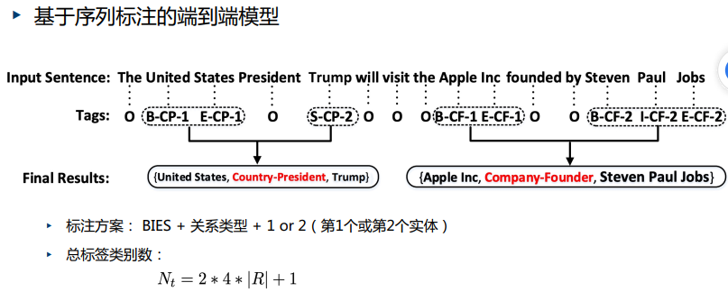
生成模型
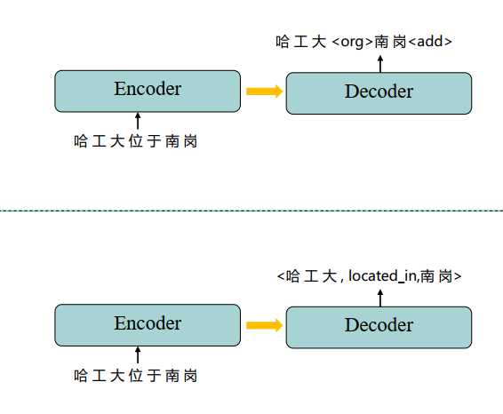


## 4.事件抽取
[事件识别与抽取：从定义到方法_事件抽取-CSDN博客](https://blog.csdn.net/cooldream2009/article/details/135904456)
从描述事件的文本中识别事件，抽取出用户感兴趣的事件元素并以结构化的形式呈现出来。
- 通常包含事件触发词的识别及分类、事件元素的识别及分类等子任务

事件组成：
- 事件提及（Event mention）：▸描述事件的短语或句子，包括触发器和元素。
- 事件触发器（Event trigger）：▸最清晰地表达事件发生的主要词（通常是动词或名词）。
- 事件元素（Event argument）：▸参与事件的实体提及、时间表达或值（例如职位名称）。
- 元素角色（Argument role）：▸元素与其参与的事件之间的关系。

Pipeline
- 事件检测（Event Detection，ED）：检测事件触发器并对其对应的事件类型进行分类
	- 
- 事件参数提取（Event Argument Extraction， EAE）：找到作为检测到的事件的参数的实体，并对参数角色进行分类
	- 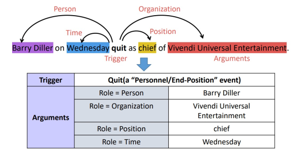

挑战：
- 复杂的结构
	- 事件结构比实体关系复杂得多
	- 内在依赖关系：触发器-参数、参数-参数
- 数据稀缺性


传统模型
- 人为设计的功能
	- 词法级特征▸实体信息
	- 句子级别特征▸依存关系解析
	- 篇章级特征▸跨事件推断
- 严重依赖 NLP 工具进行特征提取
	- 引入解析错误并导致错误传播、特别是对于低资源语言

事件触发词识别与分类
 - 通过观察发现顺序是语言无关的特征，通过观察发现顺序（Sequence）是语言无关的特征。这意味着在不同语言中，事件触发词的位置和顺序可以不相同，但依然可以通过某些特征来识别和分类事件触发词。
 - Bi-LSTM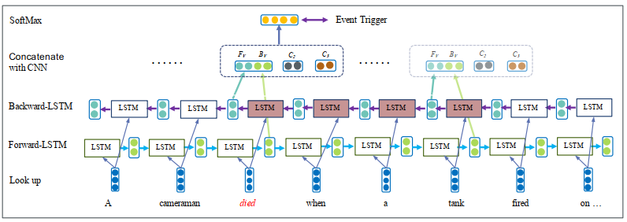

 - DMCNN：DMCNN对句子中的每个单词进行分类以识别触发器。对于具有触发器的句子，该阶段使用类似的DMCNN为触发器分配论点并对论点的角色进行对齐。
	 - 论元识别与分类
		- DMCNN输入层包括了三种类型的特征：**CWF、PF、EF**，分别代表了词嵌入、位置嵌入以及事件类型嵌入。三个嵌入拼接的结果作为一个词的词级别特征。
		- 卷积层-分段池化就是对卷积的结果分块，每块单独池化，最终分了3段就有3个值。分段的切分点分别是触发词和候选论元。这样无论是触发词同候选论元不同，触发词不同而候选论元相同、还是触发词不同且候选论元同…最终获得的句子级语义特征都不同了。**动态多重池化**
		- 最后分类层的输入是词级语义特征+分段卷积后的句子级语义特征，然后经过一个线性层就获得了相应角色的分值了。需要注意的是这里词级别的语义特征仅是由触发词和候选论元以及它们左右的词的词嵌入特征拼接，可以把左右词的词嵌入看作local context，而句子级的语义特征则是global context。
	- 触发词识别与分类
		- 词级的语义特征：触发词及其左右的词的嵌入拼接
		- 句子级语义特征：首先位置特征只相对于候选触发词而言，然后则是分段也只有两段（因为切分点就只有触发词）
	- 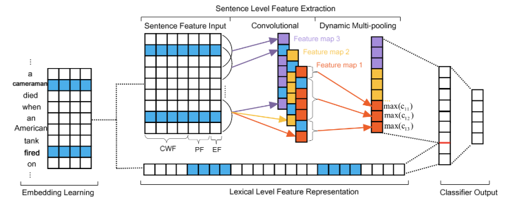

远程监督方法

- 人工很难建立大规模的EE数据
	- ▸任务难度▸相互协商少
- 使用远距离监督自动生成训练实例
	- ▸利用知识库中现有的事件实例
- 不像关系抽取那么简单
	- ▸难以在文本上进行事件标注


## 5.知识抽取
#### 开放域知识抽取
旨在从无监督的开放领域语料库中发现具有无限关系类型的新事实

给定一个句子和句子中提及的两个实体▸提取表示两个实体之间关系的短语

**OpenIE**
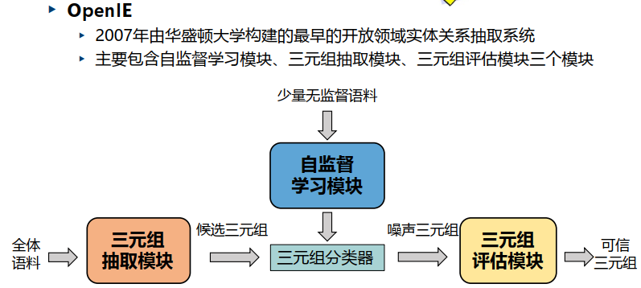

- Self-Supervised Learner：构造训练数据集，学习一个贝叶斯分类器，判断(ei, relation words, e_j)是否是可信的关系
	- 利用规则为三元组打上正确或错误标签，最后利用标注数据训练分类器（如朴素贝叶斯分类器等）

- Single-Pass Extractor：输入一句话，产生所有可能的候选三元组，使用分类器判别，保留可信的三元组

- Redundancy-Based Assessor：统计(e_i, relationwords, e_j)发生在不同句子中的频次，保留高频词的结果作为最终结果

**从动词中抽取关系**
- 使用句法约束来指定关系短语，有三种简单的模式，找到与句法约束之一匹配的最长短语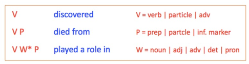
- 找到关系短语左右最近的名词短语，不是关系代词或WHO副词
- 可能的问题：过度指定关系，包含了过多特定细节的关系模式，这些模式在处理不同的文本或新的句子时很难泛化。
- 解决方案：调整模式松散度（Pattern Looseness），允许模式中出现可变或不严格匹配的部分


#### 多模态知识抽取
- 从多种不同模态结合的知识源中抽取出相应的知识(如实体三元组等)
- 需要考虑不同模态的文本（无结构化文本、半机构化文本、结构化表格）
- 需要考虑不同模态的信号输入（文本信息、视觉信息等）

GraphIE▸ 将OCR识别出的连续的文本认为是一个句子，通过行列对齐关系对不同的句子之间进行连接
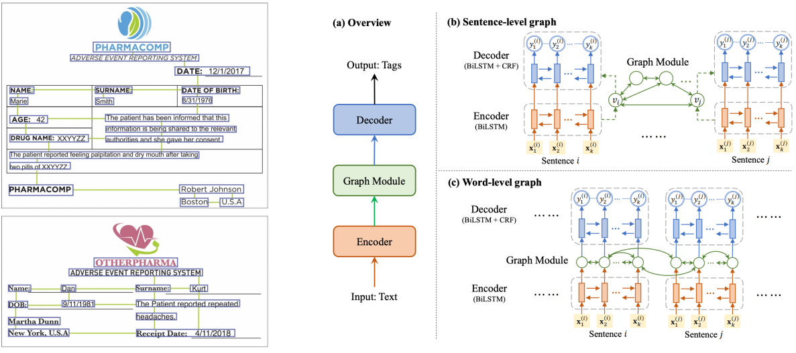
LayoutLM▸ 通过预训练模型建模不同模态之间联系
- ROI（Region of Interest）是图像中的一个子区域，通常由一个矩形框表示。这些子区域被认为可能包含目标物体。
- 在目标检测任务中，初步从图像中生成多个候选区域（可能包含目标的区域），这些候选区域就是ROI。
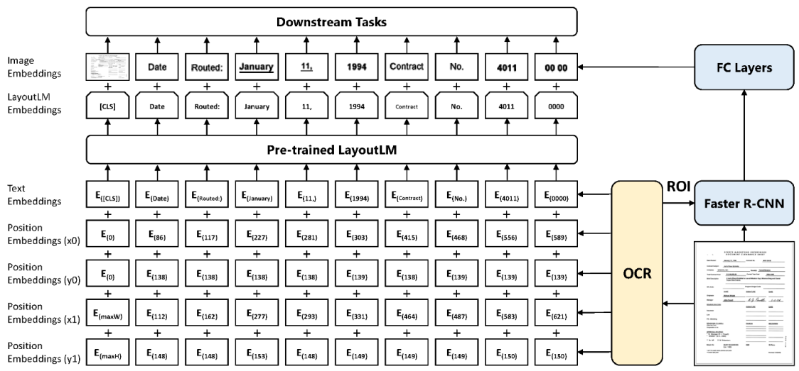