## 文本表示学习

> 文本表示学习就是让计算机学习和理解人类自然语言的过程

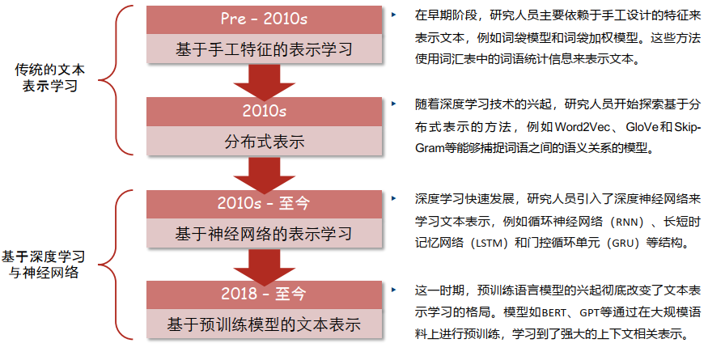

### 传统的文本表示学习方法

#### 1. 基于手工特征的文本表示学习 —— 词袋模型

词袋模型（Bag of Words）/ 向量空间模型（Vector Space Model）：将自然语言的每一个词作为一个特征
- 独热编码（One-hot），维度=词表大小
- 每个句子的向量表示即为其中每个词的向量表示“相加”
- 优点：简单，方便，在语料充足的前提下，对于简单的自然语言处理任务效果不错。
- 缺点：
	1. 数据稀疏（大部分元素为0）和维度灾难（向量维度等于词表大小）
	2. 无法表示相近语义（例如“我”和“人”的点积相似度为0）

```
	句子1：小孩喜欢吃零食。
	句子2：小孩喜欢玩游戏，不喜欢运动。
	句子3 ：大人不喜欢吃零食，喜欢运动。

分词：{“小孩”:1，“喜欢”:2，“吃”:3，“零食”:4，“玩”:5，“游戏”:6，“大人”:7，“不”:8，“运动”:9}

得到表示：
	句子1：[1,1,1,1,0,0,0,0,0]
	句子2：[1,2,0,0,1,1,0,1,1]
	句子3：[0,2,1,1,0,0,1,1,1]
```

#### 2. 基于手工特征的文本表示学习 —— TF-IDF

词频-逆文档频率（TF-IDF）
- TF（term frequency）：词频，用来衡量字在一篇文档中的重要性 $$
TF(t, d) = \frac{\text{词 } t \text{ 在文档 } d \text{ 中出现的次数}}{\text{文档 } d \text{ 中的总词数}}$$
- IDF（inverse document frequency）：逆文档频率$IDF(t, D) = \log(\frac{\text{文档集} D \text{ 的总文档数 }}{\text{包含词 } t \text{的文档数}})$

- $TF-IDF(t, d, D) = TF(t,d) \times IDF(t,D)$
- 优点：简单，方便，在语料充足的前提下，对于简单的自然语言处理任务效果不错。
- 缺点：
	1. 数据稀疏和维度灾难
	2. 没有考虑句中词语的顺序性

TF-IDF的改进：
- 文档长度归一化：考虑文档长度对TF值的影响，通过将TF值除以文档长度来进行归一化，以避免文档长度对TF值的偏差影响。$$w_{i,j}=\frac{tf_{i,j}\cdot\log(N/n_i)}{\sqrt{\sum_{t_i\in D_j}\left[tf_{i,j}\cdot\log(N/n_i)\right]^2}}$$
#### 3. 分布式文本表示

> 利用词语的邻居（上下文）表示词

潜在语义索引：基于词与文档的共现（co-occurrence）频率关系学习词的特征向量

- 缺点
	- 词向量维度会随着语料库中词汇的增多而大幅增加，这会导致所需存储
	- 空间增大，且矩阵会变得相当稀疏，基于此构建的模型鲁棒性较差
	- 功能词出现频次极高，但没有提供相应的信息
	- 没有反映出词距与词相关性之间的联系
- 改进方法
	1. 降低高频词的权重：点互信息$$PMI(x;y)=log\frac{p(x,y)}{p(x)p(y)}=log\frac{p(x|y)}{p(x)}=log\frac{p(y|x)}{p(y)}$$
	```python
	def pmi(M, positive=True):     # M-共现矩阵
		col_totals = M.sum(axis=0) # 按列求和
		row_totals = M.sum(axis=1) # 按行求和
		total = col_totals.sum()  # 总频次
		expected = np.outer(row_totals,col_totals) / total # 获得每个元素的分子
		M = M / expected
		with np.errstate(divide='ignore'): # 不显示1og(0)的警告
			M= np.log(M)
		M[np.isinf(M)] = 0.0 #将log(0)置为0
		if positive:
			M[M < 0] = 0.0
		return M
	```

	2. 使用SVD方法对共现矩阵做降维处理，选定词向量维度，即将共现矩阵M分解为三个矩阵之积吗，只选取最重要的几个特征值，得到每一个词的低维表示
- 相关工作Word2Vec
	- 直接计算词的向量表示，而不是通过计数的方式
	- 自监督学习：语料库中出现在某个词附近的单词 c 充当监督学习的“正确答案”
		- CBOW：利用两边的词预测中间的词
		- Skip-gram：利用中间的词预测两边的词
			- Skip-gram with Negative Sampling" (SGNS)：
				- 把目标词和其上下文作为正例 （目标词，上下文词）
				- 随机从词典中选取词作为负例 （目标词，随机词）
				- 使用“逻辑回归”（logistic regression）训练分类器，权重矩阵 W 就是我们要的词向量
				- 一个单词更倾向于出现在相似单词附近，利用“点乘”（dot-product）计算相似度(Sigmod映射至概率)计算 $𝑃 (+ | 𝑡, 𝑐)$
				- 训练优化目标：$$\begin{align} L(\theta) &= \log P(+|t,c) + \sum_{i=1}^{k}\log P(-|t,n_{i}) \nonumber = \log\sigma({\operatorname*{c}}\cdot t) + \sum_{i=1}^{k}\log\sigma(-n_{i}\cdot t) \nonumber \\ &= \log\frac{1}{1+e^{-c\cdot t}} + \sum_{i=1}^{k}\log\frac{1}{1+e^{n_i\cdot t}} \nonumber \end{align}$$
### 基于深度学习与神经网络的文本表示学习方法
#### 1. 感知器模型
$$y = \left\{
\begin{aligned}
&1 \quad && \text{if} \quad \sum_i w_i x_i + b \geq 0 \\
&0 \quad && \text{else}
\end{aligned}
\right.
\text{，其中} \quad b = -t$$
#### 2. 基于神经网络模型
1. RNN$$\begin{aligned}&O_{t}=g(V\cdot S_{t})\\&S_{t}=f(U\cdot X_{t}+W\cdot S_{t-1})\end{aligned}$$
	矩阵 U 便是我们所需要的词向量矩阵
	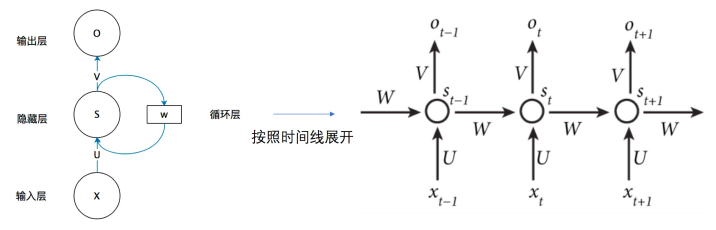
2.  LSTM
	- 除了原有的隐藏层状态 $h_t$ 外，多出一个状态 $C_t$（相当于是有 2 个隐藏层， $C_t$存储着 long-term 的信息（长期记忆）） 
	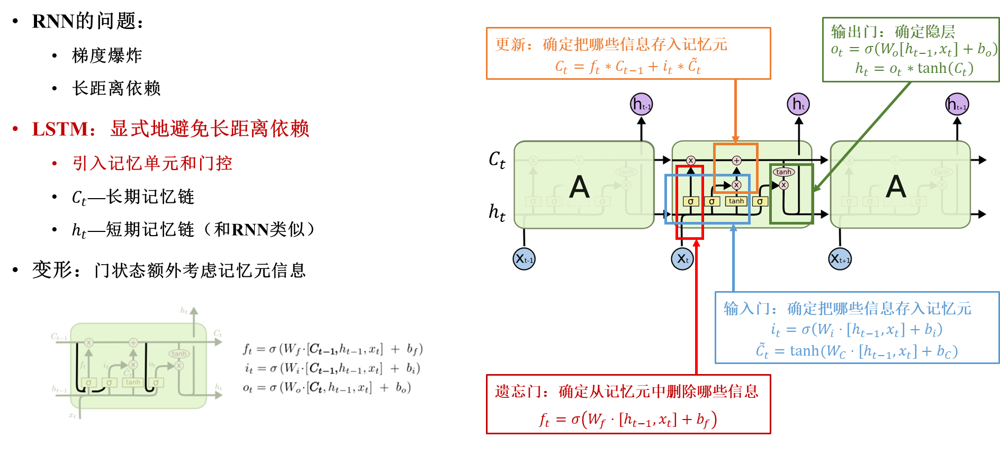
3. Transformer
	- 编码器
		- 自注意力机制的优点：提高并行计算效率；捕捉长距离的依赖关系
		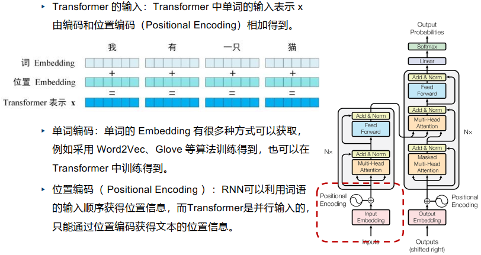
		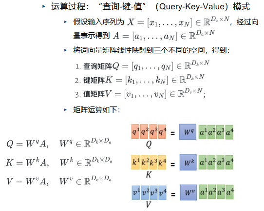
		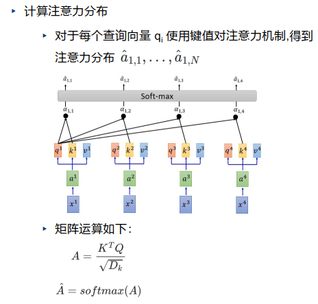
		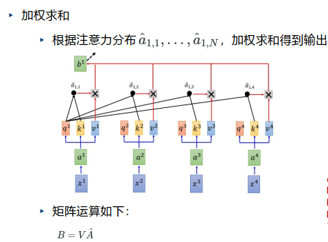
		
	- 解码器
		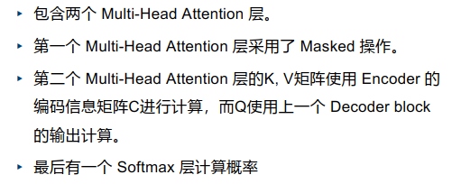
		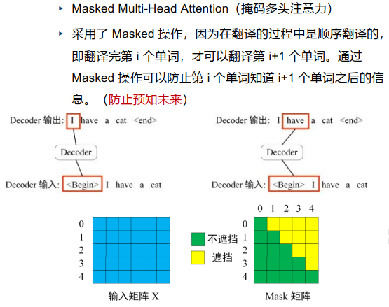
		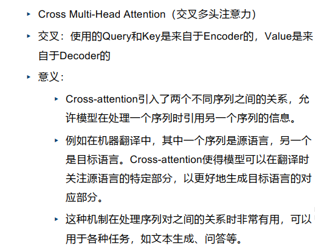

## 视觉表示学习
### 视觉表示学习概述
典型计算机视觉任务（视觉理解）
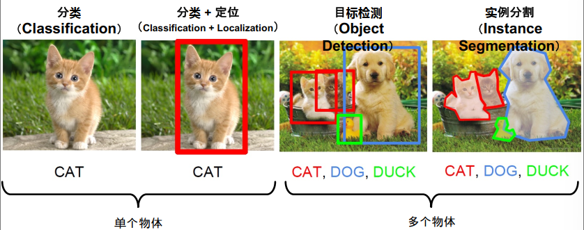医学影像分析（Medical Image Analysis）
光学字符识别（Optical Character Recognition）

传统视觉识别流程
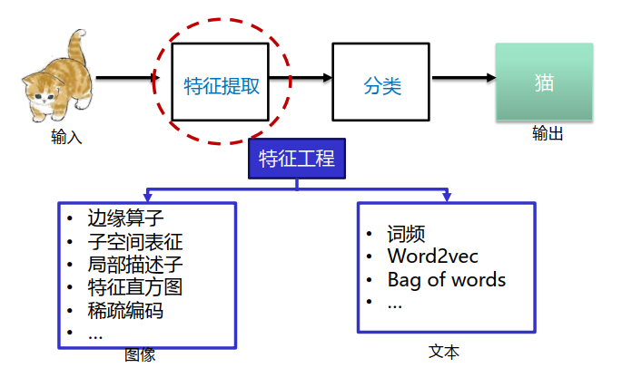

### 卷积神经网络
卷积是一种数学运算，用于描述函数或信号之间的重叠和混合。在信号处理和图像处理等领域有着广泛的应用。

它本质上是两种函数（通常是信号或图像）的乘积与一个系数函数的卷积求和，这个系数函数通常是一个滑动的窗口，用于覆盖原始信号或图像的不同部分。

> 卷积网络的优势：平移不变性；共享参数

**卷积：局部连接+权值共享**  &&  Lenet->Alexnet->Resnet

### 基于注意力的神经网络（ViT）
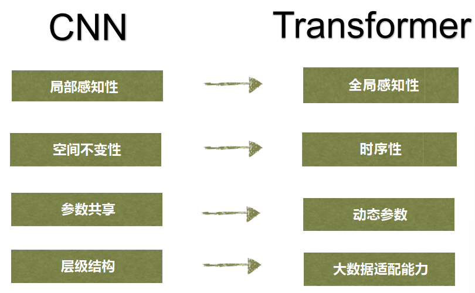

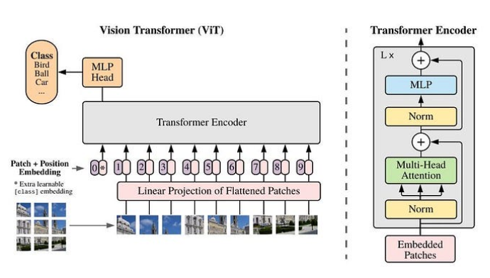ViT主要由三个模块组成： 
1. Linear Projection (Patch + Position 的Embedding层) 
2. Transformer Encoder（详细结构见图右边） 
3. MLP Head（分类层）

### 多模态视觉表征学习（CLIP）

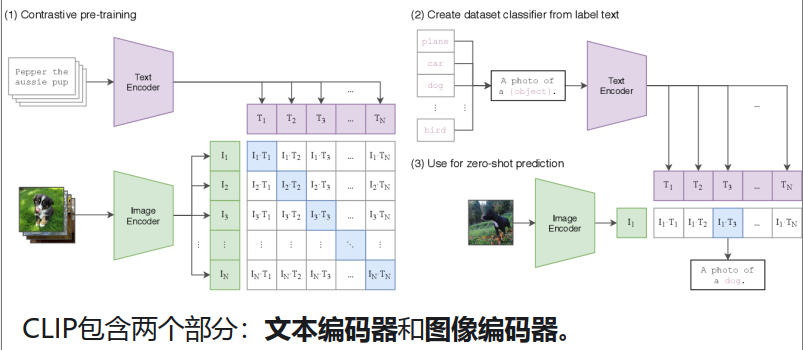对比学习：

向量来自同一文本对：相似度越高越好
向量来自不同文本对：相似度越低越好
$$min(\sum_{i=1}^{N}\sum_{j=1}^{N}\left(I_{i}\cdot T_{j}\right)_{(i\neq j)}-\sum_{i=1}^{N}\left(I_{i}\cdot T_{i}\right)), \ \ I_{i}\cdot T\quad\text{代表余弦相似度(cosine similarity)}$$最大亮点：**zero-shot图像分类能力**

## 图表示学习
> 图是用于描述和分析具有关系/交互的实体的通⽤语言

问题：现代深度学习⼯具主要是为简单的序列和网格设计的，而网络结构是复杂的，具有任意大小和复杂的拓扑结构(即没有像像素那样的空间局部性)

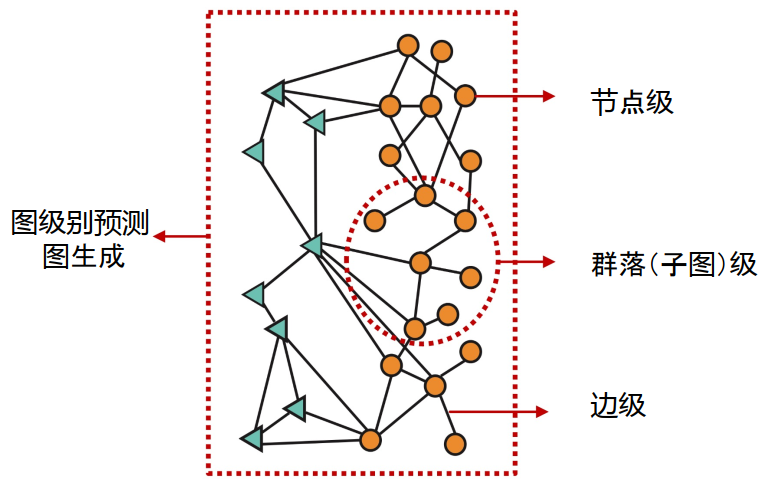


### 图节点表示

节点级的任务
- 节点分类
- 关系预测任务，例子：推荐系统，药物副作用预测

将节点映射到嵌⼊空间
- 节点间嵌⼊的相似性表示它们在⽹络中的相似性。例如:两个节点彼此靠近(通过⼀条边连接)
- 编码⽹络信息
- 可⽤于许多下游预测

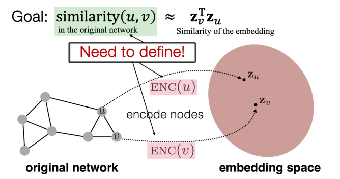最简单的编码⽅法:编码器只是⼀个嵌⼊查找表
- 每个节点被分配⼀个唯⼀的嵌⼊向量
- 即我们直接优化每个节点的嵌⼊，使⽤随机游走的节点相似性定义$$z_u^Tz_v\approx\text{ u和v在图上随机游走时共出现的概率}$$使⽤某种随机游⾛策略𝑹估计从节点𝒖开始的随机⾏⾛中访问节点𝒗的概率，优化embedding来编码这些随机游⾛统计数据
- Random walk的优势
	- 表达性:节点相似度的灵活随机定义，结合了局部和高阶邻域信息（思路:如果从节点𝑢开始的随机⾏⾛⾼概率访问𝑣，那么𝑢和𝑣是相似的(高阶多跳信息)）
	- 效率:训练时不需要考虑所有的节点对;只需要考虑随机游⾛同时出现的成对
- 计算实例：计算余弦相似度，按Skip-gram更新
	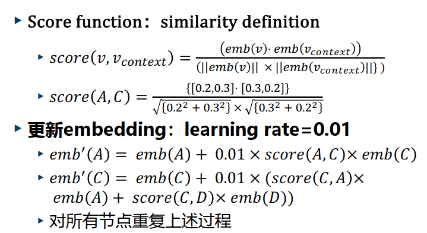

随机游走优化：
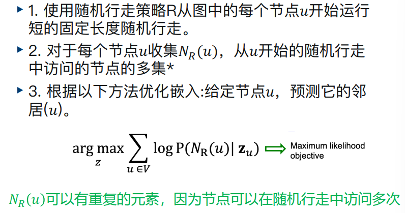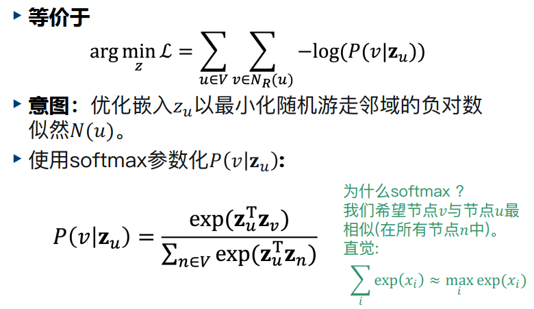
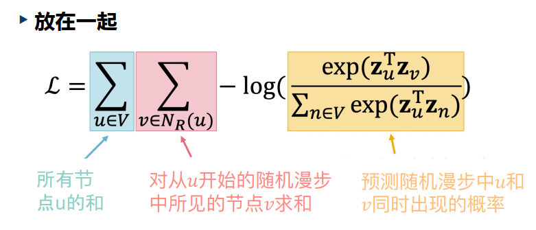优化：不对所有节点进⾏规范化，⽽是对𝑘随机“负样本”𝑛:进⾏规范化。负采样允许快速的似然计算

变形：Biased random walk（偏置随机游走）是指在随机游走过程中，节点选择下一步移动的概率不是均匀分布的，而是根据某种规则或权重来决定的一种随机游走模型。

变形：多层带权图Struct2Vec，Struc2vec会分别统计每个节点的k度距离邻居，以及每个邻居的度数，以每个节点外扩k层的每个邻居度数统计信息来表征这个节点的网络结构形态
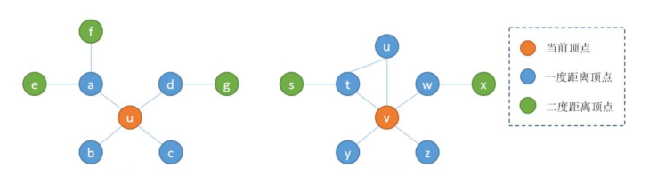
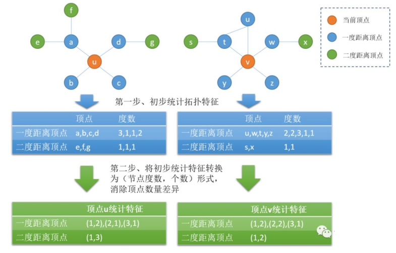
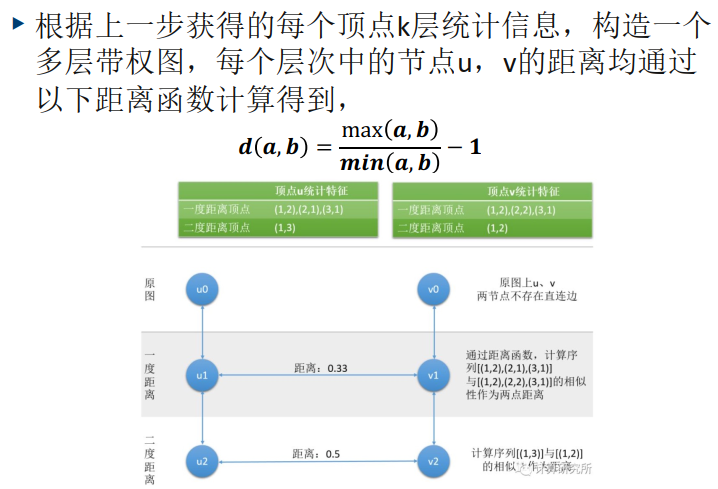
注意当𝑎=𝑏时，𝑑(𝑎,𝑏)=0。因此，两个相同的有序度序列的距离为零。还要注意，通过取最大值和最小值的比值，1和2的度数比101和102的度数差得多，这是在测量节点度数之间的距离时所需的属性。

构建完多层带权图后，即可根据不同节点间的距离以及不同层次节点间的权重进行随机游走，获取节点采样序列

## 图神经网络

浅层编码 -> 基于图结构的多层⾮线性变换

浅层编码的局限性:
- 所需参数𝑶(|𝑽|d)，节点之间不共享参数，每个节点都有自己独特的嵌⼊
- 不能生成在训练中没有看到的节点的嵌⼊
- 不要合并节点特征：许多图中的节点都有我们可以⽽且应该利用的特征

图神经网络的动机：置换不变性（图）和置换等变性（节点），学习如何将信息跨图传播来计算节点特征

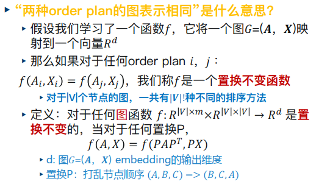


GNN的原理
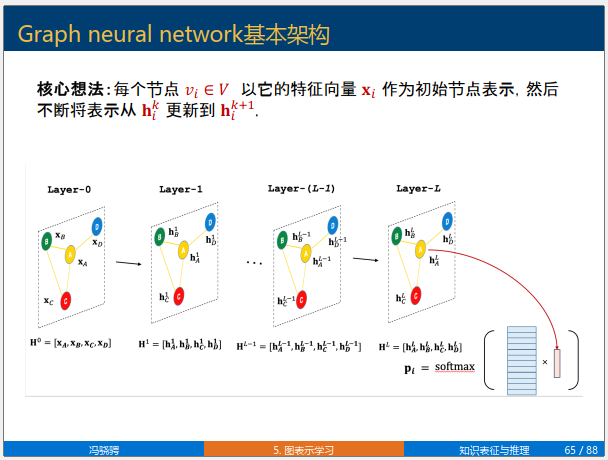
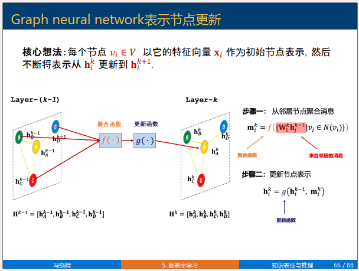

更新方法：
1. 经典图神经网络: 来自所有邻居节点的消息均等对待
	
2. 图卷积神经网络：一些节点的消息比另一些节点的消息更重要
	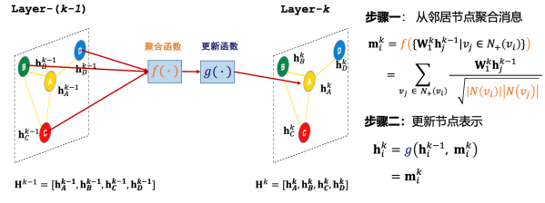
3. 图注意力神经网络：一些节点的消息比另一些节点的消息更重要
	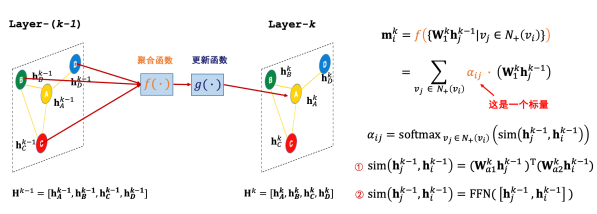