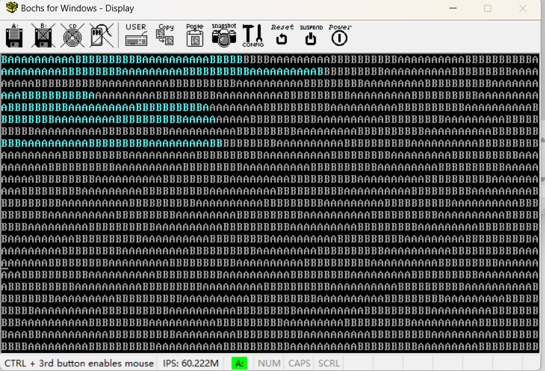
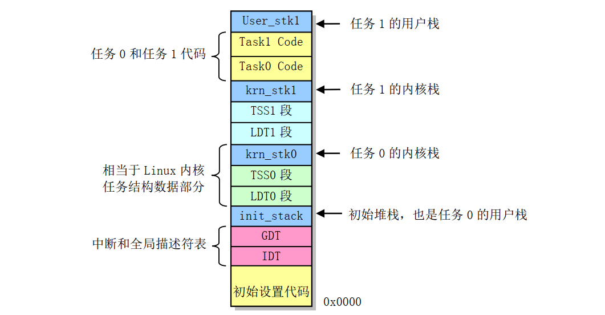
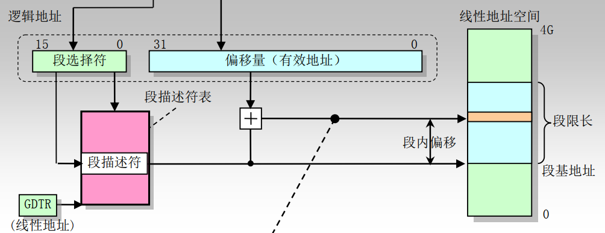
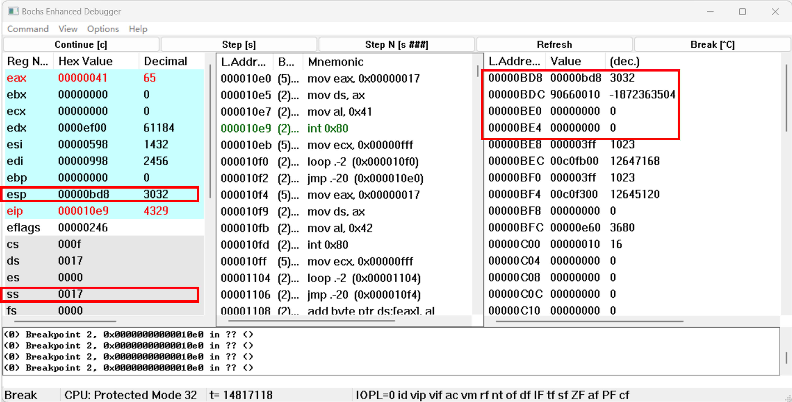
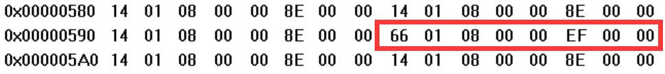
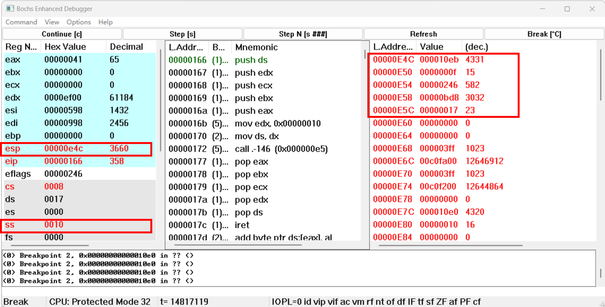

# HITOS-LAB1 调试分析 Linux 0.00 引导程序
## 一、实验目的
- 熟悉实验环境；
- 掌握如何手写Bochs虚拟机的配置文件；
- 掌握Bochs虚拟机的调试技巧；
- 掌握操作系统启动的步骤；
## 二、实验内容
### 2.1 掌握如何手写Bochs虚拟机的配置文件
  - 配置文件是以.bxrc为后缀的文件，以`key: value`来配置参数。
  - 从软驱（硬盘）启动通过设置`boot`参数的值以及指定软盘镜像/硬盘的位置即可。
  - 调试选项通过设置`debug, info, error, panic`参数的值，一般选用默认值。

参数（部分）|作用
---|---
config_interface|配置界面选择，win32config为windows系统下可视化界面
display_library|显示Bochs VGA屏幕的代码
megs|指定主机给虚拟机分配的内存大小，以及指定虚拟机模拟的内存大小
romimage|指定bios镜像的路径
vgaromimage|指定vga bios镜像的路径
floppya|指定软盘镜像的位置
boot|定义引导顺序，最多可以指定3个启动驱动器。
log|指定bochs日志记录的位置

### 2.2 掌握Bochs虚拟机的调试技巧，并以此查看计算机引导程序。

指令（部分）|作用
---|---
`s`|单步执行，用于执行一条指令，然后停下来，显示下一条即将执行的指令。
`b addr`|断点指令,设置一个物理内存地址，当处理器执行到这个地址时，就自动停下来
`c`|持续执行，要求处理器不间断地持续执行指令，如果设置了断点，会在断点处停下来
`q`|退出 Bochs 调试过程
`xp /nuf addr`|显示指定物理内存地址处的内容(双字)
`info reg`|可以显示多种类型的处理器信息包括寄存器，如GDT, LDT, TSS等
`print-stack`|查看栈
`u start end`|反汇编指定内存

## 三、实验报告
### 3.1 head.s 的工作原理

Linux 0.00内核代码包含两个文件，
- **引导启动程序boot.s**，用于在计算机系统加电时从启动盘把内核代码加载到内存中；
- **内核程序head.s**，实现两个运行在特权级3的任务在时钟中断控制下相互切换运行，并且还实现了在屏幕上显示字符的一个系统调用。


head.s实现了两个运行在特权级 3 上的任务在时钟中断控制下相互切换运行，代码执行会在屏幕上分别连续**循环的显示出字符'A'和'B'**，直到每个 10 毫秒切换到另一个任务。



#### boot.s
boot.s 程序编译出的代码共 512 字节，将被存放在软盘映像文件的第一个扇区中。PC 机在加电启动时， ROM BIOS 中的程序会把启动盘上第一个扇区加载到物理内存 `0x7C00` 位置开始处，并把执行权转移到 `0x7C00` 处开始运行 boot.s 程序代码。

boot 程序的主要功能是利用 ROM BIOS 中断 `int 0x13` 把软盘或映像文件中的 head 内核代码**加载到内存** `0x10000` 位置开始处，而后这段 head 代码移动到**内存 0 开始处**，**设置临时 GDT 表**等信息，之后通过设置**控制寄存器 CR0 中的PE标志**把处理器设置成运行**在保护模式**下，然后跳转到内存 0 处 head 代码处去运行内核代码。

#### head.s
head.s 程序运行在 32 位保护模式下，其中主要包括**初始设置**的代码、**时钟中断** `int 0x08` 的过程代码、**系统调用中断** `int 0x80` 的过程代码以及**任务 A 和任务 B 等的代码和数据**。

**head.s的工作原理和流程：**
1. **加载段寄存器和栈顶指针**，数据段寄存器 DS、堆栈段寄存器 SS 和堆栈指针 ESP。所有段的线性基地址都是 0。

2. 在新的位置**重新设置 IDT 和 GDT 表**(IDT 暂时全设置为默认中断)。
   - 并且在改变 GDT 之后重新加载所有段寄存器

3. **设置 8253 定时芯片**。把计数器通道 0 设置成每隔 10 毫秒向中断控制器发送一个中断请求信号。

4. 在 IDT 表第 8 和第 128（ 0x80） 项处分别设**置定时中断门描述符和系统调用陷阱门描述符**。
   - 中断门类型是 14（屏蔽中断），特权级 0 或硬件使用（开机时 BIOS 设置的时钟中断向量号 8）。
   - 陷阱门类型是 15，特权级 3 的程序可执行。

5. **保护现场**，移动到任务 A 中执行。
   - 由于处于特权级 0 的代码不能直接把控制权转移到特权级 3 的代码中执行，但**中断返回**操作是可以的，因此利用中断返回指令 `IRET` 来启动运行第 1 个任务。
   - 初始堆栈 init_stack 中人工设置一个返回环境。即把任务 0 的 **TSS 段选择符**加载到任务寄存器 LTR 中、 **LDT 段选择符**加载到 LDTR 中以后，把任务 0 的**用户栈指针**（`0x17:init_stack`） 和**代码指针**（`0x0f:task0`） 以及标志寄存器值压入栈中
    
6. **任务执行与切换**
   - 每个任务在执行时，会首先把一个字符的ASCII码放入寄存器 AL 中，然后调用**系统中断调用** `int 0x80`，而该系统调用处理过程则会调用一个简单的字符写屏子程序，把寄存器 AL 中的字符显示在屏幕上，同时把字符显示的屏幕的下一个位置记录下来，作为下一次显示字符的屏幕位置。
   - 任务切换的实现方法是在中断 8 的处理过程中（定时器芯片 8253 的通道 0 设置成每经过 10 毫秒就向中断控制芯片 8259A 发送一个**时钟中断**请求信号），查看 **current 变量**中当前运行任务号。
       - 如果 current 当前是 0，就利用任务 1 的 TSS 选择符作为操作数执行远跳转指令，从而切换到任务 1 中执行
       - 如果 current 当前是 1，就利用任务 0 的 TSS 选择符作为操作数执行远跳转指令，从而切换到任务 0 中执行

### 3.2 head.s 的内存分布状况
在 head.s 程序编译出的目标文件中以及最终得到的软盘映像文件中，代码和数据的组织形式如图所示。



head.s 所有代码和数据段都对应到物理内存同一个区域上，即**从物理内存 0 开始的区域**。每个数据段，代码段，栈段的起始与终止的内存地址如下表所示

#### 代码段
代码段|起始地址|终止地址
------|-------|-------
startup_32|0x0000 0000|0x0000 00ac
setup_gdt|0x0000 00ad|0x0000 00b4
setup_idt|0x0000 00b5|0x0000 00d1
rp_sidt|0x0000 00d2|0x0000 00e4
write_char|0x0000 00e5|0x0000 0113
ignore_int|0x0000 0114|0x0000 0129
time_interrupt|0x0000 012a|0x0000 0165
system_interrupt|0x0000 0166|0x0000 017c
task0|0x0000 10e0|0x0000 10f3
task1|0x0000 10f4|0x0000 1107

#### 数据段
数据段|起始地址|终止地址
------|-------|-------
current|0x0000 017d|0x0000 0180
scr_loc|0x0000 0181|0x0000 0185
lidt_opcode|0x0000 0186|0x0000 018b
lgdt_opcode|0x0000 018c|0x0000 0197
idt|0x0000 0198|0x0000 0997
gdt|0x0000 0998|0x0000 09d7
ldt0|0x0000 0be0|0x0000 0bf7
tss0|0x0000 0bf8|0x0000 0c5f 
ldt1|0x0000 0e60|0x0000 0e77 
tss1|0x0000 0e78|0x0000 0edf

#### 堆栈段
堆栈段|起始地址|终止地址
------|-------|-------
init_stack|0x0000 09d8|0x0000 0bdf
krn_stk0|0x0000 0c60|0x0000 0e5f
krn_stk1|0x0000 0ee0|0x0000 10df
user_stk1|0x0000 1108|0x0000 1307

### 3.3 head.s 57 至 62 行的执行

**head.s 57 至 62 行代码**
```
pushl 	$0x17                            # 压入任务0当前局部空间数据段（堆栈段）选择符
pushl	$init_stack                      # 压入栈顶指针
pushfl                                   # 压入标志寄存器
push	$0x0f                            # 压入当前局部空间代码段描述符
push	$task0                           # 压入任务0的入口地址
iret                                     # 压入任务0的入口地址
```
head.s 57 至 62 行执行的内容是设置堆栈返回环境后使用`IRET`中断返回来实现向任务0的切换。

> *由于处于特权级 0 的代码不能直接把控制权转移到特权级 3 的代码中执行，但**中断返回**操作是可以的，因此利用中断返回指令 `IRET` 来启动运行第 1 个任务。在此阶段，代码完成的内容包括：*

1. **设置堆栈返回环境**
   - 模拟中断返回时栈的内容，即**在堆栈中构筑中断返回指令需要的内容**，把返回地址的段选择符设置成任务 0 代码段选择符，其特权级为 3。在返回后从栈中取出**对应的段选择符**。
   - 把任务 0 的用户栈指针（0x17:init_stack）和代码指针（0x0f:task0）以及标志寄存器值压入栈中，然后**执行中断返回指令 IRET**。压入数据之后的**内核栈**，其中自栈顶向下为：
     - 任务 0 的程序入口地址`cs:eip`（0x0f:0x10e0） —— *最后入栈，对应代码60-61行*
     - 标志寄存器值`EFLAGS`（0x0246） —— *对应代码59行*
     - 任务 0 用户栈段的`ss:esp`（0x17:0x0bd8） —— *最早入栈，对应代码57-58行*
   - 需要注意的是：
     - 0x17 对应 0000 0000 0001 0111，按照段选择符的各位含义是以用户态选择 LDT 中第 3 个段描述符（内核数据段）；0x0f 同理，对应 0000 0000 0000 0000 1111，表示以用户态选择 LDT 中第 2 个段描述符（内核代码段）。
     - 因为内核启动代码特权级为 0，而需要转移到的任务 0 代码段特权级为 3 。可以通过`IRET`中断返回转移到特权级3的任务 0 代码段执行。

2. **`IRET`中断返回**

   - 在`IRET`后，从栈中取出任务 0 对应的 `cs:eip`、`eflags`、`ss:esp` ，实现从高特权级到低特权级的任务跳转。
     - 该指令会弹出**栈中代码指针**（代码指针 （0x0f:task0））放入 `cs:eip` 寄存器中。
     - 恢复假设的任务 0 的标志寄存器内容（pushfl 的 EFLAGS）。
     - 并且弹出**堆栈上的堆栈指针**（用户栈指针（0x17:init_stack））作为任务0用户栈指针。
   - 切换后，原来的内核栈变为了任务 0 的用户栈，栈中内容变空

下图为执行`IRET`前后栈和寄存器的变化，可以看到 0x000f，0x10e0，0x0246，0x0017，0x0bd8 等值在栈中的进出，同时寄存器 ESP 和 EIP 的变化也说明了任务的成功切换，印证了上述压栈和弹栈的过程，完成任务以及特权级的转化。


### 3.4 `IRET`执行后PC寻址

执行`IRET`指令时，CPU 会认为是从中断中返回，因此会将**现** `ss:esp` （也就是0x10:0x0BC4）所指向堆栈中的前 12 个字节（也就是 **0x0f:0x10e0** ）弹出送入 `cs:eip` 中。**即新的 `cs:eip` 为 0x000f:0x0000 10e0**，接下来即是保护模式下（ boot.s 从实模式切换到了保护模式）的分段寻址（此例程中无分页机制，因此**线性地址空间就是物理地址空间**），计算方式如下图。



**计算过程为：**
1. 0x000f=b'0000 0000 0000 1111，对应以特权级 3 （用户态）访问 LDT 中第 2 个段描述符
2. 取出段描述符为 0x 00c0 fa00 0000 03ff，根据段描述符结构，
   - 基地址为位 16-39，56-63 组合而成为 0x0000 0000
   - 粒度位G位 55 为 1，段限长为位 0-15，48-51 组合而成为 0x003ff（4MB）
   - DPL 为 3 ，RPL<=DPL 可以访问该段
   - 类型为执行/可读代码段。
3. 段基地址加上段偏移 0x10e0 ，得代码段起始地址为 0x10e0 ，则跳转至**0x10e0**处。

因此 PC 在执行`IRET`指令后指向地址 0x0000 10e0

### 3.5 `IRET`执行前后，栈的变化
设置 bochs 断点为 0x0000 00ac，此时即为`IRET`执行前的堆栈情况，而后step(s)单步执行，此时中断返回，在恢复 EFLAGS 寄存器内容后，进行堆栈切换，此时即为`IRET`执行后的堆栈情况。

如3.3节中图所示，可见**栈的内容被清空**了，但**栈指针所在的位置**没变。变化的过程如下：
- 执行`IRET`指令时，CPU 认为是从中断状态返回，会从当前栈内的内容依次取出 `cs:eip`\EFLAGS 作为**新的`cs:eip`\EFLAGS**。
- 同时由于特权级发生变化，CPU接着从栈内取出 `ss:esp` 作为**新的 `ss:esp`**（即用户段栈指针和选择符）。

具体而言，堆栈的切换可以描述为
1. CPU 弹出**堆栈上的堆栈指针**（用户栈指针（0x17:init_stack））作为任务 0 用户栈指针，**新**的`ss:esp`则为0x17:0x0bd8。
   - 0x0017=b'0000 0000 0001 0111 对应以特权级 3 （用户态）访问 LDT 中第 3 个段描述符
2. SS 会从 LDTR 所指向任务 0 的 LDT （第 53-54 行加载）取出相应的段描述符，段描述符为 0x00c0 f200 0000 03ff
   - 基地址为 0x0000 0000
   - DPL 为 3，RPL<=DPL 可以访问该段
   - 类型为可读/写数据段
3. 加上偏移地址 0x0bd8 得到栈段基地址为 0x0000，栈指针的地址为 0x0bd8

**在`IRET`指令执行后，栈顶由 0x0bc4 切换至 0x0bd8**

### 3.6 `int 0x80`系统调用

当任务进行系统调用时，即 int 0x80 时，**所有中断服务程序都属于内核级别代码**，主要涉及以下步骤：

- 如果一个中断产生时任务正在用户代码中执行，那么该中断就会引起 CPU 特权级从 3 级到 0 级的变化，此时 CPU 就会进行**用户态堆栈到内核态堆栈**的切换操作。
- CPU 会从当前任务的任务状态段 **TSS 中取得新堆栈的段选择符和偏移值**。
- 在定位了新堆栈（内核态堆栈）之后，CPU 就会首先把原用户态堆栈指针 ss 和 esp **压入内核态堆栈**，随后把标志寄存器 EFLAGS 的内容和返回位置 cs、eip 压入内核态堆栈。
- 最后执行**中断服务程序**，调用显示字符子程序 wirte_char 显示字符 

**具体过程**

1. 执行`int 0x80`系统调用前，堆栈指针 `ss:esp` 为 0x17:0x0bd8，当前栈为空。



2. 执行`int 0x80`，即 $system_interrupt 中断时。查询 IDT 表第 0x80 项，为 0x0000 ef00 0008 0166
   - 从起始地址 0x0000 0198 开始，每 8 个字节一项，第 128 项起始地址为 0x0000 0598
     
   - 按门描述符格式解析此门描述符
     - 由位 40-43 确定此门为陷阱门，由位 45-46 确定 DPL 为 3，当前 CPL=3 可以访问
     - 由位 0-15，48-64 确定偏移为 0x0000 0166
     - 由位 16-31 确定段选择符为 0x0008（也就是内核代码段的选择符），即以特权级 0 访问 GDT 中的第 1 项，而对应的段选择符的RPL为0，可以访问 int 0x80 指向的中断代码

3. 执行`int 0x80`后
   - 首先CPU会切换到内核模式，然后由于特权级别切换，CPU会从当前任务 0 的任务状态段 TSS 0 中取得新堆栈的段选择符和偏移值。即 ss:esp<0>。
   
   - 得到新的 `ss:esp` 为 0x10:0x0e60，CPU切换到新的堆栈（内核态堆栈），并把原用户态堆栈指针 ss 和 esp **压入内核态堆栈**，随后把标志寄存器 EFLAGS 的内容和返回位置 cs、eip 压入内核态堆栈，**当前栈顶指针**寄存器 ESP 也随栈的压入变为 0x0e4c。栈中的内容依次为
       - 0x0000 10eb (原EIP/中断的下一条指令)
       - 0x0000 000f 原CS选择子的值
       - 0x0000 0246 为EFLAGS的值
       - 0x0000 0bd8 为原%esp的值
       - 0x0000 0017 为原栈堆SS寄存器的值
   - 执行中断服务程序，把寄存器 AL 中的字符显示在屏幕上，同时把字符显示的屏幕的下一个位置记录下来，作为下一次显示字符的屏幕位置。

