# HITOS-LAB2 调试分析 Linux 0.00 多任务切换
## 一、实验目的
- 通过调试一个简单的多任务内核实例，使大家可以熟练的掌握调试系统内核的方法；
- 掌握Bochs虚拟机的调试技巧；
- 通过调试和记录，理解操作系统及应用程序在内存中是如何进行分配与管理的；

## 二、实验内容
- 通过调试一个简单的多任务内核实例，熟练掌握调试系统内核的方法。内核示例中包含两个特权级 3 的用户任务和一个系统调用中断过程。
- 说明这个简单内核的基本结构和加载运行的基本原理，描述它是如何被加载进机器 RAM 内存中以及两个任务是如何进行切换运行的。

## 三、实验报告
### 3.1 系统调用 `system_interrupt` 函数执行完后iret
设置断点 b 0x017c （对应`system_interrupt` 函数 153 行 `iret`），continue 执行到此位置，观察当前栈（内核栈）和各寄存器的状态如下图所示。

此时栈内为`int $0x80`前压入栈的`cs:eip`、`eflags`、`ss:esp`，由于是**陷阱门**，所以没有错误码。

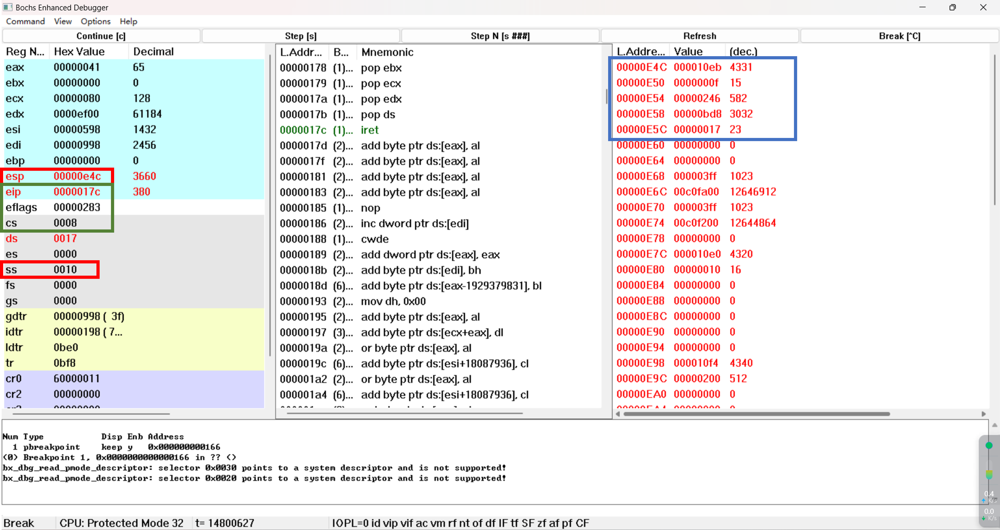

单步执行，即执行 `iret` 指令，由于系统调用为内核态，返回任务 0 或 1 为用户态，因此涉及**堆栈的切换**，主要包含以下操作：

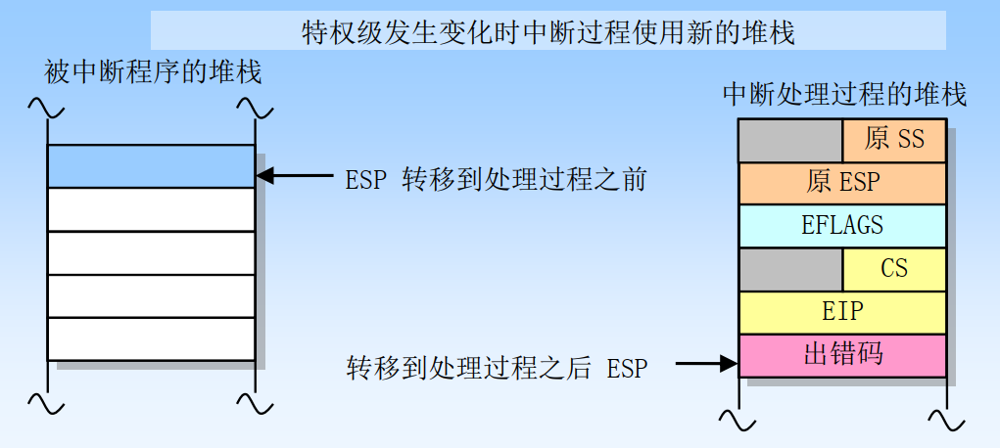

- 在`IRET`后，从栈中取出任务 0 对应的 `cs:eip`、`eflags`、`ss:esp` ，实现从高特权级到低特权级的任务跳转。
  - 该指令弹出**栈中代码指针**（代码指针 （0x0f:0x10eb））放入 `cs:eip` 寄存器中。
  - 恢复假设的任务 0 的标志寄存器 EFLAGS 内容。
  - 最后弹出**堆栈上的堆栈指针**（用户栈指针（0x17:0xbd8））作为任务0用户栈指针。
- 切换后，原来的内核栈（这里是任务 0 的内核栈）变为了任务 0 的用户栈，栈中内容变空

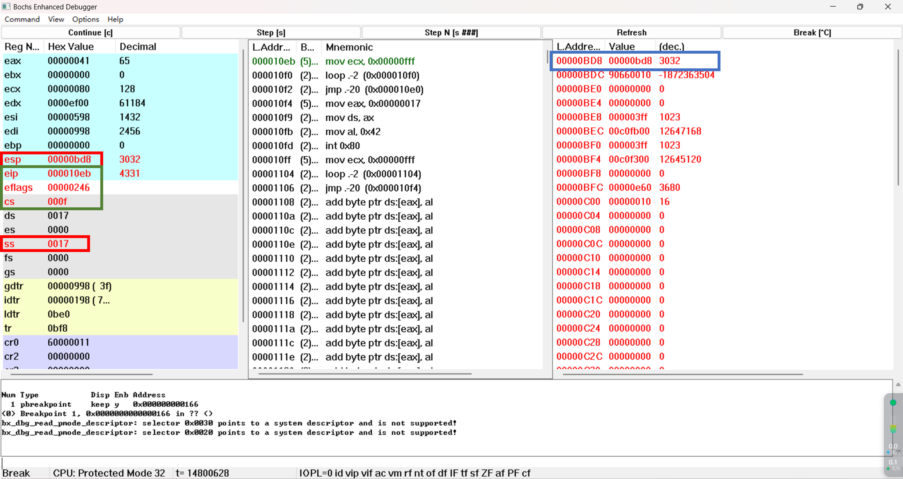

### 3.2 系统调用中的模式切换
当进入和退出 `system_interrupt` 时，都发生了模式切换，涉及**特权级的改变和栈的切换**。

#### 特权级的改变
当任务进行系统调用时，即 int 0x80 时，**所有中断服务程序都属于内核级别代码**，如果一个中断产生时任务正在用户代码中执行，那么该中断就会引起 CPU 特权级从 3 级到 0 级的变化。同样地，从中断服务程序返回也会引起 CPU 特权级从 0 到 3 的转移。

>**保护模式下，CPU 特权级 CPL 由CS 段寄存器中的位 0-1 决定，对应被加载的段选择子的 RPL。**

- 进入`system_interrupt`，从用户模式到内核模式，特权级为 3 到 0；
  1. 执行`int 0x80`，即 `$system_interrupt` 中断时。查询 IDT 表第 0x80 项（起始地址 0x0000 0598），为 0x0000 ef00 0008 0166
  2. 按门描述符格式解析此门描述符
     - 由位 40-43 确定此门为陷阱门，由位 0-15，48-64 确定偏移为 0x0000 0166
     - 由位 45-46 确定 **DPL 为 3**，当前 CPL=3 可以访问
     - 由位 16-31 确定段选择符为 0x0008（也就是内核代码段的选择符），即以特权级 0 访问 GDT 中的第 1 项。
  3. 对应的**段选择符的RPL为0**，切换到内核态（特权级 0）访问 int 0x80 指向的中断代码
   
- 退出`system_interrupt`，从内核模式到用户模式时，特权级为 0 到 3。
  1. `IRET`指令弹出**栈中代码指针**（代码指针 （0x0f:0x10eb））放入 `cs:eip` 寄存器中。
  2. 此时寻址的段选择符为 0x000f，**RPL 为 3**，切换到用户态（特权级 3）访问任务 0 代码。

#### 栈的切换

执行栈切换操作的目的是为了防止高特权级程序由于栈空间不足而引起崩溃，同时也为了防止低特权级程序通过共享的堆栈有意或无意地干扰高特权级的程序。

> *每个任务至多定义 4 个栈（对应 4 个特权级）*

- 进入`system_interrupt`，处理过程将在高特权级（特权级 0）上执行，发生堆栈切换操作（**从任务的用户栈切换到内核栈**）。
  - 处理器从当前执行任务的 TSS 段中得到中断或异常处理过程使用的堆栈的段选择符和栈指针（例如 tss.ss0、 tss.esp0）。
  - 然后处理器会把被中断程序（或任务）的栈选择符和栈指针压入新栈中。
  - 接着处理器会把 EFLAGS、 CS 和 EIP 寄存器的当前值也压入新栈中。
- 退出`system_interrupt`，由于调用中断处理过程时发生了堆栈切换，那么在返回时 `IRET` 指令会切换回到原来的堆栈。（**从内核栈切换回任务的用户栈**）
  - 弹出` cs:eip `和 EFLAGS 寄存器内容后，继续弹出**堆栈上的堆栈指针**到当前的` ss:esp `寄存器，从而完成栈的切换。
  
### 3.3 时钟中断—任务 0 切换到任务 1

在任务 0 的执行过程中，定时芯片每隔 10 ms向 CPU 发送中断请求信号，CPU 接收中断信号后进入 `timer_interrupt` 中断服务程序，服务程序的流程如下：

1. 首先将寄存器 ds 和 eax的值压入栈中保存，
2. 接着修改原 ds 和 eax 的值让 ds 指向内核数据段（0x10）
3. 然后立刻允许其他硬件中断，向 8259A 发送 EOI 命令
4. 将寄存器 al 的值从 0x20 端口输出
5. 接着判断当前任务，若是任务 1 则去执行任务 0，或反之。
   - 若当前任务是 0，则把 1 存入current，并跳转到任务 1 去执行
   - 若当前任务是 1，则把 0 存入current，并跳转到任务 0 去执行

>*当段间指令 `jmp` 所含指针的选择符指示一个可用任务状态段的 TSS 描述符时，将造成任务切换。*

而此处的任务跳转是由**长跳转指令 `ljmp $TSS1_SEL, $0` 完成**的（偏移值无意义）。
- 跳转的 TSS 段选择符`$TSS1_SEL`为`0x30`，为0000 0000 0011 0000，以特权级 0 访问 GDT 中第 7 个段描述符。
- 定位得到描述符为0x0000 e900 0e78 0068，
  - 基地址为 0x0000 0e78, DPL 等于 3（用户态）；
  - 忙碌位 B 为 0，可以切换；
  - 粒度位 G 为 0，段限长为 0x00068，等于 104 字节；
  - Type 位为 b'1001, 为 32 位TSS段（S 标志（描述符类型）是复位状态 0，为系统段描述符）

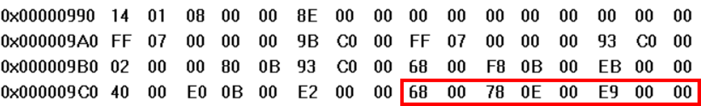

任务跳转又包含两个部分：**保存 TSS0 现场和加载 TSS1 环境**。
#### 1. 保存 TSS0 现场
任务跳转时，保存当前任务 0 的现场，将切换前的所有通用寄存器、段寄存器中的段选择符、标志寄存器 EFLAGS 以及指令指针 EIP 存入 TSS0 中，**注意esp保存的是`ljmp`指令的下一条指令`jmp 2f`的地址**。

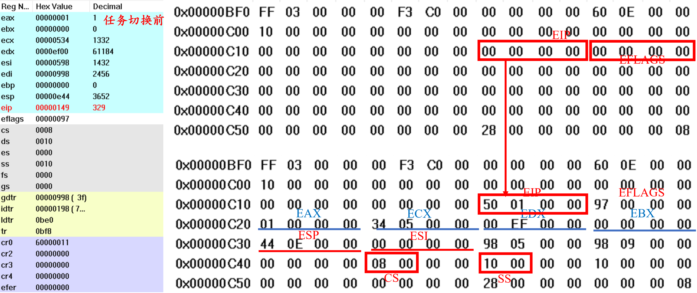

#### 2. 加载 TSS1 环境
CPU 得到 TSS 描述符后，就会将其加载到任务寄存器 TR 中，然后根据 TSS 描述符的信息（主要是基址）找到任务的 tss 内容（包括所有的寄存器信息，如 eip）。

而后把任务1的 `TSS1` **段内的状态加载进处理器**包括 LDTR 寄存器、CR3（PDBR）寄存器、EFLAGS 寄存器、EIP 寄存器以及通用寄存器和段选择符。具体细节如下：
- TR 寄存器由 0x0bf8 指向 0x0e78（即 TSS0 切换到 TSS1）
- EFLAGS为0x200，对应NT标志位为0。
  - 当任务切换是由 JMP 指令造成，那么新任务就不会是嵌套的。因而 NT 标志会被设置为 0， 并且不使用前一任务链接字段。**JMP 指令用于不希望出现嵌套的任务切换中**。
- 新的`cs:eip`为`0x0f:task1`，为task1的局部代码段和运行入口地址
- 新的`ss:esp`为`0x17:usr_stk1`，加载后栈由task0的**内核栈**切换为task1的**用户栈**
- `LDT` 切换为 LDT1 的选择符 `LDT1_SEL`，加载后 `ldtr` 切换为 task1 的**局部段描述符表**
- **首次切换时**，会设置 CR0 寄存器的**嵌套** TS 标志（为3）为 1（0x60000011 变为 0x60000019）
  
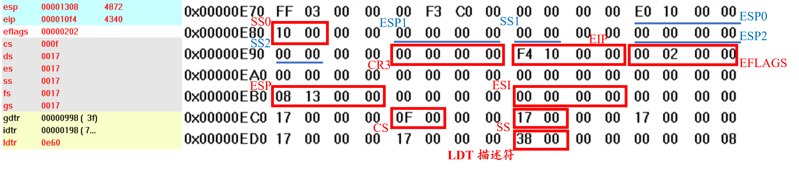

#### GDT 的变化
观察 GDT 发现，在任务切换过程中，也将原 TSS0 的 B 位（忙位置）置为 0，而TSS1 的 B 位置为 1，符合实际的任务执行情况。

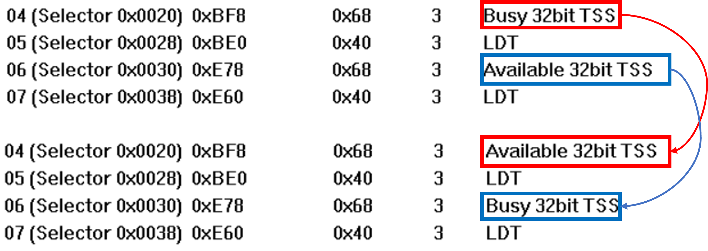

### 3.4 时钟中断—任务 1 切换回任务 0

10 ms后，任务 1 大概率在执行指令 `loop 1b`，此时处理器响应硬件中断 0x08，进入和上述相同的中断服务程序 `timer_interrupt`。此时任务标号为 1，执行 `je 1f` 指令跳转到语句
```
   movl $0, current
   ljmp $TSS0_SEL, $0
```
于是重复与上述类似的任务跳转，而此处的任务跳转是由**长跳转指令 `ljmp $TSS0_SEL, $0` 完成**的（偏移值无意义）。
- 跳转的 TSS 段选择符`$TSS1_SEL`为`0x20`，为0000 0000 0010 0000，以特权级 0 访问 GDT 中第 5 个段描述符。
- 定位得到描述符为0x0000 e900 0bf8 0068，
  - 基地址为 0x0000 0bf8, DPL 等于 3（用户态）；
  - 忙碌位 B 为 0，可以切换；
  - 粒度位 G 为 0，段限长为 0x00068，等于 104 字节；
  - Type 位为 b'1001, 为 32 位TSS段（S 标志（描述符类型）是复位状态 0，为系统段描述符）

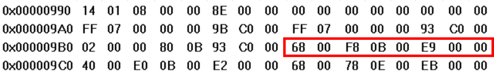

此时的任务切换同样分为两步：保存当前任务1 TSS1 现场和加载任务0 TSS0 环境（**注意此时加载的 TSS0 是上一步由任务 0 跳转到任务 1 保存下来的 TSS0**），于是返回到之前 `ljmp $TSS1_SEL, $0` 指令的下一句 `jmp 2f` ，随后正常弹栈结束中断返回到任务0，完成此次切换。

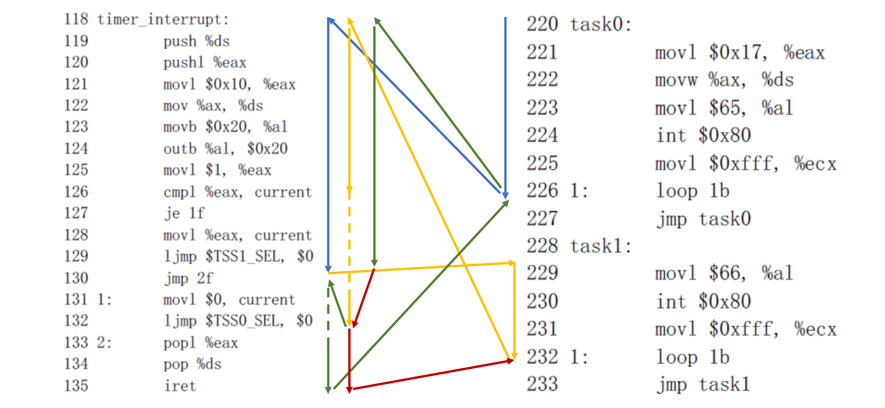

具体而言，在bochs中采用 `info tss/gdt` 分别观察 TSS0, TSS1 和 GDT 的变化如下（也可采用和上述相同的查看实际物理地址存放数据的方法，二者原理相同）：

#### 1. 保存 TSS1 现场
任务跳转时，保存当前任务 1 的现场，将切换前的所有通用寄存器、段寄存器中的段选择符、标志寄存器 EFLAGS 以及指令指针 EIP 存入 TSS0 中，**注意esp保存的是`ljmp`指令的下一条指令`pop eax`的地址**。

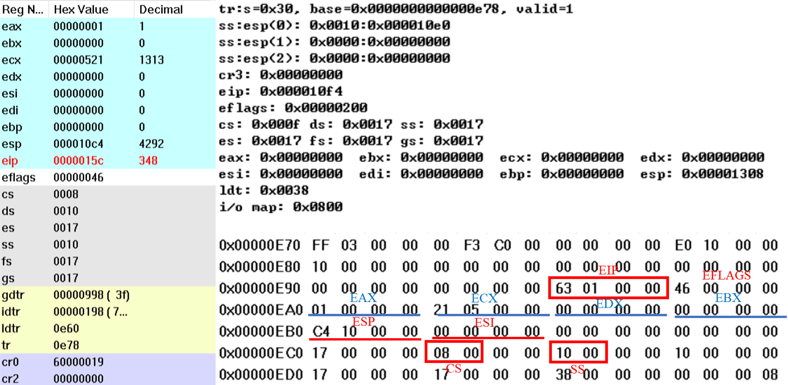

#### 2. 加载 TSS0 环境
CPU 得到 TSS 描述符后，就会将其加载到任务寄存器 TR 中，而后把任务 0 的 `TSS0` **段内的状态加载进处理器**包括 LDTR 寄存器、CR3（PDBR）寄存器、EFLAGS 寄存器、EIP 寄存器以及通用寄存器和段选择符。具体细节如下：
- TR 寄存器由 0x0e78 指向 0x0bf8（即 TSS1 切换到 TSS0）
- EFLAGS为0x0046，对应NT标志位为0。
- 新的`cs:eip`为`0x08:0x0150`，为上一步**任务 0 执行时被中断的下一句 `jmp 2f`** 指令的指针
- 新的`ss:esp`为`0x10:0x0e44`，和之前加载任务 0 执行时被中断时的任务 0 所使用的**内核**栈**完全相同**，在此栈由 task1 的**内核栈**切换为 task0 的**内核栈**（从任务 1 的中断服务程序切换到任务 0 的中断服务程序）
- `LDT` 切换为 LDT0 的选择符 `LDT0_SEL`，加载后 `ldtr` 切换为 task0 的**局部段描述符表**

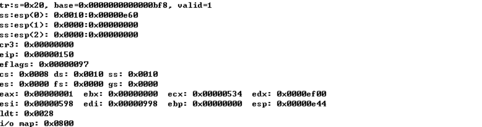

#### GDT 的变化
观察 GDT 发现，在任务切换过程中，也将原 TSS1 的 B 位（忙位置）置为 0，而TSS0 的 B 位置为 1，符合实际的任务执行情况。

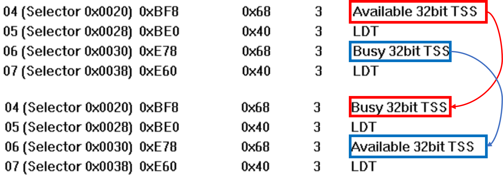

### 3.5 任务切换
处理器可使用一下 4 种方式之一执行任务切换操作：
- 当前任务对 GDT 中的 TSS 描述符执行 `JMP` 或 `CALL` 指令；
- 当前任务对 GDT 或 LDT 中的任务门描述符执行 `JMP` 或 `CALL` 指令；
- 中断或异常向量指向 IDT 表中的任务门描述符；
- 当 EFLAGS 中的 NT 标志置位时当前任务执行 `IRET` 指令。

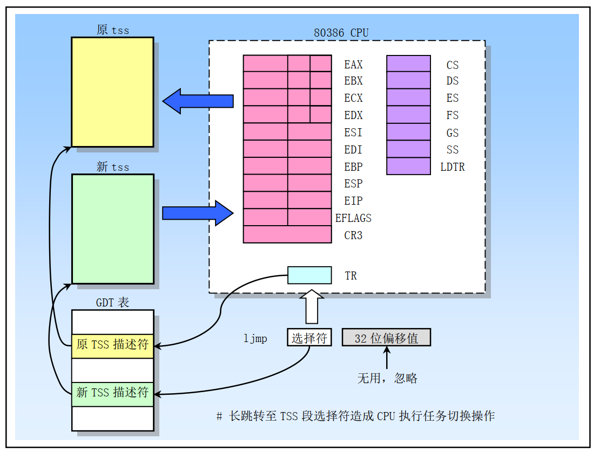

在 Linux0.00 中采用的任务切换方式为，**对 GDT 中的 TSS 描述符执行 `JMP` 或 `CALL` 指令**，需要进行以下步骤：

1. 通过 `JMP` 或 `CALL` 指令的操作数、任务门或先前任务的链接字段（对于由 `IRET` 指令引发的任务切换）**获得新任务的TSS段选择符**。
2. **特权级检查**，检查当前（旧的）任务是否允许切换到新任务。
   - 数据访问特权规则适用于 `JMP` 和 `CALL` 指令。当前任务的CPL和新任务的段选择符的 RPL 必须小于或等于被引用的 TSS 描述符或任务门的 DPL 。
   - 异常、中断（除了由 `INT n` 指令生成的中断）和 `IRET` 指令可以不考虑目标任务门或 TSS 描述符的 DPL 而进行任务切换。
   - 对于由 `INT n` 指令生成的中断，会检查 DPL。
3. **存在有效性检查**，检查新任务的 TSS 描述符是否标记为存在且具有有效的限长（大于或等于 `67H` ）。
4. **可用性检查**，检查新任务是可用（调用、跳转、异常或中断）还是忙碌（ `IRET` 返回）。
5. **忙碌标志B清除判断**
   - 如果任务切换是由 `JMP` 或 `IRET` 指令引发的，处理器会清除当前（旧的）任务的TSS描述符中的忙碌（B）标志；
   - 如果是由 `CALL` 指令、异常或中断引发的，则保持忙碌（B）标志。
6. **NT标志清除判断**
   - 如果任务切换是由 `IRET` 指令引发的，处理器会清除暂存的 EFLAGS 寄存器中的NT标志；
   - 如果是由 `CALL` 或 `JMP` 指令、异常或中断引发的，则保持暂存的 EFLAGS 中的NT标志不变。
7. **保护现场**，将当前（旧的）任务的状态保存到当前任务的 TSS 中。处理器通过在任务寄存器中查找当前 TSS 的基地址，然后将以下寄存器的状态复制到当前 TSS 中来完成此操作：
   - 所有通用寄存器
   - 段寄存器的段选择符
   - EFLAGS 寄存器
   - 指令指针寄存器（EIP）
8.  **NT标志设置判断**
    - 如果任务切换是由 `CALL` 指令、异常或中断引发的，处理器将在从新任务加载的 EFLAGS 中设置 NT 标志。
    - 如果是由 `IRET` 指令或 `JMP` 指令引发的，则NT标志将反映新任务加载的 EFLAGS 中 NT 的状态。
9.  **忙碌标志B设置判断**
    - 如果任务切换是由 `CALL` 指令、`JMP` 指令、异常或中断引发的，处理器将在新任务的 TSS 描述符中设置忙碌（B）标志；
    - 如果是由 `IRET` 指令引发的，则保持忙碌（B）标志。
10. 使用新任务TSS的段选择符和描述符**加载任务寄存器**。
11. **将TSS状态加载到处理器**，在加载 TSS 状态期间发生故障可能会损坏系统架构，尝试在之前的执行环境中处理该错误
    - LDTR 寄存器、PDBR（控制寄存器CR3）、EFLAGS 寄存器、EIP 寄存器
      - 如果未启用分页，则会从新任务 TSS 中读取 PDBR 值，但不会加载到 CR3 中。
    - 通用寄存器
    - 段选择符。
12. **加载并验证与段选择符相关联的描述符**。与此加载和验证相关的任何错误都发生在**新任务的上下文中**，并可能损坏系统架构，在开始执行新任务之前生成适当的异常。
13. 开始**执行新任务**。（对于异常处理程序而言，新任务的第一条指令尚未执行。）

>*如果所有的检查和保存都成功完成，处理器会执行任务切换。如果在步骤1到11中发生了无法恢复的错误，处理器不会完成任务切换，并确保将处理器返回到执行引发任务切换的指令之前的状态。*

在切换任务时，新任务的特权级别**不会继承**自暂停的任务，新任务的特权级与原任务的特权级没有任何关系。新任务会从CS寄存器的CPL字段指定的特权级别开始执行，该特权级别从TSS中加载。由于任务通过其单独的地址空间和TSS进行隔离，并且特权级规则控制对TSS的访问，因此软件无需在任务切换时执行显式的特权级别检查。