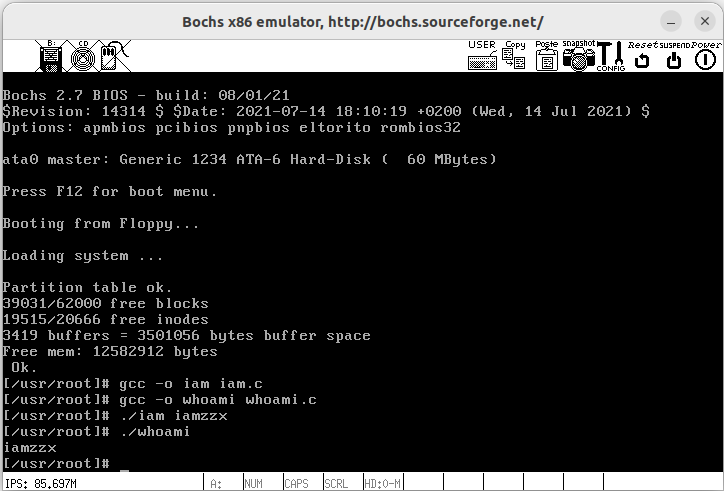
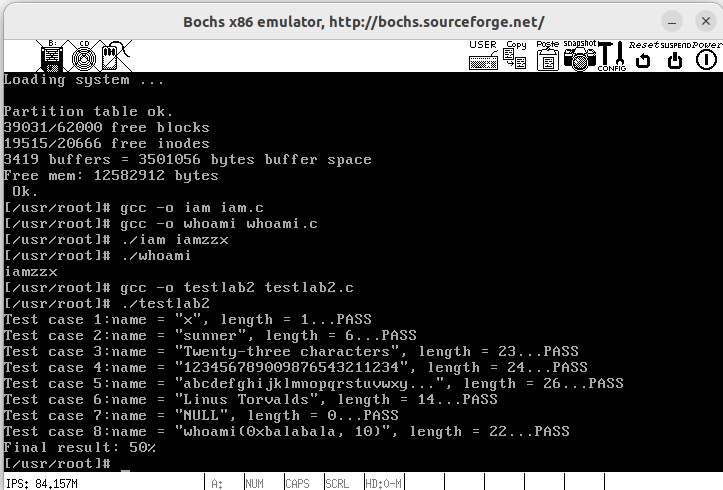
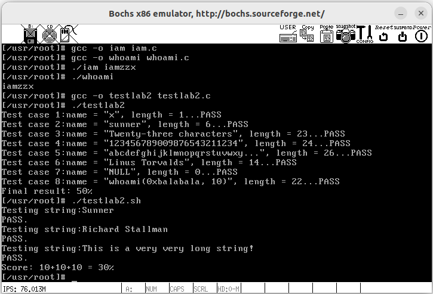

# HITOS-LAB4 Linux0.11系统调用
## 一、实验目的
- 建立对系统调用接口的深入认识
- 掌握系统调用的基本过程
- 能完成系统调用的全面控制
- 为后续实验做准备

## 二、实验内容
在 Linux 0.11 上添加两个**系统调用**，并编写两个简单的应用程序测试它们。
```c
int iam(const char * name);
int whoami(char* name, unsigned int size);
```
1. 第一个系统调用是 `iam()` ，完成的功能是将字符串参数 name 的内容拷贝到内核中保存下来。 
   - 要求 name 的长度不能超过 23 个字符。返回值是拷贝的字符数。 如果 name 的字符个数超过了 23 ，则返回 -1 ，并置 errno 为 `EINVAL` 。
2. 第二个系统调用是 `whoami()` ，它将内核中由 `iam()` 保存的名字拷贝到 name 指向的用户地址空间中， 同时确保不会对 name 越界访存（ name 的大小由 size 说明）。 
   - 返回值是拷贝的字符数。如果 size 小于需要的空间，则返回 -1 ，并置 errno 为 `EINVAL` 。
## 三、实验报告
### 3.1 回答问题：
#### 1. 从 Linux 0.11 现在的机制看，它的系统调用最多能传递几个参数？
答：最多能传递**三个参数**。根据 `Linux0.11/include/unistd.h` 的系统调用宏可以看到4种不同参数数量的系统调用如下：
```c
#define _syscall0(type,name)
#define _syscall1(type,name,atype,a)
#define _syscall2(type,name,atype,a,btype,b)
#define _syscall3(type,name,atype,a,btype,b,ctype,c) 
```
因此能够传递参数最多的是_syscall3，包含三个参数。具体而言，系统调用号存放在 eax 寄存器，而各个参数则分别存放在 ebx、ecx 和 edx 寄存器中。通过执行 `int $0x80` 汇编指令触发软中断，将控制权转移至内核，内核根据这些寄存器的值执行相应的系统调用。
```c
#define _syscall3(type,name,atype,a,btype,b,ctype,c) \
type name(atype a,btype b,ctype c) \
{ \
long __res; \
__asm__ volatile ("int $0x80" \
	: "=a" (__res) \
	: "0" (__NR_##name),"b" ((long)(a)),"c" ((long)(b)),"d" ((long)(c))); \
if (__res>=0) \
	return (type) __res; \
errno=-__res; \
return -1; \
}
```
#### 2. 你能想出办法来扩大这个限制吗？
当参数数量超过当前系统调用能够容纳的限制时，可以采用以下方法：

1. **寄存器扩展：** 增加可用于传参的通用寄存器数量，如利用另外三个通用寄存器 edx、esi 和edi 传递参数，增加参数数量更多的系统调用模式`_syscall4`、`_syscall5`、`_syscall6`等。

2. **结构体/数组传递：** 将多个参数封装成一个结构体/数组，存放在连续的地址空间内，然后将其起始指针作为系统调用的参数传递。内核在执行系统调用时，可以通过指针访问结构体中的具体参数。

3. **利用堆栈传递：** 将多个参数会推送到堆栈上，系统调用会从堆栈中读取这些参数。但需要在系统调用处理例程中额外处理堆栈的布局，确保参数能够正确地从堆栈中读取。

#### 3. 用文字简要描述向 Linux 0.11 添加一个系统调用 `foo()` 的步骤。
向 Linux 0.11 添加一个系统调用 foo() 的步骤简要如下：

1. 在 `linux-0.11/include/unistd.h` 中为此系统调用分配系统调用号 `__NR_foo xx`，并在 `linux-0.11/kernel/system_call.s` 中更新 `nr_system_calls` 的值，将其增加1，确保新系统调用号被正确分配。

2. 在内核 `linux-0.11/include/linux/sys.s` 中，为新的系统调用 `foo` 定义一个外部声明 `extern type sys_foo()`，并在系统调用表中按照系统调用号的顺序在 `sys_call_table` 函数表中添加 `sys_foo` 函数。

3. 在内核 `linux-0.11/kernel/` 目录下，创建 `foo.c` 文件，实现供用户调用的系统调用函数 `type sys_foo()`。

4. 在内核的 `linux-0.11/kernel/Makefile` 文件中，将 `foo.c` 与其他内核文件一起编译链接，确保新的系统调用能够被正确集成到内核中。

5. 在用户程序中，根据参数个数，选择相对应的系统调用宏 `_syscallN`，其中 `N` 取值为系统调用参数的个数，即可在用户模式下系统调用 `foo()`


### 3.2 实验结果
#### 3.2.1 简单测试程序
运行添加过新系统调用的 Linux 0.11 ，在其环境下编写两个测试程序 `iam.c` 和 `whoami.c`并编译，运行：
```shell
./iam iamzzx
./whoami
```
最终的运行结果是：

#### 3.2.2 `testlab2.c`编译后测试
将 `testlab2.c` 在修改过的 Linux 0.11 上编译运行，显示的结果即内核程序的得分。测试结果如下，得到满分 50% 。
 

#### 3.2.3 `testlab2.sh`测试
将脚本 `testlab2.sh` 在修改过的 Linux 0.11 上运行，显示的结果即应用程序的得分。测试结果如下，得到满分 30% 。


## 四、实验过程及截图
实验内容及流程总体上如下：
- 在**内核层面**添加了两个系统调用 `sys_iam` 以及 `sys_whoami`，以 `who.c` 的文件格式保存在了Linux 0.11系统的内核（kernel）中， 并在相应的头文件和调用函数中进行修改；
  - `sys_iam` 调用了一个名为 `get_fs_byte()` 的系统函数实现数据读取输入，`sys_whoami` 则调用了 `put_fs_byte()` 这个系统函数完成对数据的打印输出。
- 在**用户层面**实现了两个应用程序 `iam.c` 和 `whoami.c`，通过 `syscall` 这个宏开启调用系统函数的窗口，调用 `sys_iam` 以及 `sys_whoami` 系统调用函数；
- 修改 `Makefile` 等编译文件，将文件移动到虚拟机上 `hdc` 后，在 Linux0.11 中编译执行测试程序


### 4.1 在内核中添加系统调用
首先，在 `linux-0.11/include/unistd.h` 中新增两个系统调用函数对应的宏:
```c
#define __NR_iam	72
#define __NR_whoami	73
```
而后需要在 `include/linux/sys.h` 的 `sys_call_table` 函数表中增加两个函数引用: `sys_iam` 和 `sys_whoami` 。 当然该函数在 `sys_call_table` 数组中的位置必须和之前添加的 `__NR_xxxxxx` 的值对应上。 
```c
fn_ptr sys_call_table[] = { sys_setup, ……, sys_iam, sys_whoami };
```
同时还要仿照此文件中前面各个系统调用的写法，加上：

```c
extern int sys_whoami();
extern int sys_iam();
```

最后在 `kernel/system_call.s` 中修改 `nr_system_calls` 的值:
```asm
nr_system_calls = 74        #这是系统调用总数。如果增删了系统调用，必须做相应修改
```

### 4.2 在内核中实现函数 `sys_iam` 和 `sys_whoami`
创建一个文件 `kernel/who.c`，仿照其他内核函数，根据函数功能，利用函数 `get_fs_byte()` 和 `put_fs_byte()` 编写代码如下：
```c
#include <string.h>
#include <errno.h>
#include <asm/segment.h>

char msg[24];
int len=0;

/*
 * 将字符串参数 name 的内容拷贝到内核中保存下来
 * 要求 name 的长度不能超过 23 个字符。
 * 返回值是拷贝的字符数
 * 如果 name 的字符个数超过了 23 ，则返回 -1
 * 并置 errno 为 EINVAL 。
 */
int sys_iam(const char * name){
    char temp[24];
    int i;
    for(i = 0; i < 24; i++){
        temp[i] = get_fs_byte(name+i);
        if(temp[i] == '\0')
            break;
    }
    if(i == 24 && temp[i-1] != '\0')
        return -(EINVAL);
    else{
        len = i;
    	strcpy(msg, temp);
    	return i;
    }
}

/*
 * 将内核中由 iam() 保存的名字拷贝到 name 指向的用户地址空间中，
 * 同时确保不会对 name 越界访存（name 的大小由 size 说明）。
 * 返回值是拷贝的字符数。如果 size 小于需要的空间，则返回 -1
 * 并置 errno 为 EINVAL 。
 */
int sys_whoami(char* name, unsigned int size){
    if(len > size)
        return -(EINVAL);
    int i = 0;
    for(int i = 0; i < len; i++)
    	put_fs_byte(msg[i], name+i);
    return len;
}
```

### 4.3 修改 `Makefile`

要想让我们添加的 `kernel/who.c` 可以和其它 Linux 代码编译链接到一起，必须要修改 `Makefile` 文件。 `Makefile` 里记录的是所有源程序文件的编译、链接规则。

Makefile 在代码树中有很多，分别负责不同模块的编译工作。我们要修改的是 `kernel/Makefile` ，需要修改两处。一处是：
#### 4.3.1 在 OBJS 中加入 `who.o`
```makefile
OBJS  = sched.o system_call.o traps.o asm.o fork.o \
        panic.o printk.o vsprintf.o sys.o exit.o \
        signal.o mktime.o
```
改为：
```
OBJS  = sched.o system_call.o traps.o asm.o fork.o \
        panic.o printk.o vsprintf.o sys.o exit.o \
        signal.o mktime.o who.o
```
#### 4.3.2 加入 `who.c` 的链接编译
```makefile
### Dependencies:
exit.s exit.o: exit.c ../include/errno.h ../include/signal.h \
  ../include/sys/types.h ../include/sys/wait.h ../include/linux/sched.h \
  ../include/linux/head.h ../include/linux/fs.h ../include/linux/mm.h \
  ../include/linux/kernel.h ../include/linux/tty.h ../include/termios.h \
  ../include/asm/segment.h
```

改为：
```makefile
### Dependencies:
who.s who.o: who.c ../include/linux/kernel.h ../include/unistd.h
exit.s exit.o: exit.c ../include/errno.h ../include/signal.h \
  ../include/sys/types.h ../include/sys/wait.h ../include/linux/sched.h \
  ../include/linux/head.h ../include/linux/fs.h ../include/linux/mm.h \
  ../include/linux/kernel.h ../include/linux/tty.h ../include/termios.h \
  ../include/asm/segment.h
```

`Makefile` 修改后，和往常一样 `make all` 就能自动把 `who.c` 加入到内核中了。

### 4.4 编写测试程序
在应用程序中，要有：
```c
#define __LIBRARY__                              /* 有它，_syscall1等才有效。详见unistd.h */
#include <unistd.h>                              /* 有它，编译器才能获知自定义的系统调用的编号 */
_syscall1(int, iam, const char*, name);          /* iam()在用户空间的接口函数 */
_syscall2(int, whoami, char*, name, unsigned int, size);    /* whoami()在用户空间的接口函数 */
```
> 但是在 `/usr/include` 目录下，它和 0.11 源码树中的 `unistd.h` 并不是同一个文件，没有 `__NR_whoami` 和 `__NR_iam` 两个宏，需要从修改过的 0.11 源码树中拷贝新的 `unistd.h` 过来。

仿照 `lib/close.c`，编写应用程序如下：

#### 4.4.1 `iam.c`
```c
#define __LIBRARY__
#include <unistd.h>
#include <stdio.h>
_syscall1(int,iam,const char*,name); 

int main(int argc, char ** argv)
{
	int err = 0;
	if(argc < 1){
		printf("not enough arguments!\n");
		return -1;
	}
	err = iam(argv[1]);
	return err;
}
```

#### 4.4.2 `whoami.c`
```c
#define __LIBRARY__                             
#include <unistd.h>                              
_syscall2(int, whoami, char*, name, unsigned int, size);  

int main(){
	char result[24];
	int len = 0;
	len = whoami(result, 24);
	printf("%s\n",result);
	return len;
}
```

### 4.5 移动挂载后启动内核
在 `/oslab` 目录下执行命令，将 Minix 文件系统的镜像文件挂载到 `/oslab/hdc` 下
```shell
./mount-hdc
```
而后将上述编辑的测试代码 `iam.c`,`whoami.c` 以及测试文件 `testlab2.c` , `testlab2.sh` 移动到 `/oslab/hdc/usr/root` 目录下。（可能还需要移动 `unistd.h` 到 `/usr/include` 目录下）

而后通过 `./dbg-bochs` 启动 Linux0.11 内核（新版本实验环境会自动取消挂载），在 Linux0.11 中编译
```shell
gcc -o iam iam.c -Wall
gcc -o whoami whoami.c -Wall
gcc -o testlab2 testlab2.c -Wall
```

而后执行`./testlab2` 和 `./testlab2.sh` 即可获得相应的评分