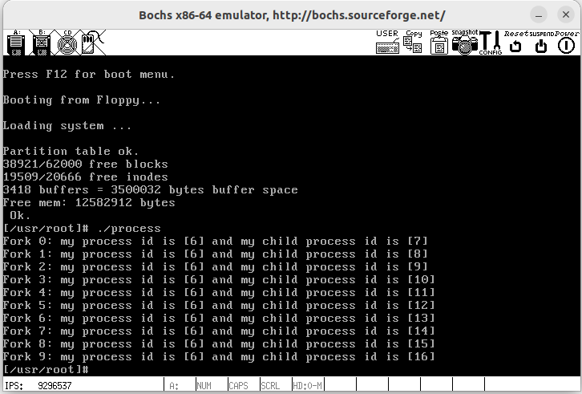
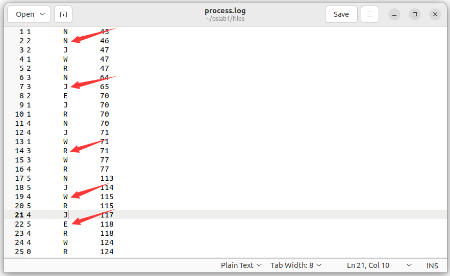
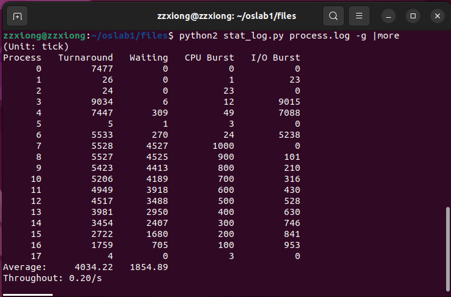
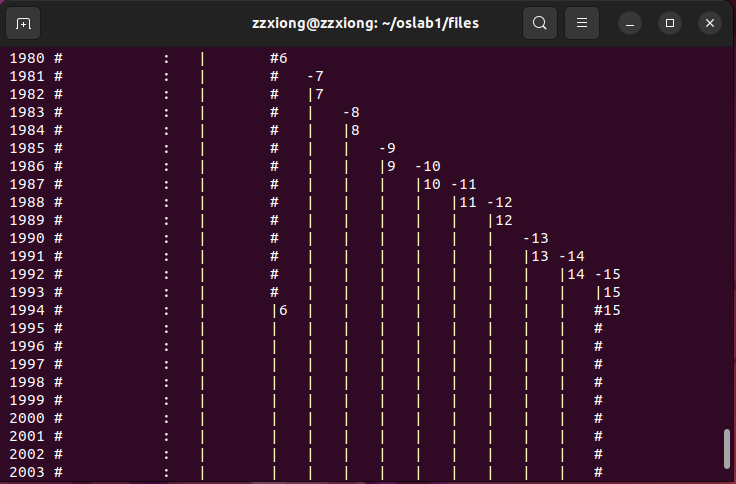
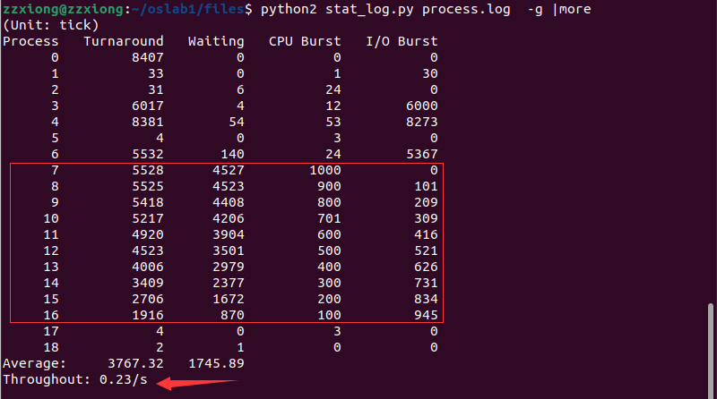
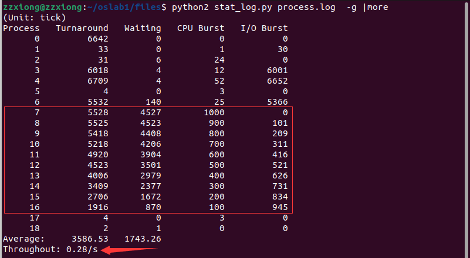
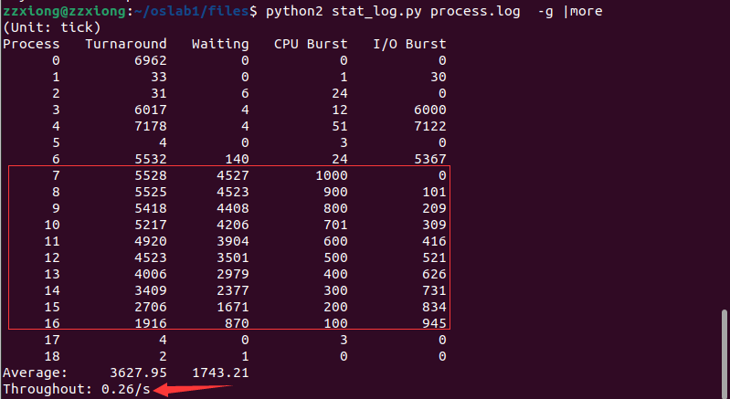
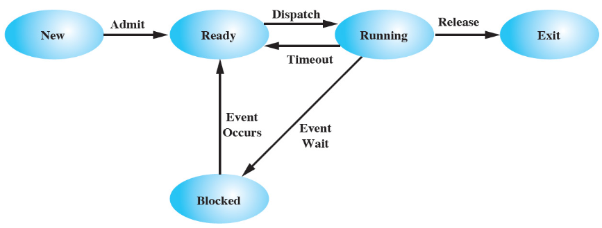

# HITOS-LAB5 进程运行轨迹的跟踪与统计
## 一、实验目的
- 掌握 Linux 下的多进程编程技术；
- 通过对进程运行轨迹的跟踪来形象化进程的概念；
- 在进程运行轨迹跟踪的基础上进行相应的数据统计，从而能对进程调度算法进行实际的量化评价， 更进一步加深对调度和调度算法的理解，获得能在实际操作系统上对调度算法进行实验数据对比的直接经验。

## 二、实验内容
1. 基于模板 `process.c` **编写多进程**的样本程序，实现如下功能：
   - 所有子进程都**并行**运行，每个子进程的实际运行时间一般不超过 30 秒；
   - 父进程向标准输出打印所有子进程的 id ，并在所有子进程都退出后才退出；
   - 在 Linux 0.11 上实现进程运行轨迹的跟踪。基本任务是在内核中维护一个日志文件 `/var/process.log` ，把从操作系统启动到系统关机过程中所有进程的运行轨迹都记录在这一 `log` 文件中。

2. 在修改过的 0.11 上运行样本程序，通过分析 `log` 文件，统计该程序建立的所有进程的**等待时间、完成时间（周转时间）和运行时间**，然后计算平均等待时间，平均完成时间和吞吐量。可以自己编写统计程序，也可以使用 python 脚本程序 `stat_log.py` 进行统计。
3. **修改 0.11 进程调度的时间片**，然后再运行同样的样本程序，统计同样的时间数据，和原有的情况对比，体会不同时间片带来的差异。

## 三、实验报告
### 3.1 实验结果
运行样本程序 `process.c`，完成 10 个子进程的创建，各子进程并行运行且占用 CPU 和 I/O 时间均不同，父进程向标准输出打印所有子进程的 id 如下：



可以看到父进程的 `pid` 为 6，而子进程的 `pid` 分别为 7-16。随后查看输出打印的 `process.log` 文件如下



可以看到，日志文件建立成功，能向日志文件输出信息，且能输出5种状态：进程新建( `N` )、进入就绪态( `J` )、进入运行态( `R` )、进入阻塞态( `W` )和退出( `E` )

而后运行 `stat_log.py` 统计全部进程的平均周转时间、平均等待时间和吞吐率如下，
```shell
python2 stat_log.py process.log -g |more
```


可以看到进程 7-16 基本符合预设的占用 CPU 和 I/O 时间，同时查看后续输出可以直观看到进程创建与控制权的切换如下：



### 3.2 回答问题：
##### 1. 结合自己的体会，谈谈从程序设计者的角度看，单进程编程和多进程编程最大的区别是什么？

多进程编程一般相较于单进程编程更复杂，需要考虑进程的**创建、终止、通信、同步**等方面的问题，可能需要更仔细的设计和调试。但可以更好地**利用处理器**，提高整体性能。其主要区别包括：

- **执行方式**：在单进程编程中，代码是按照预设流程**顺序**执行的，一次只能执行一个任务。而多进程编程允许多个任务并行执行（实际上是**高速切换轮转运行**多个进程）。每个进程都有自己的**独立地址空间**，可以独立执行任务。
- **资源共享**：单进程的数据是同步的，而在多进程中由于多个进程之间**执行顺序无法得知**，故而要考虑进程之间的关系和影响，尤其是数据异步，需要考虑**进程之间的同步，通信，互斥**等，可以使用进程间通信来实现数据的共享，如共享内存、消息队列等机制。
- **稳定性**：在多进程编程中，需要及时捕获和处理异常，同时还需设计合理的进程架构，尽量降低各个进程之间的依赖性，提高系统整体的健壮性与稳定性，对于程序设计者要求较高。

##### 2. 你是如何修改时间片的？仅针对样本程序建立的进程，在修改时间片前后， `log` 文件的统计结果（不包括Graphic）都是什么样？结合你的修改分析一下为什么会这样变化，或者为什么没变化？

时间片 `p->counter` 在进程创建之初就被初始化为 `p->priority`，只与优先级`priority` 有关，而每个进程的 `priority` 都是继承自父亲进程的。因此只需要**修改 `INIT_TASK` 的 `priority` 值（进程 `0` 的 `priority`）** 即可完成各进程初始化时间片的修改。

注意**需要在Linux0.11内**，修改时间片分别为`5`、`15（default）`、`25`，结果如下：

###### `priority` = 5

###### `priority` = 15

###### `priority` = 25


可以发现伴随时间片的增大，**吞吐率和调度次数**呈现**先升高后降低**的趋势，分析变化的原因为：
  - 时间片较小时，进程因中断或者睡眠进入的进程调度次数少，而因时间片超时而产生的进程调度较多；
  - 然而随着时间片增大，进程因中断或者睡眠进入的进程调度次数增多，因时间片超时而产生的进程调度变少；
  - 总体上看，因超时带来的调度相较于因中断或者睡眠导致的调度对内核效率的影响更大，因此需设置合理的时间片，既不能过大，也不能过小。

但运行 `process.c` 创建的子进程调度次数和等待时间基本不变的原因可能是这些进程间的控制转移基本由中断或者睡眠完成，与时间片的关系较小。时间片的影响主要可从前面初始化创建的进程的调度次数可以看出。


## 四、实验过程及截图

### 4.1 编写样本程序
`process.c` 的编写涉及到 `fork()` 和 `wait()` 系统调用

#### 4.1.1 `fork()` 的基本流程
`fork()` 系统调用用于创建子进程。 Linux 中所有进程都是进程 `0` 的子进程。
- `fork()` 首先会为新进程申请一页内存页用来复制父进程的任务数据结构（进程控制块， PCB）信息;
- 然后会为新进程修改复制的任务数据结构的某些字段值，如 TSS 结构中的各字段值，让新进程的状态**保持父进程即将进入中断过程前的状态**。
- 然后为新进程确定在线性地址空间中的起始位置（ `nr * 64MB` ）。
- 接着系统会为新进程复制父进程的页目录项和页表项。

在 `fork()` 的执行过程中，内核并**不会立刻为新进程分配代码和数据内存页**。新进程将与父进程共同使用父进程已有的代码和数据内存页面。只有当以后执行过程中如果其中有一个进程以写方式访问内存时被访问的内存页面才会在写操作前被复制到新申请的内存页面中。

#### 4.1.2 `wait()` 的基本流程
`wait()` 函数是 `waitpid()` 函数的简单版本，参数更少，但完成的功能基本一致。系统调用 `waitpid()` 用于挂起当前进程，直到 `pid` 指定的子进程退出（终止）或者收到要求终止该进程的信号，或者是需要调用一个信号句柄（信号处理程序）。如果 `pid` 所指的子进程早已退出（即僵死进程），则本调用将立刻返回。子进程使用的所有资源将释放。

#### 4.1.3 样本程序 `process.c` 的编写
下列样本程序 `process.c` 基于 `fork()` 和 `wait()` 系统调用，主进程（父进程）完成了 10 个子进程的创建，各子进程通过 `cpuio_bound()` 函数执行不同的内容，而父进程向标准输出打印所有子进程的 ID ，并在所有子进程都退出后才退出。
- `fork()` 函数若成功调用一次则返回两个值，子进程返回 0 ，父进程返回子进程 ID ；否则，出错返回 -1
- 对于 `wait(NULL)`， 等待回收一个子进程即返回，对于多子进程的程序需要执行多次 `wait(NULL)`
- `times()` 函数在 `tbuf` 所指用户数据空间处返回 `tms` 结构的任务运行时间统计值，返回值是从过去一个任意的时间点所经过的时钟数 `jiffies`。
  - `tms_utime` 记录的是进程执行用户代码的时间
  - `tms_stime` 记录的是进程执行内核代码的时间

```c
#include <stdio.h>
#include <stdlib.h>
#include <unistd.h>
#include <time.h>
#include <sys/times.h>
#include <sys/wait.h>

#define HZ 100

void cpuio_bound(int last, int cpu_time, int io_time);

int main(int argc, char * argv[])
{
	int i;
	pid_t child_pid[10];
	for(i = 0; i < 10; i++){
		child_pid[i] = fork();
		if(!child_pid[i]){
			cpuio_bound(10, 10-i, i);
			exit(0);
		}
		else
			printf("Fork %d: my process id is [%d] and my child process id is [%d]\n", i, getpid(), child_pid[i]);
			
	}
	for(i = 0; i < 10; i++)
		wait(NULL);
	return 0;
}

/*
 * 此函数按照参数占用CPU和I/O时间
 * last: 函数实际占用CPU和I/O的总时间，不含在就绪队列中的时间，>=0是必须的
 * cpu_time: 一次连续占用CPU的时间，>=0是必须的
 * io_time: 一次I/O消耗的时间，>=0是必须的
 * 如果last > cpu_time + io_time，则往复多次占用CPU和I/O
 * 所有时间的单位为秒
 */
void cpuio_bound(int last, int cpu_time, int io_time)
{
	struct tms start_time, current_time;
	clock_t utime, stime;
	int sleep_time;
	/* 如果last > cpu_time + io_time，则往复多次占用CPU和I/O，直到总运行时间超过last为止 */
	while (last > 0)
	{
		/* CPU Burst */
		times(&start_time);
		/* 其实只有t.tms_utime才是真正的CPU时间。但我们是在模拟一个
		 * 只在用户状态运行的CPU大户，就像“for(;;);”。所以把t.tms_stime
		 * 加上很合理。*/
		do{
			times(&current_time);
			utime = current_time.tms_utime - start_time.tms_utime;
			stime = current_time.tms_stime - start_time.tms_stime;
		} while (((utime + stime) / HZ)  < cpu_time);
		last -= cpu_time;

		if (last <= 0 )
			break;

		/* IO Burst */
		/* 用sleep(1)模拟1秒钟的I/O操作 */
		sleep_time=0;
		while (sleep_time < io_time){
			sleep(1);
			sleep_time++;
		}
		last -= sleep_time;
	}
}
```
### 4.2 `log` 文件
操作系统启动后先要打开 `/var/process.log` ，然后在每个进程发生状态切换的时候向 `log` 文件内写入一条记录
#### 4.2.1 打开 `log` 文件
为了能尽早开始记录，应当在内核启动时就打开 `log` 文件。 内核的入口是 `init/main.c` 中的 `main()` ， 其中一段代码是：
```c
move_to_user_mode();
if (!fork()) {        /* we count on this going ok */
    init();
}
```
这段代码首先在进程 `0` 中运行，先切换到用户模式，然后全系统第一次调用 `fork()` 建立进程 `1` 。进程 `1` 调用 `init()` 。在 `init()` 中：
```c
setup((void *) &drive_info);        //加载文件系统
(void) open("/dev/tty0",O_RDWR,0);  //打开/dev/tty0，建立文件描述符0和/dev/tty0的关联
(void) dup(0);                      //让文件描述符1也和/dev/tty0关联
(void) dup(0);                      //让文件描述符2也和/dev/tty0关联
```
这段代码建立了文件描述符 `0` 、 `1` 和 `2` ，它们分别就是 `stdin` 、 `stdout` 和 `stderr` 。文件系统初始化，描述符 `0` 、 `1` 和 `2` 关联之后，才能打开 `log` 文件，开始记录进程的运行轨迹。

在此段代码之后加入如下代码新增 `open()` 创建并打开 `process.log` 文件
```c
(void) open("/var/process.log", O_CREAT|O_TRUNC|O_WRONLY, 0666);
```
打开 `log` 文件的参数的含义是建立只写文件，如果文件已存在则清空已有内容。文件的权限是所有人可读可写。

这样，文件描述符 `0` 、 `1` 、 `2` 和 `3` 就在进程 `1` 中建立了。根据 `fork()` 的原理，**进程 `1` 之后的进程**会继承这些文件描述符，所以就不必再 `open()` 它们。

> 把加载文件系统的语句提前到 `init()` 函数之前(也就是 `move_to_user_mode();` 语句之后)打印进程 `0` 的相关内容会导致系统报错 `Kernel panic: No root inode`。因此，后续所有的打印输出都是从进程 `1` 开始。

> 因此，由于在 `fork()` 之后才进行打印，**`log` 日志文件中==并不会==出现`"1    N    x//进程1新建（init()）"`的字样**，在运行统计`stat_log.py` 时需要手动修改。


#### 4.2.2 写 `log` 文件

`log` 文件将被用来记录进程的状态转移轨迹。所有的**状态转移都是在内核**进行的。在内核状态下， `write()` 功能失效。将指导书中 `fprintk()` 函数放入到 `kernel/printk.c` 中

```c
#include <linux/sched.h>
#include <sys/stat.h>

static char logbuf[1024];
int fprintk(int fd, const char *fmt, ...)
// ……
```

`fprintk()` 的使用方式与 C 标准库函数 `fprintf()` 相似 ，唯一的区别是第一个参数是**文件描述符**，而不是文件指针，于是可以使用如下语句在内核状态下实现打印和文件输出。

```c
fprintk(1, "The ID of running process is %ld", current->pid); //向stdout打印正在运行的进程的ID
fprintk(3, "%ld\t%c\t%ld\n", current->pid, 'R', jiffies); //向log文件输出
```

### 4.3 跟踪进程运行轨迹

`jiffies` 在 `kernel/sched.c` 文件中定义为一个全局变量，记录了从开机到当前时间的时钟中断发生次数，实际上记录了从开机以来共经过了多少个 10ms（PC 机 8253 定时芯片每 10ms 产生一次时钟中断），这个数也被称为**滴答数**。

接下来就是去找到所有发生进程状态切换的代码点（跟踪进程运行轨迹），并在这些点添加插入内核文件输出代码，来将进程状态变化的情况输出到 `log` 文件中。 

主要需要对 `kernel` 目录下的 `fork.c` 、 `sched.c` 、 `exit.c` 进行修改。

状态则分为**N新建 W阻塞态 E退出 J就绪态 R运行态**五种，对应不同时期的进程状态，其基本转化流程如下图所示：



而在内核代码中表示进程的数据结构是 `task_struct`，其中有一个 `state` 字段表示进程的状态，它在 Linux 0.11 里有五种枚举值（定义在 `shed.h` 中）。
```c
#define TASK_RUNNING 0      	// 运行态
#define TASK_INTERRUPTIBLE 1    // 可中断睡眠状态。
#define TASK_UNINTERRUPTIBLE 2  // 不可中断睡眠状态
#define TASK_ZOMBIE 3       	// 僵死状态
#define TASK_STOPPED 4      	// 停止
```
注意：**只有当处于运行态的进程，才会被调度机制选中**，送入 CPU 开始执行（与上述N W E J R五种状态）并不是完全对应。

#### 4.3.1 `fork.c`进程的创建

一个进程生命期的开始，起源于进程的创建函数 `fork()`，而在fork() 的内核中实现 `sys_fork()` 中真正实现进程创建的函数是 `copy_process()` ，它在 `kernel/fork.c` 中定义为

```c
int copy_process(int nr, /* ……*/)
{
    struct task_struct *p;
    // ……
    p = (struct task_struct *) get_free_page();  //获得一个task_struct结构体空间
    // ……
    p->pid = last_pid;
    // ……
    p->start_time = jiffies;    //设置start_time为jiffies 
    // ……
    p->state = TASK_RUNNING;    //设置进程状态为就绪。所有就绪进程的状态都是
                                //TASK_RUNNING(0），被全局变量current指向的
                                //是正在运行的进程。
    return last_pid;
}
```
真正实现进程创建的函数是 `copy_process()`，其主要完成的功能是复制系统进程信息( `task[n]` )，并且设置必要的寄存器，同时还整个地复制数据段（也是代码段），其基本流程如下：

1. 首先为**新任务数据结构分配内存**（ 如果分配出错，则返回出错码并退出） 。然后将新任务结构指针放入任务数组的 nr 项中。
2. 随后**修改复制来的进程结构内容**，作为新进程的任务结构。
   - 先将新进程的状态置为不可中断等待状态，以防止内核调度其执行。
   - 然后初始化进程号 `pid` 和运行时间片值等于其 `priority` 值。
   - 接着复位新进程的一些标志和其他值，设置进程开始运行的系统时间 `start_time`。
> 此时操作系统已经建立用于管理该进程的数据结构，并在内存中给它分配地址空间，可认为进程已经被创建完成。
3. 再**修改任务状态段 TSS 内容**，如任务内核态栈指针 `esp0` 和内核态栈的段选择符 `ss0` 等
4. 接下来**复制进程页表**。即在线性地址空间中设置新任务代码段和数据段描述符中的基址和限长，并复制页表。
5. 随后在 GDT 表中**设置**新任务 TSS 段和 LDT **段描述符项**。这两个段的限长均被设置成 104 字节。
6. 然后**设置进程之间的关系链表指针**，即把新进程插入到当前进程的子进程链表中，让当前进程**最新**子进程指针指向新进程。
> 此时该进程的信息已经保存在了内存的进程表中，相关段和页表信息均已初始化，可以随时开始执行，进入就绪态。

这里要输出两种状态，分别是 N （新建） 和 J （就绪） 。即需要在 `start_time` 设置后输出 N 状态（**此时进程被创建**），在进程状态设置为 `TASK_RUNNING` 后输出 J 状态（**这个时候进程已经准备好了相应的 TSS 段中的内容，可以被执行**），即修改代码如下：

```c
    struct task_struct *p;
    // ……
    p = (struct task_struct *) get_free_page();  //获得一个task_struct结构体空间
    // ……
    p->pid = last_pid;
    // ……
    p->start_time = jiffies;    //设置start_time为jiffies
    /* 进程被创建 */
    fprintk(3, "%ld\t%c\t%ld\n", last_pid, 'N', jiffies);
    // ……
    /* 进程已经准备好了相应的 TSS 段中的内容，进入就绪态 */
    p->state = TASK_RUNNING;
    fprintk(3, "%ld\t%c\t%ld\n", last_pid, 'J', jiffies);
    return last_pid;
```

#### 4.3.2 `sched.c`

##### 4.3.2.1 就绪与运行间的状态转移
就绪与运行间的状态转移是通过调度函数 `schedule()` （它亦是调度算法所在）完成的，即选择系统中下一个要运行的任务（进程），其具体流程是：
1. 针对任务数组中的每个任务，检查其报警定时值 `alarm`。如果任务的 `alarm` 时间已经过期(`alarm<jiffies`), 则在它的信号位图中设置 `SIGALRM` 信号，然后置0 `alarm`值。 如果进程接收到信号且任务处于可中断睡眠状态（`TASK_INTERRUPTIBLE`），则置任务为就绪状态（`TASK_RUNNING`）。
2. 随后根据进程的时间片和优先权调度机制，来选择随后要执行的任务。它首先循环检查任务数组中的所有任务，根据每个就绪态任务剩余执行时间的值 `counter`，选取该值最大的一个任务，并利用 `switch_to()` 函数切换到该任务。

因此需要在唤醒和切换时进行输出，输出两种状态，分别是 R （运行）和 J （就绪），具体为：
- 唤醒接收到信号且处于可中断睡眠状态的任务；
- 如果下一个进程不是当前进程，则将当前进程切换至就绪态，调度选择的下一个进程切换至运行态

```c
void schedule(void)
{
	int i,next,c;
	struct task_struct ** p;

/* check alarm, wake up any interruptible tasks that have got a signal */
	for(p = &LAST_TASK ; p > &FIRST_TASK ; --p)
		if (*p) {
			if ((*p)->alarm && (*p)->alarm < jiffies) {
					(*p)->signal |= (1<<(SIGALRM-1));
					(*p)->alarm = 0;
				}
			if (((*p)->signal & ~(_BLOCKABLE & (*p)->blocked)) &&
			(*p)->state==TASK_INTERRUPTIBLE){
				(*p)->state=TASK_RUNNING;
				/* 唤醒接收到信号且处于可中断睡眠状态的任务 */
				fprintk(3, "%ld\t%c\t%ld\n", (*p)->pid, 'J', jiffies);
			}
		}

/* this is the scheduler proper: */
	while (1) {
		c = -1;
		next = 0;
		i = NR_TASKS;
		p = &task[NR_TASKS];
		while (--i) {
			if (!*--p)
				continue;
			if ((*p)->state == TASK_RUNNING && (*p)->counter > c)
				c = (*p)->counter, next = i;
		}
		if (c) break;
		for(p = &LAST_TASK ; p > &FIRST_TASK ; --p)
			if (*p)
				(*p)->counter = ((*p)->counter >> 1) + (*p)->priority;
	}
	/* 如果下一个进程不是当前进程，则将当前进程切换至就绪态，调度选择的下一个进程切换至运行态 */
	if (task[next]->pid != current->pid) {
		if (current->state == TASK_RUNNING) 
			fprintk(3, "%ld\t%c\t%ld\n", current->pid, 'J', jiffies);
		fprintk(3, "%ld\t%c\t%ld\n", task[next]->pid, 'R', jiffies);
	} 
	switch_to(next);
}
```
##### 4.3.2.2 运行到睡眠间状态的转移
接下来需要记录进程进入睡眠态的时间，`sleep_on()` 和 `interruptible_sleep_on()` 让当前进程进入睡眠状态。

这两个函数需要实现进程的睡眠和唤醒过程的输出：
- `sleep_on()` 函数中主要实现的是将当前进程切换到睡眠态，同时唤醒队列中的上一个（tmp）睡眠进程
- 而 `interruptible_sleep_on()` 函数则是当队列头进程和刚唤醒的进程current不是一个，说明从队列中间唤醒了一个进程，因此需要将队列头进程唤醒，然后在将其切换至睡眠态

因此修改 `sleep_on()` 和 `interruptible_sleep_on()` 如下

###### `sleep_on()`

`sleep_on()` 函数的主要功能是当一个进程（或任务）所请求的资源正被占用或不在内存中时暂时先把该进程切换出去，放在等待队列中等待一段时间。当切换回来后再继续运行。放入等待队列的方式利用了函数中的 `tmp` 指针作为各个正在等待任务的联系。

在把进程插入等待队列后，`sleep_on()` 函数就会调用 `schedule()` 函数去执行别的进程。当进程被唤醒而重新执行时就会执行后续的语句，把比它早进入等待队列的一个进程唤醒，处于可以被调度执行的**就绪**状态

>需要注意的是，`sleep_on()` 把当前任务置为不可中断的等待状态，并让**睡眠队列头指针**指向当前任务。这种等待状态的任务需要利用 `wake_up()`函数来明确唤醒，从而**提供了进程与中断处理程序之间的同步机制**。

代码层面，涉及一处进程睡眠和一处进程唤醒操作，需要在唤醒和阻塞时进行输出，输出两种状态，分别是 W （阻塞）和 J （就绪），具体如下：
```c
void sleep_on(struct task_struct **p)
{
	struct task_struct *tmp;

	if (!p)
		return;
	if (current == &(init_task.task))
		panic("task[0] trying to sleep");
	tmp = *p;
	*p = current;
	current->state = TASK_UNINTERRUPTIBLE;
	/* 进程切换到非中断睡眠态 */ 
	fprintk(3, "%ld\t%c\t%ld\n", current->pid, 'W', jiffies);
	schedule();
	if (tmp){
		tmp->state=0;
    /* 将队列中的上一个（tmp）睡眠进程唤醒，切换到就绪态 */
    fprintk(3, "%ld\t%c\t%ld\n", tmp->pid, 'J', jiffies);
	}
}
```
###### `interruptible_sleep_on()`

`interruptible_sleep_on()` 结构与 `sleep_on()` 的基本类似，只是在进行调度之前是把当前任务置成了**可中断睡眠状态**，并被放入**头指针 `*p` 指定的等待队列**中，可以通过信号、任务超时等手段唤醒，但在本任务被唤醒后还需要判断队列上是否有后来的等待任务。若有，则调度它们先运行。

>参数 `state` 是任务睡眠使用的状态：`TASK_UNINTERRUPTIBLE` 或 `TASK_INTERRUPTIBLE`。
>- 处于不可中断睡眠状态（`TASK_UNINTERRUPTIBLE`）的任务需要内核程序利用 `wake_up()` 函数明确唤醒之；
>- 处于可中断睡眠状态（`TASK_INTERRUPTIBLE`）的任务可以通过信号、任务超时等手段唤醒（置为就绪状态 `TASK_RUNNING`）


代码层面，涉及一处进程睡眠和两处进程唤醒操作，需要在唤醒和阻塞时进行输出，输出两种状态，分别是 W （阻塞）和 J （就绪），具体如下：
```c
void interruptible_sleep_on(struct task_struct **p)
{
	struct task_struct *tmp;

	if (!p)
		return;
	if (current == &(init_task.task))
		panic("task[0] trying to sleep");
	tmp=*p;
	*p=current;
repeat:	current->state = TASK_INTERRUPTIBLE;
	/* 进程切换到可中断睡眠态 */
	fprintk(3, "%ld\t%c\t%ld\n", current->pid, 'W', jiffies);
	schedule();
	if (*p && *p != current) {
		(**p).state=0;
		/* 唤醒队列头 */
		fprintk(3, "%ld\t%c\t%ld\n", (*p)->pid, 'J', jiffies);
		goto repeat;
	}
	*p=NULL;
	if (tmp){
		tmp->state=0;
		/* 将队列中的上一个（tmp）睡眠进程切换到就绪态 */
		fprintk(3, "%ld\t%c\t%ld\n", tmp->pid, 'J', jiffies);
	}
}
```

###### `wake_up()`
将处于不可中断睡眠状态（`TASK_UNINTERRUPTIBLE`）的任务唤醒，即将 `*p` 指向进程的状态切换为J （就绪）即可。
```c
void wake_up(struct task_struct **p)
{
	if (p && *p) {
    /* 将处于不可中断睡眠状态的任务唤醒 */
		if((**p).state != 0)
		    fprintk(3, "%ld\t%c\t%ld\n", (*p)->pid, 'J', jiffies);
		(**p).state=0;
		*p=NULL;
	}
}
```

###### `sys_pause（）`
`sys_pause（）`为`pause()`对应的系统调用，用于**主动**转换当前任务的状态为可中断的等待状态，并重新调度。该系统调用将导致进程进入睡眠状态，直到收到一个信号。该信号用于终止进程或者使进程调用一个信号捕获函数。

只需将当前进程的状态切换为 W （阻塞）即可。
```c
int sys_pause(void)
{
	current->state = TASK_INTERRUPTIBLE;
  /* 当前进程进入睡眠状态 */
	if (current->pid != 0) 
		fprintk(3, "%ld\t%c\t%ld\n", current->pid, 'W', jiffies);
	schedule();
	return 0;
}
```

###### `sys_waitpid()`(`exit.c`中)
系统调用 `waitpid()` 用于**主动**挂起当前进程，直到 `pid` 指定的子进程退出（终止）或者收到要求终止该进程的信号，或者是需要调用一个信号句柄（信号处理程序）。

只需将当前进程的状态切换为 W （阻塞）即可。
```c
int sys_waitpid(pid_t pid,unsigned long * stat_addr, int options)
{
	// ……
	if (flag) {
		if (options & WNOHANG)
			return 0;
		current->state=TASK_INTERRUPTIBLE;
    /* 挂起当前进程 */
		fprintk(3, "%ld\t%c\t%ld\n", current->pid, 'W', jiffies);
		schedule();
		if (!(current->signal &= ~(1<<(SIGCHLD-1))))
			goto repeat;
		else
			return -EINTR;
	}
	return -ECHILD;
}
```

#### 4.3.3 `exit.c`进程的退出
程序退出处理函数 `do_exit()` 会在 `exit` 系统调用的中断处理程序中被调用，其执行流程如下：
1. 首先释放当前进程的代码段和数据段所占用的内存页面。 
2. 如果当前进程有子进程，就将子进程的 `father` 字段置为 `1`，即把子进程的父进程改为进程 `1`（`init` 进程）。'
   - 如果该子进程已经处于僵死状态，则向进程 `1` 发送子进程终止信号 `SIGCHLD`。
3. 接着关闭当前进程打开的所有文件、释放使用的终端设备、协处理器设备。 
   - 若当前进程是进程组的首进程，则还需要终止所有相关进程。
4. 随后把当前进程置为僵死状态，设置退出码，并向其父进程发送子进程终止信号 `SIGCHLD`。
>此时与进程相关的表和其他信息已完全从内存中删除，进程被从系统中删除。
5. 最后让内核重新调度任务运行

则具体只需要在置为僵死状态（`TASK_ZOMBIE`）后记录进程的状态为 E （退出）即可
```c
int do_exit(long code)
{
	// ……
	current->state = TASK_ZOMBIE;
	fprintk(3, "%ld\t%c\t%ld\n", current->pid, 'E', jiffies);
	current->exit_code = code;
	tell_father(current->father);
	schedule();
	return (-1);	/* just to suppress warnings */
}
```

### 4.4 管理 log 文件
在 Linux0.11 中执行样本程序 `process.c`，把 `process.log` 文件拷贝到主机环境下可查看如下。由于在 `fork()` 之后才进行打印，**`log` 日志文件中==并不会==出现`"1    N    x//进程1新建（init()）"`的字样**。

而后运行 `stat_log.py` 即可计算平均周转时间、平均等待时间和吞吐率。


### 4.5 修改时间片
根据 4.3.2.1 中的调度函数 `schedule()` (定义在 `kernel/sched.c` 中)，其能够综合考虑进程优先级并能动态反馈调整时间片，其基本流程如下：

1. 是选取 `counter` 值最大的就绪进程进行调度。 其中运行态进程（即 `current` ）的 `counter` 数值会随着时钟中断而不断减 1 。

2. 而当没有 `counter` 值大于 0 的就绪进程时， 要对所有的进程做
    ```c
    (*p)->counter = ((*p)->counter >> 1) + (*p)->priority
    ```
    其效果是对所有的进程（包括阻塞态进程）都进行 `counter` 的衰减，并再累加 `priority` 值。 这样一个进程在阻塞队列中停留的时间越长，其优先级越大，被分配的时间片也就会越大。

而进程的 `counter` 是在 `fork()` 中设定的，具体而言，时间片 `p->counter` 在进程创建之初就被初始化为 `p->priority`，只与优先级`priority` 有关
```c
*p = *current;             //用来复制父进程的PCB数据信息，包括priority和counter
p->counter = p->priority;  //初始化counter
```
每个进程的 `priority` 都是继承自父亲进程的，并且假定不会调用 `nice` 系统调用，因此时间片的初值就是进程 `0` 的 `priority` ，即宏 `INIT_TASK` (定义在 `include/linux/sched.h` 中)
```c
#define INIT_TASK \
  { 0,15,15, //分别对应state;counter;和priori;
```

那么，我们只需要修改 `INIT_TASK` 的 `priority` 值即可完成各进程初始化时间片的修改。