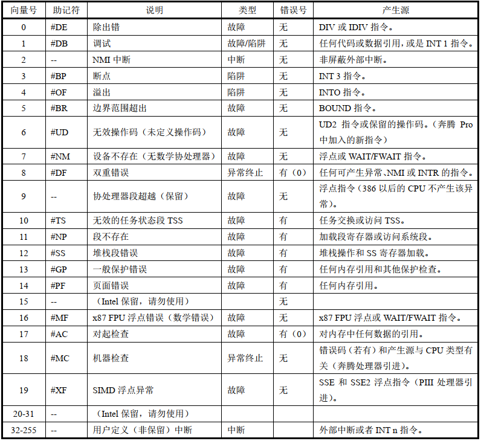
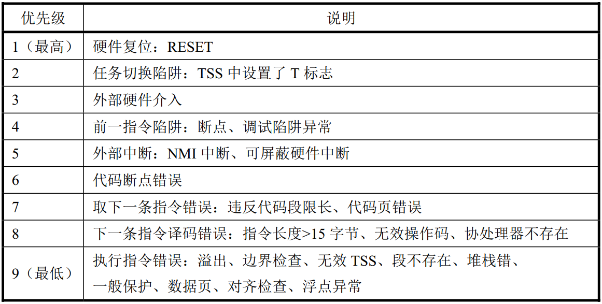
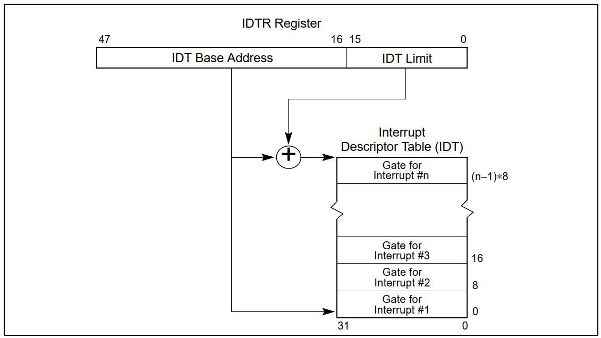
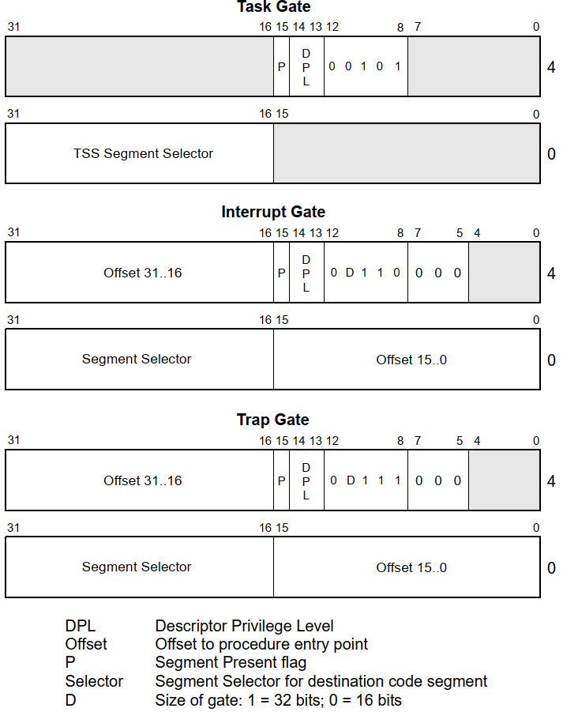
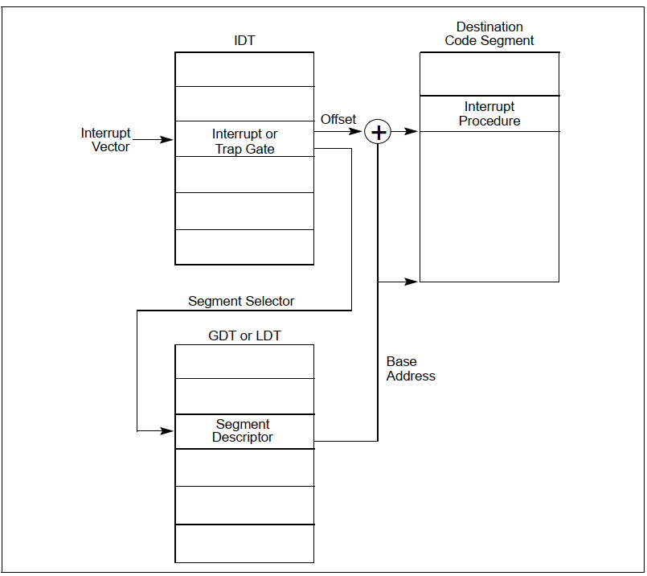
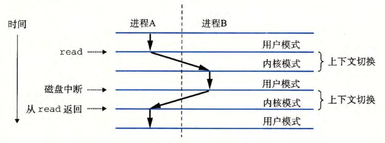
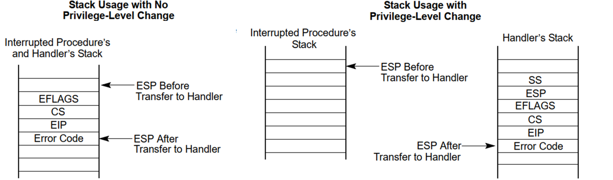

# HIT-OS读书笔记（三）：中断和异常处理

## 1.中断和异常处理概述

### 1.1 中断和异常
**中断**（Interrupt）和**异常**（Exception）是指明系统、处理器或当前执行程序（或任务）的某处出现一个事件，该事件需要处理器进行处理。""

- 通常，中断发生在程序执行的随机时刻，以响应**硬件**发出的信号。系统硬件使用中断来处理外部事件，例如要求为外部设备提供服务。当然，**软件**也能通过执行`INT n`指令产生中断。
- 异常发生在**处理器执行指令**检测到错误条件时，例如除0错误。处理器可以检测到各种出错条件，包括违反保护机制、页错误以及机器内部错误。
  - *Pentium 4、Intel Xeon、P6系列和Pentium处理器的机器检查架构也允许在检测到内部硬件错误和总线错误时生成机器检查异常。*
  - *异常又分为三类：陷阱（Trap）、故障（Fault）和中止（Abort）。*

### 1.2 处理器处理
通常中断和异常会导致执行**控制被强迫**从当前运行程序**转移**到被称为中断处理程序（interrupt handler）或异常处理程序（exception handler）的特殊软件函数或任务中。处理器响应中断或异常所采取的行动被称为**中断/异常服务（处理）**。

对应用程序和操作系统来说，80x86的中断和异常处理机制可以**透明地处理**发生的中断和异常事件。当收到一个中断或检测到一个异常时，处理器会自动地把**当前正在执行的程序或任务挂起**，并开始运行中断或异常处理程序。当处理程序执行完毕，处理器就会**恢复并继续执行**被中断的程序或任务。

>*被中断程序的恢复过程并不会失去程序执行的连贯性，除非异常是不可恢复的或者中断导致当前运行程序被终止。*

### 1.3 中断向量表在两种模式下的比较
实模式和保护模式下的中断向量表（Interrupt Vector Table，IVT）是不同的。

**实模式下的中断向量表：**
在实模式下，中断向量表是一组连续的内存位置，每个位置存储一个4字节的中断向量，用于存放中断服务程序的地址。
- 这些中断向量是从内存地址`0x00000`开始的，依次向上排列，每个中断向量占4个字节，占用从`0x00000`到`0x0003FF`共1KB的空间。
  - 4个字节中，2个字节存储段地址，另外2个字节存储偏移值。
- CPU响应中断请求后，由中断源自动给出中断类型号n送入CPU，由CPU自动完成向量表地址的运算，从向量表中取出中断服务子程序的入口地址送入CS和IP中，将执行的流程控制转移到中断服务子程序。
- 内部中断的向量地址由系统负责装入，用户不能随意修改。用户中断的向量地址在初始化编程时装入。

**保护模式下的中断描述符表：**
在保护模式下，中断描述符表（Interrupt Descriptor Table，IDT）取代了实模式下的中断向量表，充当引导程序到服务程序初始点执行的指针。
- IDT是一个表格，其中每个条目是8字节的中断描述符。每个IDT条目一般包含32位的偏移地址，16位的段选择子以及描述中断处理的其他信息，如特权级别、中断类型等。
- 处理器在响应异常或中断时，采用类似于使用CALL指令调用程序的方法。它使用异常或中断的向量作为中断描述符表（IDT）中的索引，以调用相应的异常处理程序或中断服务程序。
  
## 2.有关中断和异常了解性的内容

### 2.1 中断和异常向量
为了帮助处理异常和中断，每个需要被处理器进行特殊处理的异常和中断条件被分配一个**唯一**的标识号，称为**向量（vector）**。处理器使用分配给异常或中断的向量作为中断描述符表IDT（Interrupt DescriptorTable）的索引标识，来定位一个异常或中断的处理程序入口点位置。向量数的允许范围是0到255。

- 其中0到31保留用作Intel 64和IA-32架构定义的异常和中断，不过目前该范围内的向量号并非每个都已定义了功能，未定义功能的向量号将留作今后使用。
- 范围在32到255的向量号用于用户定义的中断。这些中断通常分配给外部I/O设备，使得这些设备可以通过外部硬件中断机制向处理器发送中断。
  


### 2.2 中断源和异常源

#### 2.2.1 中断源
处理器从两种地方接收中断：

- **外部（硬件产生）的中断**，通过处理器芯片上引脚或本地APIC接收。当本地APIC为全局/硬件禁用时，这些引脚分别配置为INTR和NMI引脚。
  - 外部中断当引脚INTR接收到外部发生的中断信号时，处理器就会从系统总线上读取外部中段控制器（例如8259A）提供的中断向量。
  - 当引脚NMI接收到信号时，就产生一个不可屏蔽中断。
  
  >*中断向量0-255可通过INTR引脚传递；中断向量16-255那些可以通过本地APIC传递；NMI使用固定的中断向量号2*

- **软件产生的中断**，`INT n`指令可用于从软件中产生中断
  - `INT n`指令允许通过提供中断向量号作为操作数从软件内部生成中断(n可取0-255)。
  - 但是，如果使用处理器预定义的NMI向量，则处理器的响应将与以正常方式生成的NMI中断的响应不同，调用NMI中断处理程序，但并不会激活处理器的NMI处理硬件。

> *标志寄存器EFLAGS中的IF标志可用来屏蔽所有这些硬件中断，但不能够屏蔽使用INT指令从软件中产生的中断。*

#### 2.2.2 异常源
处理器从三个来源接收异常:

1. 处理器检测到的**程序错误异常**：处理器在应用程序或操作系统的执行过程中检测到程序错误时，会产生一个或多个异常。Intel 64和IA-32架构为每个处理器可检测的异常定义了一个异常向量。异常可以被细分为**故障**（faults）、**陷阱**（traps）和**中止**（aborts）
2. **软件生成异常**：指令`INTO`、`INT 3`和`BOUND`指令可以用来从软件中产生异常。这些指令可对指令流中指定点执行的特殊异常条件进行检查。
   - `INT n`指令可用于在软件中模拟指定的异常，但有一个限制，不能模拟那些会产生错误码的异常。原因是处理程序则会把EIP（正好处于缺少的错误码位置处）弹出堆栈，从而会造成返回位置错误。
3. **机器检查异常**：P6系列和Pentium处理器提供内部和外部机器检查机制，用于检查内部芯片硬件和总线事务的操作。当检测到机器检查错误时，处理器发出机器检查异常信号(向量18)并返回错误代码。

### 2.3 异常的分类
异常一般出现在当前执行的指令结束后，由CPU主动产生。根据异常被**报告的方式**以及导致异常的指令是否**能够被重新执行**，异常可被细分成故障（Fault）、陷阱（Trap）和中止（Abort）。

- **故障**：故障通常可以纠正，一旦纠正，允许程序重新启动，而**不会失去连续性**。当故障被报告时，处理器将机器状态**恢复到开始执行故障指令之前的状态**。故障处理程序的返回地址(CS和EIP寄存器保存的内容)**指向故障指令**，而不是指向故障指令之后的指令。
- **陷阱**：陷阱是在执行陷阱指令后立即报告的异常，**允许继续执行**程序或任务而**不会失去程序的连续性**。陷阱处理程序的返回地址指向**在陷阱指令之后要执行的指令**。
- **中止**：中止并**不总是报告**引起异常的指令的精确位置，也**不允许重新启动**引起异常的程序或任务。中止用于报告严重的错误，例如硬件错误和系统表中不一致或非法的值。

类别|原因|异步/同步|返回行为
--|--|--|--
中断|来自I/O设备或其他硬件设备的信号|异步|总是返回到下一条指令
陷阱|有意的异常|同步|总是返回到下一条指令
故障|潜在可恢复的错误|同步|可能返回到当前指令
中止|不可恢复的错误|同步|不会返回

### 2.4 程序或任务的重新执行
为了让程序或任务在一个异常或中断处理完之后能重新恢复执行，除了中止之外的所有异常都能报告精确的指令位置，并且所有中断保证是在指令边界上发生。

- **故障类异常**，通常用于处理**访问指令操作数受阻**的情况 
  - 处理器产生异常时保存的**返回指针指向出错指令**，当程序或任务在故障处理程序返回后重新开始执行时，**原出错指令会被重新执行**。
  - 为了确保重新执行对于当前执行程序具有**透明性**，处理器会**保存必要的寄存器和堆栈指针**信息，以使得自己能够返回到执行出错指令之前的状态。
- **陷阱类异常**
  - 处理器产生异常时保存的**返回指针指向引起陷阱操作的后一条指令**。
  - 如果在一条执行控制转移的指令执行期间检测到陷阱，则返回指令指针会反映出控制的**转移情况**。
- **中止类异常**
  - **不支持可靠地重新执行**程序或任务。
  - 中止异常的处理程序通常用来收集异常发生时有关处理器状态的诊断信息，并且尽可能恰当地关闭程序和系统。
- **中断**
  - **严格支持**被中断程序的重新执行而**不会丢失任何连贯性**。
  - 中断所保存的返回指令指针指向处理器获取中断时将要执行的**下一条指令边界处**。
  - 如果刚执行的指令有一个重复前缀，则中断会在当前重复结束并且寄存器已为下一次重复操作设置好时发生。

>*P6系列处理器推测性执行指令的能力不会影响处理器接收中断。中断发生在指令执行的退出阶段的指令边界;因此，它们总是在“有序”指令流中使用。*
  
### 2.5 开启和禁止中断

标志寄存器EFLAGS的**中断允许标志IF**（Interrupt enable Flag）和**恢复标志RF**（Reverse Flag）可用于开启和禁止处理器接收处理中断。
#### 2.5.1 屏蔽硬件中断
IF标志可以禁用从处理器的INTR引脚或通过本地APIC接收的可屏蔽硬件中断的服务。
- 当IF=0时，处理器禁止发送到INTR引脚的中断；
- 当IF=1时，则发送到INTR引脚的中断信号会被处理器进行处理。

但是，IF标志并不影响发送到NMI引脚的非屏蔽中断或通过本地APIC传递的NMI消息，也不影响处理器产生的异常。如同EFLAGS中的其他标志一样，处理器在响应硬件复位操作时也会将IF标志置0。

>可屏蔽硬件中断组包括保留中断和异常向量0到32，当IF=1时，
>- 0到32的任何向量的中断都可以通过INTR引脚传递给处理器
>- 从16到32的任何向量都可以通过本地APIC传递。
>
>而后处理器将生成一个中断，并调用向量号所指向的中断或异常处理程序。

>*但当通过INTR引脚到异常向量生成中断时，处理器不会将错误代码推送到堆栈上，因此异常处理程序可能无法正确操作。*
  
IF标志可以通过以下方式修改：
- 当程序的$CPL \leq IOPL$时，使用指令`STI`和`CLI`来设置或清除。而若$CPL > IOPL$时使用这两条指令会引发通用保护异常(#GP)。
- `PUSHF`指令会把EFLAGS内容存入堆栈中，并且可以在那里被修改。而`POPF`指令可用于把已被修改过的标志内容放入EFLAGS寄存器中。
- 任务切换、`POPF`和`IRET`指令会加载EFLAGS寄存器。因此，它们可用来修改IF标志。
- 当通过中断门处理一个中断时，IF标志会被自动清除（复位），从而会禁止可屏蔽硬件中断。但如果是通过陷阱门来处理一个中断，则IF标志不会被复位。

#### 2.5.2 屏蔽指令断点
EFLAGS寄存器中的RF(恢复)标志控制处理器对指令断点条件的响应，能够防止处理器在指令断点上进入调试异常循环。
- 当RF=1时，能够防止断点指令生成调试异常(#DB);
- 当RF=0时，处理器执行到断点指令时将生成调试异常。

#### 2.5.3 切换堆栈时屏蔽异常和中断
为了切换到不同的堆栈段，软件通常使用一对指令，例如:
```
  MOV SS, AX
  MOV ESP, StackTop 
```
如果中断或异常发生在段选择器被加载到SS寄存器之后，但在ESP寄存器被加载之前，那么在中断或异常处理程序的持续时间内，进入堆栈空间的逻辑地址的这两个部分是不一致的。

为了防止这种情况，处理器在`MOV To SS`指令或`POP To SS`指令之后**禁止中断、调试异常和单步陷阱异常**，直到到达下一条指令之后的指令边界。（但还可能会产生其他故障，因而一般使用`LSS`指令修改SS寄存器的内容）

### 2.6 异常和中断的优先级
如果在一条指令边界有多个异常或中断等待处理时，处理器会**按规定的次序**对它们进行处理。 

处理器会首先处理最高优先级类中的异常或中断。低优先级的异常会被**丢弃**，而低优先级的中断则会**被挂起**。当中断处理程序返回到产生异常和/或中断的程序或任务时，被丢弃的异常会**重新发生**。



## 3.中断描述符表

### 3.1 中断描述符表构成
中断描述符表IDT（Interrupt Descriptor Table）将每个异常或中断向量分别与它们的处理过程联系起来。
- 与GDT和LDT类似，IDT也是由8字节长描述符组成的一个数组。
- 与GDT不同的是，表中第1项可以包含描述符。同时IDT表中的索引值为异常或中断的向量号乘上8。
$$索引值Index=Vector \times 8$$
- 因为最多只有256个中断或异常向量，所以IDT无需包含多于256个描述符。
- IDT中所有空描述符项应该设置其存在位（标志）为0。



### 3.2 中断处理程序的地址获取
>*IDT的基址应该在8字节的边界上对齐，以最大化缓存线填充的性能。界限值以字节表示，并将其添加到基址中以获得最后一个有效字节的地址（极限为$8N-1$）。*

IDT表可以驻留在线性地址空间的**任何地方**，处理器使用IDTR寄存器来定位IDT表的位置。寄存器IDTR中含有IDT表32位的基地址和16位的界限值。

使用IDT的基地址和中断向量号，你可以定位到相应的**中断描述符**。每个中断描述符包含了中断处理程序的地址以及其他相关信息，根据相应的计算方式即可获得中断处理程序的地址。

### 3.3 设置中断描述符表寄存器
`LIDT`(加载IDT寄存器)和`SIDT`(存储IDT寄存器)指令分别加载和存储IDTR寄存器的内容。
- `LIDT`指令将保存在内存操作数中的基址和限制加载到IDTR寄存器中。
  - 该指令只能在CPL为0时执行，通常由操作系统的初始化代码在创建IDT时使用。
  - 操作系统也可以使用`LIDT`指令从一个IDT切换到另一个IDT。
- `SIDT`指令将存储在IDTR中的基值和限制值复制到内存中。
  - 该指令可以在任何特权级别上执行。
  
如果一个向量引用的描述符超出了IDT的限制，就会生成一个通用保护异常(#GP)。

## 4.IDT 描述符
IDT可以包含以下三种门描述符：
- **Task-gate任务门**描述符。任务门用于**任务切换**，允许操作系统在不同任务间进行切换。
- **Interrupt-gate中断门**描述符。中断门用于处理**异步**事件，如硬件中断或外部中断，允许系统在发生中断时转移到特定的处理程序。
- **Trap-gate陷阱门**描述符。陷阱门与中断门类似，但用于处理**同步**事件，如系统调用或异常。陷阱门**不会影响处理程序之前的特权级别**。

门描述符用于描述**可执行代码**，比如：一段程序、一个过程（例程、子程序）或者一个任务，存储段选择子。其格式中的DPL字段指定门的特权级别，而P位表示描述符是否存在。
- IDT中使用的任务门的格式与GDT或LDT中使用的任务门的格式相同，包含用于异常或中断处理程序任务的**TSS的段选择子**。
- 中断门和陷阱门与调用门非常相似。它们包含一个**远指针(段选择器和偏移量)**，处理器使用它将程序执行转移到异常或中断处理程序代码段中的处理程序过程。

>*这些门的不同之处在于处理器在EFLAGS寄存器中处理IF标志的方式。**中断门会清除EFLAGS中的IF位，而陷阱门则不会**，这使它们成为处理硬件中断的理想选择。陷阱门广泛用于硬件辅助虚拟化。*



## 5.中断与异常处理
处理器对异常和中断处理过程的调用操作方法与使用CALL指令调用程序过程和任务的方法类似。当响应一个异常或中断时，处理器使用异常或中断的向量作为IDT表中的索引。
- 如果索引值指向中断门或陷阱门，则处理器使用与CALL指令操作**调用门**类似的方法调用异常或中断处理过程。
- 如果索引值指向任务门，则处理器使用与CALL指令操作**任务门**类似的方法进行任务切换，执行异常或中断的处理任务。
### 5.1 中断的调用流程
中断门或陷阱门引用在当前执行任务的上下文中运行的异常或中断处理程序。门中的段选择子指向GDT或当前LDT中可执行代码段的段描述符。门描述符的偏移字段指向异常或中断处理过程的开始。


### 5.2 中断处理过程与被中断任务的优先级比较
在x86架构中，处理器一般具有4个特权级别（0是最高特权级，3是最低特权级），一般存在于描述符及段选择子中，进行某些操作或被别的对象访问时，可用于控制进行的操作或者限制访问。主要包括以下概念：

- **描述符特权级（DPL，Descriptor Privilege Level）**：位于段描述符中，表示该段的特权级别，决定了哪些特权级的程序可以访问该段。
- **当前特权级（CPL，Current Privilege Level）**：存在于CS段寄存器中，当前执行代码的特权级别，由当前运行的代码决定。
- **请求特权级（RPL，Request Privilege Level）**：位于段选择子中，指定对段的请求访问权限级别，由程序员或系统软件设置。
  
在判断中断处理过程与被中断任务的优先级时，主要依赖于中断服务程序和被中断任务的特权级别（CPL、RPL、DPL）：
- 处理器会检查中断描述符中的**DPL（中断处理程序优先级）字段**，比较它与当前特权级**CPL（被中断任务优先级）字段**的值。
  - 如果DPL高于或等于CPL，表示当前特权级足够高，可以访问该中断服务程序；
  - 否则，将会引发权限异常。
- 如果特权级别检查通过，处理器会执行中断服务程序。在执行过程中，通常会切换到更高特权级（如内核态，CPL 0）以执行中断服务程序中需要的特权操作。

>*对于一般的中断，控制权会首先转移给中断处理器，CPU进入内核态（CPL=0），中断处理器完成一些基本的辅助工作后，再将控制权转给与已发生的特定中断相关的操作系统例程。*



### 5.3 不同优先级的处理方式

当有多种中断源时，则需要判定响应优先级和处理优先级
- **中断响应优先级**是由硬件排队线路或中断查询程序的查询顺序决定的，不可动态改变；
- 而**中断处理优先级**可以由中断屏蔽字来改变，反映的是正在处理的中断是否比新发生的中断的处理优先级低（屏蔽位为‘0’，对新中断开放），如果是的话，就中止正在处理的中断，转到新中断去处理，处理完后再回到刚才被中止的中断继续处理

中断处理程序的处理方式可能会根据不同的优先级有所不同，特别是在多级中断处理系统中。
- 高优先级中断一般对应更高的特权级，能够被更快的响应和处理，可以能够调用更多的资源和权限执行特权操作，且一般不会嵌套响应低优先级中断；
- 而较低特权级别的中断则受到限制，同时可能在高优先级中断出现时需要暂时挂起。

>*同时，在调用中断处理程序时也与当前执行任务的特权级具有关联。*

### 5.4 处理器执行异常/中断处理程序
当处理器执行异常处理程序或中断处理程序的调用时:
- 如果处理程序过程将在数字上较**低**的特权级别上执行，则会发生**堆栈切换**。发生堆叠切换时:
  1. 处理程序要使用的堆栈的段选择器和堆栈指针是从当前执行任务的TSS中获得的。在这个新的堆栈上，处理器推送被中断过程的堆栈段选择器和堆栈指针。
  2. 处理器将EFLAGS、c和EIP寄存器的当前状态保存到新的堆栈中。
  3. 如果异常会产生一个错误码，则将错误码压入EIP值之后的新堆栈。
- 如果处理程序过程将以与被中断过程**相同的特权级别**执行:
  1. 处理器保存当前堆栈中EFLAGS、CS和EIP寄存器的当前状态。
  2. 如果异常会产生一个错误码，则将错误码压入EIP值之后的当前堆栈。



### 5.5 中断返回
要从异常处理程序或中断处理程序中返回，处理程序必须使用`IRET(或IRETD)`指令。`IRET`指令与`RET`指令类似，除了它将保存的标志恢复到EFLAGS寄存器中。
- 当$CPL=0$时，EFLAGS寄存器的IOPL字段会被恢复
- 而当$CPL \leq IOPL$时，IF标志会被改变。

如果在调用处理程序过程时发生堆栈切换，则`IRET`指令在返回时切换回被中断过程的堆栈。

### 5.6 异常和中断处理程序的保护
异常和中断处理过程的特权级保护机制与通过调用门调用普通进程类似。处理器不允许把控制转移到比CPL更低的特权级代码段的中断处理过程中，否则会产生通用保护异常(#GP)。

另外，中断和异常的保护机制在以下方面与一般调用门过程不同：
- 中断和异常向量没有RPL，因而在对异常和中断处理程序的隐式调用时不检查RPL。
- 只有当异常或中断由`INT n`、`INT 3`或`INTO`指令产生时，处理器才检查中断或陷阱门的DPL（CPL必须**小于或等于**门描述符的DPL）。
  - 此限制防止在特权级别3上运行的应用程序或过程使用软件中断访问关键异常处理程序。
  - 对于硬件产生的中断和处理器检测到的异常，处理器忽略中断和陷阱门的DPL。

由于异常和中断通常不会在可预测的时间发生，因此这些特权规则有效地对运行异常和中断处理过程的特权级别施加了限制。但可以利用以下技术之一来避免违反特权级保护规则：
- 异常或中断处理程序可以放在一个**一致性代码段**中。此技术可用于**只需要访问**堆栈上可用**数据**的处理程序。
- 该处理程序可以放置在**特权级别为0的非一致性代码**段中。无论被中断的程序或任务的当前特权级CPL，该处理程序总是能够运行。

### 5.7 异常和中断处理过程的标志使用方式
当通过中断门或陷阱门访问异常或中断处理程序时，处理器会在把EFLAGS寄存器内容保存到堆栈上之后清除EFLAGS中的TF标志。清除TF标志可以防止指令跟踪影响中断响应。随后使用`IRET`指令从堆栈中内容恢复EFLAGS的原TF标志。

>*在调用异常和中断处理程序时，处理器还清除EFLAGS寄存器中的VM、RF和NT标志，然后将它们保存在堆栈上。*

中断门与陷阱门**唯一的区别**在于处理器操作EFLAGS寄存器IF标志的方法。
- 当通过中断门访问一个异常或中断处理过程时，处理器会**复位IF标志**以防止其他中断干扰当前中断处理过程。随后的`IRET`指令则会用保存在堆栈上的内容恢复EFLAGS寄存器的IF标志。
- 而通过陷阱门访问处理过程并**不会影响IF标志**。

  