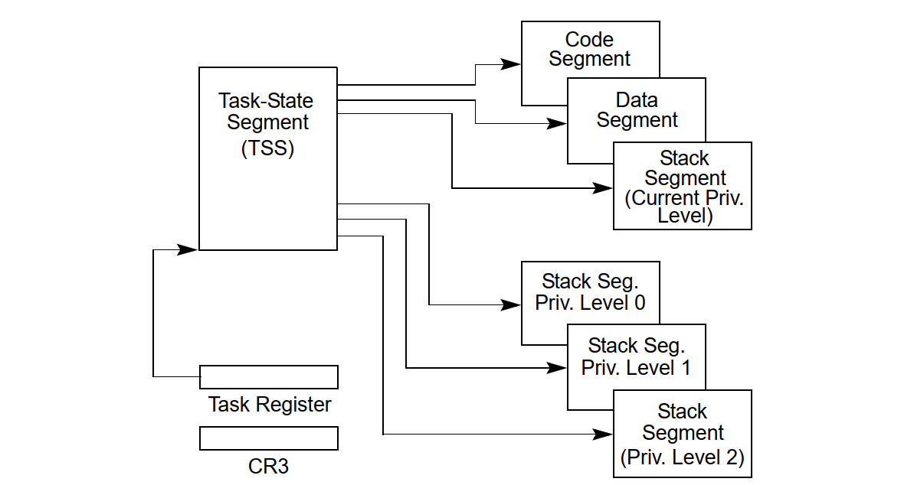
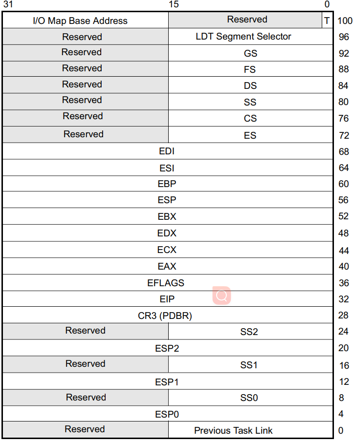
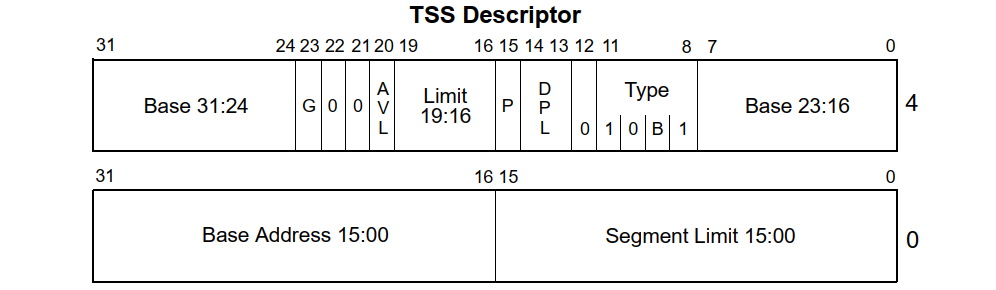
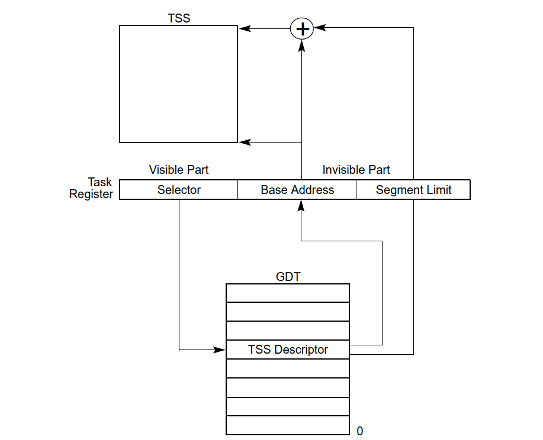
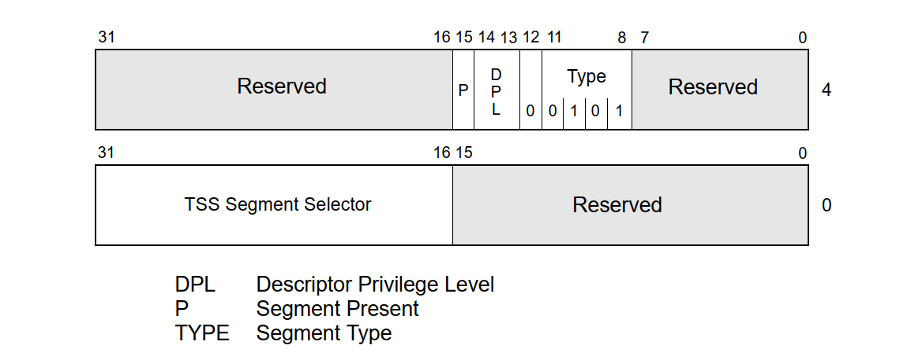
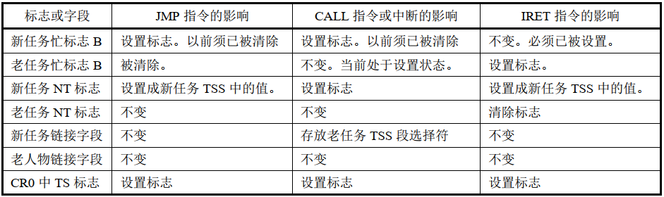
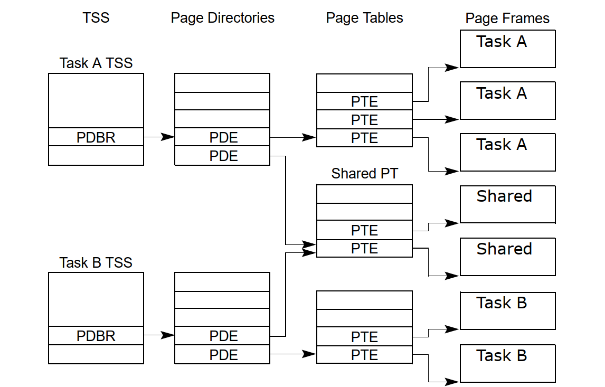

# HIT-OS读书笔记（四）：任务管理

## 1. 任务管理概述
#### 任务
任务是处理器可以**分派、执行和挂起的工作单元**，用于执行程序、任务或进程、操作系统服务实用程序、中断或异常处理程序、内核或执行实用程序。

#### 硬件支持
IA-32架构提供了一种机制，用于**保存任务的状态，调度任务执行以及任务切换**。在保护模式下，所有处理器的执行都在任务内进行。即使是简单的系统也必须定义至少一个任务。更复杂的系统可以使用处理器的任务管理功能来支持多任务应用程序。

`80x86`架构提供了多核处理器、多线程支持、分段与分页机制、任务状态段(TSS)、任务门、中断描述符表(IDT)、任务切换指令、本地APIC、调度优先级等硬件特性，为操作系统实现任务管理和多任务处理提供基本支持。

#### 任务状态段描述符和任务门
任务是一个**正在运行的程序**，或者是一个等**待准备运行的程序**。通过中断、异常、跳转或调用，我们可以执行一个任务。当这些控制转移形式之一和某个描述符表中指定项的内容一起使用时，那么这个描述符就是一类导致新任务开始执行的描述符。

描述符表中与任务相关的描述符有两类：**任务状态段描述符和任务门**。当执行权传给这任何一类描述符时，都会造成任务切换。

#### 任务切换和过程调用
任务切换与过程调用相似，但存在一些区别：
- 任务切换会保存**更多的处理器状态信息**，因为任务切换会把控制权完全转移到一个新的执行环境，即新任务的执行环境。这种转移操作要求保存处理器中几乎所有寄存器的当前内容，包括标志寄存器EFLAGS和所有段寄存器。
- 与过程调用不同，任务切换**不会把任何信息压入堆栈中**，处理器的状态信息都被保存在内存中称为任务状态段（Task state segment）的数据结构中。

### 1.1 任务的结构
任务由**两部分**组成：任务执行空间和任务状态段TSS

#### 任务执行空间
- 由**代码段、堆栈段**和一个或多个**数据段**组成
- 如果操作系统或执行程序使用处理器的特权级保护机制，则任务执行空间还为每个特权级别提供**单独的堆栈**。（**存在多个特权级栈空间的原因**）
  

#### 任务状态段(TSS)。
-  TSS指定组成任务执行空间的段，并为任务状态信息提供存储位置。
-  在多任务系统中，在多任务环境中，TSS为任务之间的链接提供了处理方法。任务由其TSS的段选择子标识。当一个任务被加载到处理器中执行时TSS的段选择子、基址、限制和段描述符属性被加载到任务寄存器中。

>*如果使用了分页机制，则当一个任务被加载进处理器中执行时，任务使用的页目录的基址也将加载到控制寄存器CR3中。*

### 1.2 任务状态
当前执行任务的状态由处理器所有以下内容组成:
- 任务的当前执行空间，由段寄存器(CS、DS、SS、ES、FS和GS)中的段选择子定义
- 所有通用寄存器的状态
- EFLAGS寄存器、EIP寄存器、控制寄存器CR3、任务寄存器和LDTR寄存器的状态
- I/O映射基址和I/O映射(包含在TSS中)
- 指向特权0、1和2堆栈的堆栈指针(包含在TSS中)
- 链接到先前执行的任务的指针(包含在TSS中)

在调度任务之前，除了任务寄存器的状态外，所有这些项都包含在任务的TSS中。但是，LDTR寄存器的完整内容并不包含在TSS中，只包含LDT的段选择子。

这些状态信息是任务的**运行时环境**，记录了任务执行的**位置、状态和上下文信息**。在进行任务切换时，需要保存当前任务的这些状态信息，以便稍后恢复到相同的执行点并继续执行。任务切换发生时，操作系统会将当前任务的状态信息保存到TSS中或其他数据结构中，然后切换到新任务的状态信息，确保**任务的切换和执行的连续性**。
### 1.3 任务的执行

#### 任务执行方式
软件或处理器可以通过下列方式之一调度任务执行:
- 使用`CALL`指令对任务的**显式**调用
- 使用`JMP`指令**显式**地跳转到任务（*Linux内核使用的方式*）
- (由处理器)对中断处理程序任务的隐式调用
- 对异常处理程序任务的隐式调用
- 使用`IRET`指令返回（EFLAGS寄存器中的NT标志为1）
  
#### 任务执行过程
所有这些调度任务执行的方法都会使用一个指向任务门或任务TSS段的选择子来确定一个任务。
- 当使用`CALL`或`JMP`指令调度一个任务时，指令中的选择子
  - 可以直接选择任务的TSS
  - 也可以选择存放有TSS选择子的任务门。
- 当调度一个任务来处理一个中断或异常时，那么IDT中该中断或异常表项**必须是一个任务门**，并且其中含有中断或异常处理任务的TSS选择子。

当任务被调度执行时，会在当前运行的任务和被调度的任务之间发生**任务切换**。
1. 在任务切换期间，当前执行任务的**执行环境**(称为任务的状态或上下文)**保存**在其TSS中，并暂停当前任务的执行。
2. 然后将已分派任务的**上下文加载**到处理器中，该任务的执行从新加载的EIP寄存器所指向的指令开始。
   - 如果任务在系统初始化后还没有运行过，EIP将指向任务代码的第一条指令;
   - 否则，它将指向任务在最后一次活动时执行的最后一条指令之后的下一条指令。

>*如果当前执行的任务(调用任务)调用正在分派的任务(被调用任务)，则调用任务的TSS段选择器存储在被调用任务的TSS中，以提供回调用任务的链接。*

#### 不可递归调用
对于所有IA-32处理器，**任务都不是递归的**，即任务不能调用或跳转到自己。

**中断和异常**可以通过任务切换到处理程序任务来处理。在这里，处理器执行任务切换来处理中断或异常，并在从中断处理程序任务或异常处理程序任务返回时**自动切换回**被中断的任务。该机制还可以处理在**中断任务期间发生的中断**。

作为任务切换的一部分，处理器还可以**切换到另一个LDT**，允许每个任务对基于LDT的段具有不同的逻辑到物理地址映射。页目录基寄存器(CR3)也在切换时被重新加载，从而允许每个任务拥有自己的一组页表，有助于**隔离任务防止相互干扰**。

>*使用任务管理工具来处理多任务应用程序是可选的，可以使用软件来实现多任务，使得每
个软件定义的任务在一个IA-32架构的任务上下文中执行。*

## 2. 任务的数据结构
处理器定义了五种数据结构来处理与任务相关的活动：
- 任务状态段(TSS)
- 任务门描述符
- TSS描述符
- 任务寄存器TR
- EFLAGS寄存器中NT标志。

>*在保护模式下运行时，必须为至少一个任务创建TSS和TSS描述符，并且必须将TSS的段选择器加载到任务寄存器中(使用`LTR`指令)。*

### 2.1 任务状态段Task-State Segment(TSS)
恢复任务所需的处理器状态信息保存在称为任务状态段(TSS)的系统段中。TSS的字段分为两大类：动态字段和静态字段。
1. **动态字段**。当任务在任务切换期间挂起时，处理器**更新动态字段**。
   - 通用寄存器字段-保存任务切换前EAX、ECX、EDX、EBX、ESP、EBP、ESI和EDI寄存器的状态。
   - 段选择子字段-保存在任务切换之前存储在ES、CS、SS、DS、FS和GS寄存器中的段选择子。
   - EFLAGS寄存器字段-保存任务切换前EFAGS寄存器的状态。
   - EIP(指令指针)字段-保存任务切换前EIP寄存器的状态。
   - 先前任务链接字段-包含前一个任务的TSS的段选择子（在由调用、中断或异常发起的任务切换上更新，允许使用`IRET`指令将任务切换回前一个任务）。
2. **静态字段**。处理器**读取静态字段**，但通常**不更改**它们。在创建任务时设置这些字段。以下是静态字段:
   - LDT段选择子字段-包含任务LDT的段选择子。
   - CR3控制寄存器字段-页目录基寄存器，包含任务要使用的页目录的基本物理地址。
   - 特权级别0、1和2堆栈指针字段-这些堆栈指针由堆栈段段选择子(SS0、SS1和SS2)和堆栈中的偏移量(ESP0、ESP1和ESP2)组成。
        >*请注意，对于特定任务，这些字段中的值是静态的;然而，如果任务内部发生堆栈交换，则寄存器SS和ESP内容将发生变化。*
   - 调试陷阱T标志字段-当设置T=1，有任务切换到该任务时，处理器会引发一个调试异常
   - I/O映射基址—包含从TSS基址到I/O权限位图和中断重定向位图的16位偏移量。
        >*当存在时，这些映射存储在TSS较高的地址。I/O映射基址指向I/O权限位映射的开始和中断重定向位映射的结束。*

如果使用分页机制，需要注意:
- 在任务切换期间应该避免处理器操作的TSS段中（前104字节中）含有内存页边界。如果边界出现在该区域，处理器可能无法正确执行地址转换。
- 与前一个任务的TSS、当前任务的TSS以及每个任务的描述符表项相对应的页面都应该被标记为读/写。
- 如果包含这些结构的页在任务切换启动之前就存在于内存中，则任务切换执行得更快。

### 2.2 TSS描述符
TSS（任务状态段），像所有其他段一样，由段描述符定义。
- TSS描述符**只能放置在**全局描述符表（**GDT**）中，不能放置在局部描述符表（LDT）或中断描述符表（IDT）中。
- 尝试使用TI标志设置（表示当前LDT）的段选择子访问TSS会在`CALL`和`JMP`期间引发通用保护异常（#GP），在`IRET`期间引发无效TSS异常（#TS）。
- 如果尝试将TSS的段选择符加载到段寄存器中，也会引发通用保护异常。

TSS描述符格式与其他段描述符相似：

- Type字段中的忙碌标志（B）指示任务是否处于**忙碌状态**。
  - 1001B表示任务处于非活动状态；
  - 1011B表示忙碌任务，表示当前正在执行的任务或等待执行（被挂起）的任务。
  >*任务是不可以递归执行的，因此处理器使用忙碌标志来检测对已中断任务执行调用的尝试。*

- 基地址、段限长、描述符特权级DPL、颗粒度G和存在位P具有与数据段描述符中相应字段同样的功能。
  - 当G标志为0时，限长字段必须具有等于或大于`67H`的值，即比TSS的最小大小少一个字节。试图切换到TSS描述符的限长小于`67H`的任务会引发无效TSS异常（#TS）。
  - 如果包括I/O权限位图或操作系统存储额外数据，则需要更大的限长。
  > *处理器在任务切换时不会检查限长是否大于`67H`；然而，在访问I/O权限位图或中断重定向位图时会进行检查。*

使用调用或跳转指令，任何可以访问TSS描述符（即其CPL数值等于或小于TSS描述符的DPL）的程序都能够通过调用或跳转来进行任务切换。

>*在大多数系统中，TSS描述符的DPL被设置为小于3的值，以便只有特权软件可以执行任务切换。然而，在多任务应用中，对于一些TSS描述符，DPL可能被设置为3，以允许在应用程序（或用户）特权级别进行任务切换。*

### 2.3 任务寄存器TR
任务寄存器保存了**16位段选择子和当前任务TSS的整个段描述符**。在处理器上电或复位时，段选择符和基地址被设置为默认值0；限长被设置为`FFFFH`。

任务寄存器有一个**可见部分（可以被软件读取和更改）和一个不可见部分（由处理器维护，软件无法访问）**。
- 可见部分中的段选择符指向GDT中的TSS描述符。`LTR`（加载任务寄存器）和`STR`（存储任务寄存器）指令加载和读取任务寄存器的可见部分：
  - `LTR`指令将一个段选择符（源操作数）加载到任务寄存器中，该段选择符指向GDT中的TSS描述符。然后，它将任务寄存器的不可见部分加载为来自TSS描述符的信息。
  > *`LTR`是一个特权指令，只能在CPL为0时执行。它在系统初始化期间用于将初始值放入任务寄存器。随后，在任务切换发生时，任务寄存器的内容会在隐式情况下被更改。*
  - `STR`指令将任务寄存器的可见部分存储在通用寄存器或内存中。这个指令可以由任何特权级别的运行代码执行，以标识当前运行的任务。
  >*通常只由操作系统软件使用。*
- 处理器使用任务寄存器的不可见部分来缓存TSS的段描述符。在寄存器中缓存这些值可以使任务的执行更高效。

### 2.4 任务门描述符Task-Gate Descriptor
任务门描述符提供对任务的**间接受保护引用**。它可以放置在GDT、LDT或IDT中。任务门描述符中的TSS段选择符字段指向GDT中的TSS描述符。该段选择符中的RPL字段不被使用，当使用任务门时，目标TSS描述符的DPL不会被使用。
>*LDT中的任务门、GDT中的任务门和IDT中的任务门都可以指向同一个任务。*

任务门描述符的DPL控制了在任务切换期间对TSS描述符的访问。当程序或进程通过任务门对任务进行调用或跳转时，指向任务门的门选择符的CPL和RPL字段必须小于或等于任务门描述符的DPL。

任务可以通过任务门描述符或TSS描述符进行访问。这两种结构满足以下需求：

- 需要每个任务**忙碌标志唯一**：因为任务的忙碌标志存储在TSS描述符中，每个任务应该只有一个TSS描述符。然而，可能会有多个任务门引用相同的TSS描述符。
- 需要对任务进行**选择性访问**：任务门满足这一需求，因为它们可以存在于LDT中，并且可以具有与TSS描述符的DPL不同的DPL。对于没有足够特权以访问GDT中任务的TSS描述符（通常具有DPL为0）的程序或过程，可以通过具有更高DPL的任务门访问任务。任务门为操作系统提供了**更大的自由度**，以限制对特定任务的访问。
- 需要将中断或异常由**独立任务处理**：任务门也可以存在于IDT中，这允许通过处理任务的处理程序处理中断和异常。当中断或异常向量指向任务门时，处理器切换到指定的任务。

## 3. 任务切换

### 执行任务切换的情况
处理器在以下四种情况下将执行任务切换：
- 当前程序、任务或过程执行`JMP`或`CALL`指令以访问GDT中的TSS描述符。
- 当前程序、任务或过程执行`JMP`或`CALL`指令以访问GDT或当前LDT中的任务门描述符。
- 中断或异常向量指向IDT中的任务门描述符。
- 当EFLAGS寄存器中的NT标志为1时，当前任务执行`IRET`指令。

`JMP`、`CALL`和`IRET`指令，以及中断和异常，都是用于重定向程序的机制。通过引用TSS描述符或任务门（在调用或跳转到任务时），或者`IRET`指令的执行时EFLAGS寄存器的NT标志的状态，决定是否进行任务切换。

### 处理器操作
处理器在切换到新任务时执行以下操作：

1. 通过`JMP`或`CALL`指令的操作数、任务门或先前任务的链接字段（对于由`IRET`指令引发的任务切换）**获得新任务的TSS段选择符**。
2. **特权级检查**，检查当前（旧的）任务是否允许切换到新任务。
   - 数据访问特权规则适用于`JMP`和`CALL`指令。当前任务的CPL和新任务的段选择符的RPL必须小于或等于被引用的TSS描述符或任务门的DPL。
   - 异常、中断（除了由`INT n`指令生成的中断）和`IRET`指令可以不考虑目标任务门或TSS描述符的DPL而进行任务切换。
   - 对于由`INT n`指令生成的中断，会检查DPL。
3. **存在有效性检查**，检查新任务的TSS描述符是否标记为存在且具有有效的限长（大于或等于`67H`）。
4. **可用性检查**，检查新任务是可用（调用、跳转、异常或中断）还是忙碌（`IRET`返回）。
5. **内存检查**，检查当前（旧的）TSS、新TSS以及在任务切换中使用的所有段描述符是否已经分页到系统内存中。
6. **忙碌标志B清除判断**
   - 如果任务切换是由`JMP`或`IRET`指令引发的，处理器会清除当前（旧的）任务的TSS描述符中的忙碌（B）标志；
   - 如果是由`CALL`指令、异常或中断引发的，则保持忙碌（B）标志。
7. **NT标志清除判断**
   - 如果任务切换是由`IRET`指令引发的，处理器会清除暂存的EFLAGS寄存器图像中的NT标志；
   - 如果是由`CALL`或`JMP`指令、异常或中断引发的，则保持暂存的EFLAGS图像中的NT标志不变。
8. **保护现场**，将当前（旧的）任务的状态保存到当前任务的TSS中。处理器通过在任务寄存器中查找当前TSS的基地址，然后将以下寄存器的状态复制到当前TSS中来完成此操作：
   - 所有通用寄存器
   - 段寄存器的段选择符
   - EFLAGS寄存器的暂存图像
   - 指令指针寄存器（EIP）
9.  **NT标志设置判断**
    - 如果任务切换是由`CALL`指令、异常或中断引发的，处理器将在从新任务加载的EFLAGS中设置NT标志。
    - 如果是由`IRET`指令或`JMP`指令引发的，则NT标志将反映新任务加载的EFLAGS中NT的状态。
10. **忙碌标志B设置判断**
    - 如果任务切换是由`CALL`指令、`JMP`指令、异常或中断引发的，处理器将在新任务的TSS描述符中设置忙碌（B）标志；
    - 如果是由`IRET`指令引发的，则保持忙碌（B）标志。
11. 使用新任务TSS的段选择符和描述符**加载任务寄存器**。
12. **将TSS状态加载到处理器**，在加载TSS状态期间发生故障可能会损坏系统架构，尝试在之前的执行环境中处理该错误
    - LDTR寄存器、PDBR（控制寄存器CR3）、EFLAGS寄存器、EIP寄存器
      - 如果未启用分页，则会从新任务TSS中读取PDBR值，但不会加载到CR3中。
    - 通用寄存器
    - 段选择符。
    
13. **加载并验证与段选择符相关联的描述符**。与此加载和验证相关的任何错误都发生在*新任务的上下文中*，并可能损坏系统架构，在开始执行新任务之前生成适当的异常。
14. 开始**执行新任务**。（对于异常处理程序而言，新任务的第一条指令尚未执行。）

>*如果所有的检查和保存都成功完成，处理器会执行任务切换。如果在步骤1到11中发生了无法恢复的错误，处理器不会完成任务切换，并确保将处理器返回到执行引发任务切换的指令之前的状态。*

在切换任务时，新任务的特权级别**不会继承**自暂停的任务，新任务的特权级与原任务的特权级没有任何关系。新任务会从CS寄存器的CPL字段指定的特权级别开始执行，该特权级别从TSS中加载。由于任务通过其单独的地址空间和TSS进行隔离，并且特权级规则控制对TSS的访问，因此软件无需在任务切换时执行显式的特权级别检查。

每次任务切换都会设置控制寄存器CR0中的任务切换标志TS。当产生浮点异常时，系统软件可用TS标志来协调处理器和浮点协处理器之间的操作。TS标志表明协处理器中的上下文可能与当前任务不一致。

### 中断/陷阱门与任务切换
在IA-32架构中，中断或异常向量指向IDT表中的中断门或陷阱门时，通常不会发生任务切换。中断门和陷阱门是用于处理中断和异常的两种机制，它们允许在特定的中断或异常发生时转移控制流到指定的处理程序，而**不会导致特权级别的改变或任务切换**。这些门的设计目的是为了提供一种可靠的处理中断和异常的方式，并**不提供直接**的任务切换功能。

如果想在中断或异常时进行任务切换，可以在中断或异常处理程序中使用任务门来改变特权级别，从而实现任务切换。
## 4. 任务链

### 任务嵌套
TSS的前一个任务链接字段和EFLAGS寄存器中的NT标志用于将执行返回到前一个任务。

>**EFLAGS.NT = 1表示当前正在执行的任务嵌套在另一个任务的执行内部**

对于不同情形下的任务切换，**发生任务嵌套**的情况也不相同：
- 当使用`CALL`指令、中断或异常导致任务切换时，处理器将当前TSS的段选择符复制到新任务的TSS的前一个任务链接字段，然后在EFLAGS中设置NT标志为1。指明TSS的前一任务链接字段中存放有保存的TSS段选择符
- 如果软件使用`IRET`指令来挂起新任务，处理器会**检查**NT标志是否为1，然后使用前一个任务链接字段中的值返回到前一个任务。
- 但是，当`JMP`指令导致任务切换时，新任务**不会嵌套**。前一个任务链接字段不会被使用，并且NT标志为0。当不需要嵌套时，可以使用`JMP`指令来分派新任务。

NT标志可以由在任何特权级别下执行的软件修改。程序可以设置NT标志并执行`IRET`指令。这可能会随机调用当前任务的TSS中前链接字段中指定的任务。为防止这种意外的任务切换成功，操作系统应该在创建的每个TSS中将前一个任务链接字段初始化为0。

>*注意，运行于任何特权级上的程序都可以修改NT标志并执行`IRET`指令。这种做法会让处理器去执行当前任务TSS的前一任务链接字段指定的任务。为了避免这种伪造的任务切换执行成功，操作系统应该把每个TSS的该字段初始化为0。*

### 任务嵌套标志位影响
任务切换会修改忙**标志B、 NT标志、前一任务链字段和TS标志**等，不同情形下的任务嵌套对应不同的标志状态。

### 任务嵌套返回
在任务嵌套的情况下，一般使用`IRET`指令恢复前一个任务的状态，并从前一个任务的入口点继续执行，需要以下步骤：

1. **检查NT标志**：首先需要检查EFLAGS寄存器中的NT标志，确保它被设置为1，表示当前任务是嵌套在另一个任务中。
2. **获取前一任务链接字段**：从当前任务的TSS中获取前一个任务链接字段的值，该字段存储了前一个任务的TSS段选择子。
3. **加载前一任务链接字段**：使用前一任务链接字段中的TSS段选择子，将其加载到任务寄存器TR中。
4. **清除NT标志**：将EFLAGS寄存器中的NT标志清除（设置为0），表明当前任务不再是嵌套任务。
5. **执行`IRET`指令**：执行`IRET`指令，该指令会将控制流返回到前一个任务，并从前一个任务的TSS中加载相应的寄存器状态，完成任务切换。

### 任务链移除
在单处理器系统中，如果需要将任务从链接任务链中移除，可以使用以下过程来移除任务：

1. 关闭中断。
2. 更改抢占任务（挂起要移除的任务的任务）的TSS中的前一个任务链接字段。假定抢占任务是链中下一个任务（更新的任务）。将前一个任务链接字段更改为指向链中下一个较旧任务的TSS，或指向链中更之前的任务。
3. 清除要从链中移除的任务的TSS段描述符中的忙标志B。如果要从链中移除多个任务，则必须清除每个要移除任务的繁忙标志。
4. 启用中断。

在多处理器系统中，必须向该过程添加额外的同步和序列化操作，以确保在前一个任务链接字段更改和忙标志清除时，TSS及其段描述符都被锁定，避免并发冲突。

## 5. 任务地址空间

### 概述
任务地址空间是指**操作系统或程序为每个任务分配的内存地址范围**，是一种**逻辑抽象**，其中包括该任务可以访问和操作的内存区域。这个地址空间用于存储任务的代码、数据、堆栈以及其他可能需要的信息。

一个任务的地址空间**包括该任务可以访问的段**。这些段包括**TSS中引用的代码、数据、堆栈和系统段，以及任务代码访问的其他段**。这些段被映射到处理器的线性地址空间，而线性地址空间又被映射到处理器的物理地址空间（可以是直接映射或通过分页）。

- TSS中的LDT段字段可以用于为**每个任务分配其自己的LDT**。为任务分配独立的LDT允许将任务地址空间与其他任务隔离开来，方法是将与任务相关的所有段的段描述符放置在任务的LDT中。
- 也可以让**多个任务共享同一个LDT**。这是一种内存高效的方式，允许特定任务相互通信或控制，而无需降低整个系统的保护屏障。
- 由于所有任务都可以访问GDT，因此还可以通过在**GDT中的段描述符上创建共享段**来实现多个任务共享访问。

>*如果启用了分页，TSS中的CR3寄存器（PDBR）字段允许每个任务拥有其自己的一组页表，用于将线性地址映射到物理地址。或者，多个任务可以共享相同的页表集。*

### 把任务映射到线性和物理地址空间
任务可以以以下两种方式映射到线性地址空间和物理地址空间中：
- **所有任务共享一个**线性到物理地址空间映射。
  - 当未启用分页时，这是唯一的选择。在没有分页的情况下，所有线性地址映射到相同的物理地址。
  - 当启用分页时，可以通过为所有任务使用一个页目录来获得这种形式的线性到物理地址空间映射。如果支持按需分页的虚拟内存，线性地址空间可能超过可用的物理空间。
- **每个任务都有自己的线性地址空间**，映射到物理地址空间。这种映射是通过为每个任务使用不同的页目录来实现的。由于任务切换时加载PDBR（控制寄存器CR3），因此每个任务可以有不同的页目录。

不同任务的线性地址空间可以映射到完全不同的物理地址。如果不同页目录的条目指向不同的页表，而页表指向物理内存的不同页面，那么这些任务就不共享物理地址。

>*无论采用哪种映射任务线性地址空间的方法，*
>- ***所有任务的TSS必须位于物理空间的共享区域**，所有任务都可以访问这个共享区域。这种映射是必需的，以便在处理器在任务切换期间读取和更新TSS时，TSS地址的映射不会发生变化。*
>- ***GDT所映射的线性地址空间也应该映射到物理空间的共享区域**，否则将违背GDT的目的。*

### 任务逻辑地址空间
任务逻辑地址空间指的是每个任务在操作系统中分配的**虚拟地址空间**，这个虚拟地址空间包含了任务能够使用的所有地址。每个任务感知到自己拥有独立的地址空间，该地址空间是虚拟的，**不直接对应**物理硬件上的**实际**内存地址。

在多任务操作系统中，每个任务都有自己的逻辑地址空间，这个空间是由**操作系统管理和分配**的。逻辑地址空间允许任务在其中进行操作，包括读取、写入、执行代码等。任务可以在逻辑地址空间中创建自己的数据结构、变量、代码段等，而不会影响其他任务的运行。

任务之间数据在一定程度上可以共享，为了允许任务之间共享数据，可以使用以下方法为数据段建立共享的逻辑到物理地址空间的映射：
- 通过**GDT中的段描述符** — 所有任务必须能够访问GDT中的段描述符。如果GDT中的一些段描述符指向线性地址空间中映射到所有任务共享的物理地址空间区域的段，那么所有任务可以共享这些段中的数据和代码。
- 通过**共享的LDT** — 如果两个或更多任务的TSS中的LDT字段指向相同的LDT，则可以共享同一个LDT。如果共享LDT中的一些段描述符指向映射到物理地址空间的共同区域的段，那么这些段中的数据和代码可以在共享该LDT的任务之间共享。**此种方式下的共享可以限制在特定任务之间进行。**
- 通过**映射到线性地址空间中共同地址的不同LDT中的段描述符** — 如果线性地址空间的这个共同区域被映射到每个任务的物理地址空间的相同区域，则这些段描述符允许任务共享段。**LDT中的其他段描述符可能指向独立的线性地址，不进行共享**，因而较之上述两种方法应用更为广泛。
