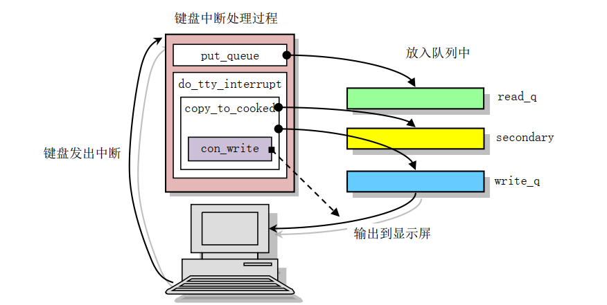
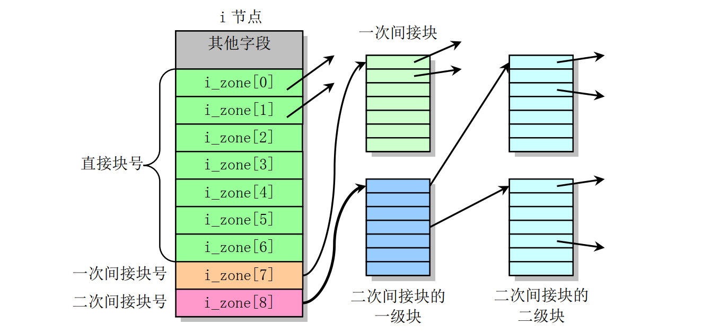
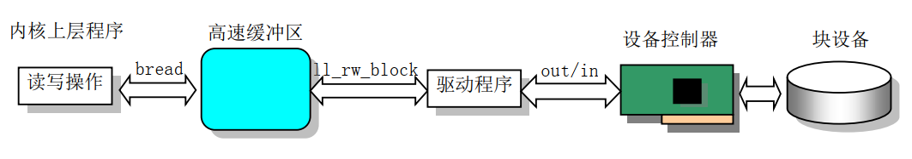
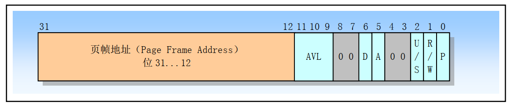
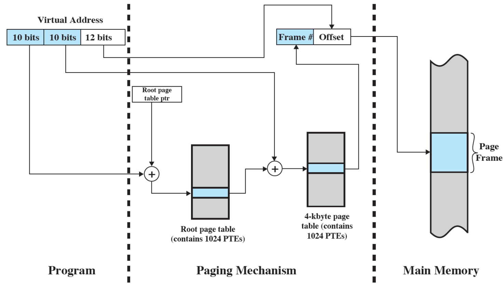
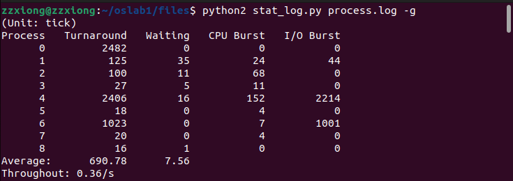
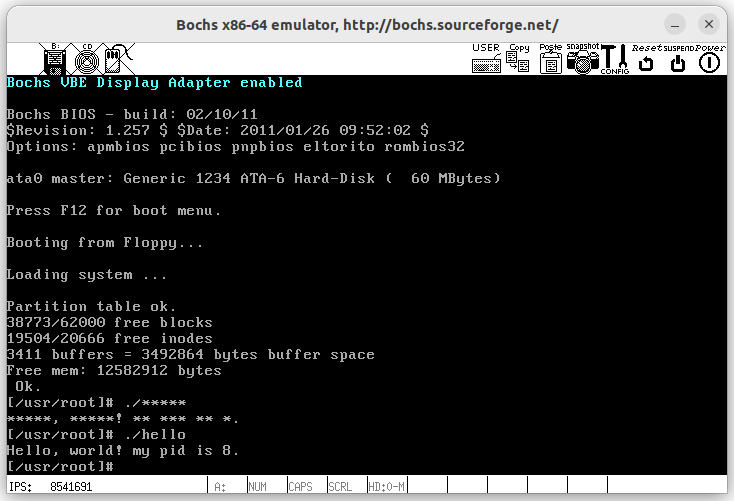

# HITOS-附加实验 从OS视角漫谈Hello World

## 前言
`Hello.c` 是一个简单的C语言程序，能够实现简单字符串信息的输出

站**在《计算机系统》的角度**，`Hello` 的一生经历了许多过程，从**预处理、编译、汇编、链接到进程管理、存储管理再到 IO 管理**，对比解析了各个过程在 `Linux` 下实现机制及原因，较为深入研究了 `hello.c` 文件的 `P2P` 和 `020` 的过程。

而本文**从《操作系统》的角度**，再探 `Hello` 从创建进程开始到执行结束过程中，涉及到的**进程管理，内存管理，IO，文件系统，缓冲，缺页中断**等等，从更为深入细致的角度回顾 `Hello` 的"一生"，主要聚焦于 `020` 的过程，也即**将一个可执行文件 `hello` 载入内存并运行**的过程中操作系统的运行具体细节。

> - P2P( From Program to Process )，指将C语言程序文件 `hello.c` 转换为可执行进程的过程
> - 020( From Zero-0 to Zero-0 )，指将一个可执行文件 `hello` 载入内存并运行的过程。此过程中，0表示内存中没有 `hello` 文件的状态。
>
## 实验内容
本文完成了对 Linux0.11 内核启动和初始化过程、`Hello` 从创建进程开始到执行结束过程从理论上进行了较为细致的分析，并从实验角度验证了其中较为核心的部分：
- 修改 `kernel/fork.c` 中的 `find_empty_process` 和 `copy_process` 函数打印进程创建相关信息；
- 修改 `mm/memory.c` 中的 `copy_page_tables` 函数打印页表复制相关信息；
- 修改 `fs/exec.c` 中的 `do_execve` 函数打印读取文件头和内存调整相关信息；
- 修改 `mm/memory.c` 中的 `do_no_page` 和 `put_page` 函数打印缺页中断处理相关信息；
- 在 `mm/memory.c` 中添加 `address_convert` 函数打印线性地址转换为物理地址的转换过程；
- 修改 `kernel/fork.c` 中的 `copy_process`、`kernel/sched.c` 中的 `schedule`、 `sys_pause`、 `sleep_on`、 `interruptible_sleep_on`、 `wake_up` 和 `kernel/exit.c` 中的 `do_exit` 函数，打印进程调度相关信息；
- ~~修改 `fs/inode.c` 中的 `bmap` 函数打印寻找磁盘块号过程；~~
- ~~修改 `fs/buffer.c` 中的 `getblk`函数（在 `bread` 函数中被调用）打印查询缓冲过程；~~
- ~~修改 `kernel/blk_drv/ll_rw_blk.c` 中的 `make_request` 和 `add_request` 函数打印创建磁盘访问请求并加入队列相关信息；~~
- ~~修改 `kernel/blk_drv/hd.c` 中的 `do_hd_request` 函数打印磁盘读写相关信息；~~
- 在 `kernel/chr_drv/tty_io.c` 添加 `press_f12_handle` 函数，修改 `/include/linux/tty.h` 和 `kernel/chr_drv/keyboard.s` 实现对 `F12` 的识别处理;
- 修改 `kernel/chr_drv/console.c` 中的 `con_write` 函数添加字符 `*` 显示处理；
- 编写 `test.c` 实现 `SIGINT` 信号的捕获
- 修改 `kernel/exit.c` 中的 `do_exit` 函数打印进程退出相关内容

注：上述~~删除线~~部分代码以注释部分出现在附件中，因为某种特殊的原因会报错。

具体得到附件如下：
- `fork.log` -- 打印进程创建和进程退出任务结构体 `task_struct` 相关信息；
- `fork_page_copy.log` -- 页表复制相关信息（页目录项、页表项）；
- `execve.log` -- 读取文件头和内存调整后任务结构体 `task_struct` 及 `eip` 等寄存器相关信息；
- `page_fault.log` -- 缺页中断处理相关信息和线性地址转换为物理地址的转换过程；
- `process.log` -- 进程调度相关信息，包含各进程的执行调度信息，结合 `stat_log.py` 使用；

## 第一部分：时间之外——内核的初始化

> 在这里简短回顾一下 Linux0.11 的启动与初始化以及 Shell 程序的运行


### 1. 操作系统的引导启动
当机器上电后，CPU 将自动进入**实模式**，并从地址 `0xFFFF0` 开始自动执行程序代码，这个地址通常是 ROM-BIOS 中的地址。PC 机的 BIOS 将执行系统的某些硬件检测和诊断功能，并在物理地址 `0` 处开始设置和初始化中断向量。此后，它将磁盘引导扇区（512 字节， 以 `0x55AA` 结束）读入内存绝对地址 `0x7C00` 处，并跳转到这个地方开始引导启动机器运行了。

在本节中，操作系统完成了初步的引导启动，实现了实模式到保护模式，再到启用分页机制，最终跳转到 `main` 内核，其整体流程如下：
```
开机上电 -> 加载启动区 -> 加载setup.s -> 加载内核 -> 分段机制 -> 进入保护模式 -> 中断机制 -> 分页机制 -> 跳转到内核
           -----------  -------------------------  -------------------------------------  -----------------------
               BIOS             bootsect.s                        setup.s                         head.s
```

> 这一部分主要对应于实验三的内容


#### 1.1 bootsect.S
`bootsect.S` 代码是磁盘引导块程序，由 BIOS 读入到内存绝对地址 `0x7C00` 处，其执行过程大致如下：

1. 首先将自己**移动**到内存绝对地址 `0x90000` 开始处。而后将把 `cs` 寄存器的值分别复制给 `ds`、`es` 和 `ss` 寄存器，然后又把 `0xFF00` 给了 `sp` 寄存器，即
   - 数据段寄存器 `ds` 和代码段寄存器 `cs` 此时都被设置为了 `0x9000`。
   - 栈顶地址被设置为了 `0x9FF00`，具体表现为栈段寄存器 `ss` 为 `0x9000`，栈基址寄存器 `sp` 为 `0xFF00`。栈是向下发展的，不会轻易撞见代码的位置

2. 而后利用 ROM BIOS 中断 `INT 0x13` 把从磁盘第 2 个扇区开始的 4 个扇区的 `setup` 模块**加载**到内存紧接着 `bootsect` 后面位置处（ `0x90200` ）
   - 在读操作过程中如果读出错，则显示磁盘上出错扇区位置，然后复位驱动器并重试；
   - 如果加载成功，则利用 BIOS `INT 0x10` 在屏幕上显示 "Loading system..." 字符串。

> `INT 0x13` 对应中断处理程序是读取磁盘的相关功能的函数。

3. 再者把磁盘上 `setup` 模块后面的 `system` 模块（大约 240 个扇区）**加载**到内存 `0x10000` 开始的地方。此后还要检查要使用哪个根文件系统设备...
4. 最后**长跳转**到 `setup` 程序开始处去执行 `setup` 程序。

#### 1.2 setup.s
`setup.S` 是一个操作系统加载程序，其主要执行逻辑为：

1. ROM BIOS `INT 0x10` 中断**读取**机器系统数据，并将这些数据保存到 0x90000 开始的位置（覆盖掉了 bootsect 程序所在的地方）。

2. **关闭中断**，将 `system` 模块从 `0x10000-0x8ffff` 整块向下**移动**到内存绝对地址 `0x00000` 处;

> 在进入保护模式之前，我们必须首先设置好将要用到的段描述符表，此时临时 IDT 为长度为 0 的空表。

3. 根据临时中断描述符表（IDT）和全局描述符表（GDT），**设置中断描述符表寄存器(IDTR)和全局描述符表寄存器(GDTR)**，开启 A20 地址线（变成 32 位可用），重新设置两个中断控制芯片 8259A，将硬件中断号重新设置为 `0x20 - 0x2f`。

4. 最后设置 CPU 的控制寄存器 CR0 的第 0 位 **PE 为 1** ，**进入 32 位保护模式**运行，并跳转到位于 `system` 模块最前面部分的 `head.s` 程序（内存地址 0）继续运行。

#### 1.3 head.s

`head.s` 程序在被编译生成目标文件后会与内核其他程序的目标文件一起被链接成 `system` 模块， 并位于 `system` 模块的最前面开始部分。 

1. 首先它**加载**各个数据段**寄存器**，**重新设置**中断描述符表 **IDT**，共 256 项，并使各个表项均指向一个只报错误的**哑**中断子程序 `ignore_int`。 

2. **重新设置**了全局段描述符表 **GDT**。实际上新设置的 GDT 表与原来在 `setup.s` 程序中设置的 GDT 表描述符除了在段限长上有些区别以外（原为 8MB，现为 16MB），其他内容**基本一致**。

> 这里重新设置 GDT 的主要原因是因为前面设置的 GDT 表处于内存 `0x902XX` 处。这个地方将在内核初始化后用作内存高速缓冲区的一部分。

3. 接着检测 A20 地址线是否已开启。程序**设置**管理内存的**分页处理机制**（设置控制寄存器 CR0 的第 31 位 **PG 为 1**），将页目录表放在绝对物理地址 0 开始处（存储于 CR3 寄存器）， 紧随后面会放置共可寻址 16MB 内存的 4 个页表，并分别设置它们的表项。


> 页目录表的存放位置也是 `head.s` 所处的物理内存位置，因此这段程序已执行部分将被覆盖掉

4. 最后， `head.s` 程序利用返回指令将预先放置在堆栈中的 `/init/main.c` 程序的入口地址弹出，去运行 `main` 程序。

#### 额外说明：Linux0.11 的分页机制

这里很重要，Linux0.11 采用**两级页表**（页目录表和页表），对于一个线性地址，首先将其拆分成

$$高 10 位：中间 10 位：后 12 位$$

高 10 位负责在页目录表中找到一个页目录项，这个页目录项的值加上中间 10 位拼接后的地址去页表中去寻找一个页表项，这个页表项的值，再加上后 12 位偏移地址，就是最终的物理地址。


那么此时页表总项数为 $4(页表) \times 1024(项/页表)=4096 项(0 - \text{0xfff})$，也即能映射物理内存 $4096 \times 4Kb = 16Mb$

而页表的具体数据初始化如下
```asm
setup_paging:
	……
	movl $pg0+7,pg_dir		/* set present bit/user r/w */
	movl $pg1+7,pg_dir+4		/*  --------- " " --------- */
	movl $pg2+7,pg_dir+8		/*  --------- " " --------- */
	movl $pg3+7,pg_dir+12		/*  --------- " " --------- */
	movl $pg3+4092,%edi
	movl $0xfff007,%eax		/*  16Mb - 4096 + 7 (r/w user,p) */
	std
1:	stosl				/* fill pages backwards - more efficient :-) */
	subl $0x1000,%eax
	jge 1b
	……
```

根据页目录项的格式，4个页目录项分别表示页表地址为 `0x1000`、`0x2000`、`0x3000`、`0x4000`，页属性为 `0x07` 表示改页存在、用户可读写。随后从最后一个页表的最后一项开始按倒退顺序填写，每项的内容是：当前项所映射的物理内存地址 + 该页的标志（这里均为 7）


最终的效果就是，经过这套分页机制，**线性地址将恰好和最终转换的物理地址一样**。

### 2. 内核初始化
在整个内核完成初始化后，内核将执行控制权切换到了用户模式（进程 `0`），也即 CPU 从 0 特权级切换到了第 3 特权级。本节 `main.c` 的主程序就工作在进程 `0` 中。然后系统第一次调用进程创建函数 `fork()`，创建出一个用于运行 `init()` 的子进程（通常被称为 `init` 进程）。

#### 2.1 边界划分

**此时中断仍被禁止着**，在 `main.c` 中，首先设置根文件系统设备号 `ROOT_DEV` 等变量，接着根据机器物理内存容量设置高速缓冲区和主内存区的位置和范围，即设置变量：

- 主内存开始地址 -> `main_memory_start`
- 机器内存容量 -> `memory_end`
- 高速缓存末端地址 -> `buffer_memory_end`

其实就只是针对不同的内存大小，设置不同的**边界**值，并且 `main_memory_start` 与 `buffer_memory_end` 实质上取值相等。

但如果在 Makefile 文件中定义了内存虚拟盘符号 `RAMDISK`，则初始化虚拟盘。此时主内存将减少。
```c
void main(void) {
	// ……
	memory_end = (1<<20) + (EXT_MEM_K<<10);
	memory_end &= 0xfffff000;
	if (memory_end > 16*1024*1024)
		memory_end = 16*1024*1024;
	if (memory_end > 12*1024*1024) 
		buffer_memory_end = 4*1024*1024;
	else if (memory_end > 6*1024*1024)
		buffer_memory_end = 2*1024*1024;
	else
		buffer_memory_end = 1*1024*1024;
	main_memory_start = buffer_memory_end;
#ifdef RAMDISK
	main_memory_start += rd_init(main_memory_start, RAMDISK*1024);
#endif
	// ……
}
```

#### 2.2 初始化
在设置边界后，内核进行所有方面的初始化工作
##### 2.2.1 内存管理 mem_init(main_memory_start,memory_end)
具体主内存区是如何管理和分配，在函数 `mem_init(main_memory_start,memory_end)` 内完成（定义在 `mm/memory.c` 中），代码如下：
```c
void mem_init(long start_mem, long end_mem)
{
	int i;

	HIGH_MEMORY = end_mem;
	for (i=0 ; i<PAGING_PAGES ; i++)
		mem_map[i] = USED;
	i = MAP_NR(start_mem);
	end_mem -= start_mem;
	end_mem >>= 12;
	while (end_mem-->0)
		mem_map[i++]=0;
}
```
>实质上就是准备了一个数组，记录了哪些内存被占用了，哪些内存没被占用。

该函数把位于 1MB 以上的所有内存划分成一个个页面（4KB），并使用一个**页面映射字节数组** `mem_map[]` 来管理所有这些页面。 
- 对于 16MB 内存，该数组共有(16MB - 1MB)/4KB = 3840项，即可管理 3840 个物理页面，而 `start_mem` 通常是 4MB；
- 缓冲区（ 1MB ~ `start_mem` ）直接标记为 `USED`，产生的效果就是无法再被分配；而剩余的主内存区域，而主内存目前没有任何程序申请，所以初始化时都是零；
- 每当一个内存页面被占用就把 `mem_map[]` 中对应的的字节项增 1；若释放一个页面，就把对应字节值减 1。
  - 若字节项为 0，则表示对应页面空闲；
  - 若字节值大于或等于 1，则表示页面被占用或被多个进程共享占用。

##### 2.2.2 陷阱门（硬件中断向量）trap_init()
`trap_init()` 定义在 `kernel/trap.c` 中，用于初始化硬件异常处理中断向量（陷阱门），并设置允许 8259A 主芯片中断请求信号的到来。

实质上就是使用 `set_trap_gate()`与 `set_system_gate()`函数去将中断向量号 0-16 与具体的中断绑定起来（在 `head.s` 中全部设定的是默认中断），而 17-47 的陷阱门均先设置为 reserved，以后各硬件初始化时会重新设置自己的陷阱门。

> 两种函数之间的主要区别在于前者设置的特权级为 0，后者是 3。

```c
void trap_init(void)
{
	// ……
	set_trap_gate(2,&nmi);
	set_system_gate(3,&int3);	/* int3-5 can be called from all */
	// ……
	for (i=17;i<48;i++)
		set_trap_gate(i,&reserved);
	// ……
}
```

##### 2.2.3 块设备初始化 blk_dev_init()
`blk_dev_init()` 定义在 `kernel/blk_drv/ll_rw_blk.c` 中，实质上就是给 `request` 这个数组的前 32 个元素的两个变量 `dev` 和 `next` 赋值 -1 和 NULL，即将所有请求项置为**空闲项**。
```c
void blk_dev_init(void)
{
	int i;

	for (i=0 ; i<NR_REQUEST ; i++) {
		request[i].dev = -1;
		request[i].next = NULL;
	}
}
```
而 `request` 结构代表了一次读盘请求（定义在 `kernel/blk_drv/blk.h` 中），具体如下：

```c
struct request {
	int dev;			/* 设备号，-1 就表示空闲 */
	int cmd;			/* 命令：READ or WRITE */
	int errors;			/* 操作时产生的错误次数 */
	unsigned long sector;		/* 起始扇区 */
	unsigned long nr_sectors;	/* 扇区数 */
	char * buffer; 			/* 数据缓冲区，读盘后数据的存放位置 */
	struct task_struct * waiting; 	/* 发出读盘请求进程 */
	struct buffer_head * bh; 	/* 缓冲区头指针 */
	struct request * next; 		/* 下一个请求项 */
};
```

##### 2.2.4  tty 终端初始化 tty_init()
字符设备初始化 `chr_dev_init()` 在 Linux0.11 中为空（`kernel/chr_drv/tty_io.c`），为以后扩展做准备。

tty 终端初始化函数 `tty_init()` （定义在 `kernel/chr_drv/tty_io.c` 中）初始化所有终端缓冲队列，初始化串口终端和控制台终端。
```c
void tty_init(void)
{
	rs_init();
	con_init();
}
```
~~代码越少，事情越大（bushi）~~ 

显然这个初始化需要拆成两部分：
- `rs_init()`：这个函数是**串口中断的开启**，以及设置对应的中断处理程序；
- `con_init()`: 定义在 `kernel/chr_drv/console.c`，根据显示卡类型和显示内存容量（系统启动初始化时获得的系统信息），设置有关屏幕的一些基本参数值（光标位置等...），用于 `con_write()` 函数（屏幕输出）的操作。

获取以上信息之后设置键盘中断后，其实就可以实现往屏幕上的任意位置**写入字符**（包括颜色、换行等）了，从最底层角度上看其实就是往内存的某处写个数据，然后顺便调整一下光标。这一步初始化完成的也就是这么个事情。

```c
#define ORIG_X          (*(unsigned char *)0x90000)
#define ORIG_Y          (*(unsigned char *)0x90001)
void con_init(void) {
	// ……
	// 定位光标并设置键盘中断
	gotoxy(ORIG_X, ORIG_Y);
	set_trap_gate(0x21,&keyboard_interrupt);
	// ……
}

static inline void gotoxy(unsigned int new_x,unsigned int new_y) {
	// ……
	x = new_x;
	y = new_y;
	pos = origin + y*video_size_row + (x<<1);
}

void con_write(struct tty_struct * tty) {
	// ……
	// 把键盘输入的字符 c 写入 pos 指针指向的内存
	__asm__("movb attr,%%ah\n\t"
		"movw %%ax,%1\n\t"
		::"a" (c),"m" (*(short *)pos)
		);
	pos += 2;
	x++;
	// ……
}
```
而控制台的**回车、换行、删除、滚屏、清屏**等可视化gui操作在底层都对应 `console.c` 中的相应函数，后续 shell 输入命令也会涉及到。

##### 2.2.5  时钟初始化 time_init()
为了让操作系统能自动地准确提供当前时间和日期信息，在初始化时，内核通过 `init/main.c` 程序中的 `time_init()` 函数读取一块 CMOS RAM 芯片中保存的当前时间和日期信息，并通过 `kernel/mktime.c` 程序中的 `kernel_mktime()` 函数转换成从 1970 年 1 月 1 日午夜 0 时开始计起到当前的以秒为单位的时间，我们称之为 **UNIX 日历时间**。

其基本结构为：
```c
static void time_init(void)
{
	struct tm time;
	do {
		time.tm_sec = CMOS_READ(0);
		// 获取 CMOS 指定端口上年月日等信息……
	} while (time.tm_sec != CMOS_READ(0));
	BCD_TO_BIN(time.tm_sec);
	// BCD 码分别转换成二进制数值……
	time.tm_mon--;
	startup_time = kernel_mktime(&time);
}
```

##### 2.2.6 调度程序初始化 sched_init()

`sched_init()` 定义在 `kernel/sched.c` 中，主要是为进程调度所需要用到的数据结构做准备。
1. 首先初始化了一组 TSS 和 LDT，分别对应**保存和恢复进程的上下文的任务状态段**和**局部描述符表**。之后将作为进程 `0`（也就是现在运行这个的 TSS 和 GDT）
```c
void sched_init(void) {
	// ……
	set_tss_desc(gdt+4, &(init_task.task.tss));
	set_ldt_desc(gdt+5, &(init_task.task.ldt));
	// ……
}
```
2. 随后**清空任务数组** `task` （数据类型为 `task_struct`）和 **GDT 描述符表项**（均定义在 `include/linux/head.h` 中），`task_struct` 结构就是代表每一个进程的信息（从 1 位置开始，初始任务的描述符**仍然保留**）
```c
void sched_init(void) {
	int i;
	struct desc_struct * p;
	// ……
	p = gdt+2+FIRST_TSS_ENTRY;
	for(i=1;i<NR_TASKS;i++) {
		task[i] = NULL;
		p->a=p->b=0;
		p++;
		p->a=p->b=0;
		p++;
	}
	// ……
}
```
>以后每创建一个新进程，就会在后面添加一组 TSS 和 LDT 表示这个进程的任务状态段以及局部描述符表信息

3. **清除** EFLAGS 标志寄存器中的 **NT 位**，避免错误的嵌套调用返回。
```c
	__asm__("pushfl ; andl $0xffffbfff,(%esp) ; popfl");
```
4. 将任务 0 的 **TSS 段选择符加载**到任务寄存器 tr。将**局部描述符表段选择符加载**到局部描述符表寄存器 ldtr 中。
```c
	ltr(0);
	lldt(0);
```
5. 修改中断控制器屏蔽码，允许**时钟中断**并添加**系统调用**，一个作为进程调度的**起点**，一个作为用户程序调用操作系统功能的**桥梁**。
```c
	set_intr_gate(0x20,&timer_interrupt);
	outb(inb_p(0x21)&~0x01,0x21);
	set_system_gate(0x80,&system_call);
```
##### 2.2.7 缓冲管理初始化 buffer_init(buffer_memory_end)
`buffer_init(buffer_memory_end)` 函数（`fs/buffer.c` 中定义）从缓冲区开始位置 `start_buffer` 处和缓冲区末端 `buffer_end` 处分别同时设置（初始化）缓冲块头结构和对应的数据块， 直到缓冲区中所有内存被分配完毕。

实质上就是创建了 `buffer_head` 结构的 `start_buffer` 和指针 `buffer_end`。缓冲区结尾的 `start_buffer` 每次循环 -1024，也就是一页的值，缓冲区结尾的 `start_buffer` 每次循环 +1（一个 `buffer_head` 大小的内存），直到碰一块为止。
```c
void buffer_init(long buffer_end) {
	struct buffer_head * h = start_buffer;
	void * b = (void *) buffer_end;
	while ( (b -= 1024) >= ((void *) (h+1)) ) {
		// ……
		h->b_data = (char *) b;
		h->b_prev_free = h-1;
		h->b_next_free = h+1;
		h++;
	}
	// ……
}
```
同时还引入了 `free_list` 指针作为该链表的头指针，指向空闲块链表中第一个“最为空闲的”缓冲块，即近期最少使用的缓冲块。

而 `start_buffer` 维护的显然是一个双向链表，同时初始化了一个哈希数组便于后续查找读取的块设备中的数据操作。
```c
	for (i=0;i<307;i++)
		hash_table[i]=NULL;
```
>哈希表 + 双向链表可以实现 LRU 算法，用在通过文件系统来读取硬盘文件时缓冲区使用和弃用之中

##### 2.2.8 硬盘和软驱初始化

进入到初始化的最后一步，初始化硬盘和软驱
- **软驱初始化** `floppy_init()`：设置软盘块设备请求项的处理函数 `do_fd_request()`，并**设置软盘中断**门（ `int 0x26`，对应硬件中断请求信号 `IRQ6`）。 然后取消对该中断信号的屏蔽，以允许软盘控制器 FDC 发送中断请求信号。
- **硬盘初始化** `hd_init()`：设置硬盘设备的请求项处理函数指针为 `do_hd_request()`，并**设置硬盘控制器中断**描述符（`int 0x2E`，对应 8259A 芯片的中断请求信号 `IRQ14`），并复位硬盘控制器中断屏蔽码，以允许硬盘控制器发送中断请求信号。

实际上就是在相应端口设置并开启一个 IO 中断，用于软/硬盘发送读写请求时，软/硬盘会发出中断信号给 CPU。

#### 2.3 分道扬镳
在完成上述繁杂但必要的初始化后，系统现在终于可以**打开中断**了（从 `setup.s` 一直关到现在），然后从内核态切换到用户态（这样可以保证之后的进程将**一直处于用户态**的模式，**除非中断**），然后通过 `fork `创建出一个新的进程 `1`，再之后进程 `0` 进入死循环，直至关机。

而只有进程 `1` 会执行 `init()` 函数，完成如加载根文件系统的任务，同时这个方法将又会创建出一个新的进程 `2`，在进程 `2` 里又会加载与用户交互的 `shell` 程序。
```c
	sti();
	move_to_user_mode();
	if (!fork()) {		/* we count on this going ok */
		init();
	}
```
但是还有一些细节需要再讨论一下
 
##### 2.3.1 特权级切换 move_to_user_mode()
回顾 Linux0.00 引导启动的实验，我们知道由于处于特权级 0 的代码不能直接把控制权转移到特权级 3 的代码中执行，但中断返回操作是可以的，因此利用中断返回指令 `IRET` 来启动运行 Linux0.00 的第 1 个任务。

具体的做法是，**模拟中断返回时栈的内容，即在堆栈中构筑中断返回指令需要的内容**，把返回地址的段选择符设置成任务 0 代码段选择符，其特权级为 3。在返回后从栈中取出对应的段选择符。
```c
// include/asm/system.h
#define move_to_user_mode() \
__asm__ ("movl %%esp,%%eax\n\t" \
	"pushl $0x17\n\t" \
	"pushl %%eax\n\t" \
	"pushfl\n\t" \
	"pushl $0x0f\n\t" \
	"pushl $1f\n\t" \
	"iret\n" \
	"1:\tmovl $0x17,%%eax\n\t" \
	"movw %%ax,%%ds\n\t" \
	"movw %%ax,%%es\n\t" \
	"movw %%ax,%%fs\n\t" \
	"movw %%ax,%%gs" \
	:::"ax")
```
在 Linux0.11 中也采用的是类似的做法，在代码中模仿 CPU 进行了五次压栈操作，这样在执行 `iret` 指令时，硬件会按顺序将刚刚压入栈中的数据，分别赋值给 `SS`、`ESP`、`EFLAGS`、`CS`、`EIP` 这几个寄存器。而返回的位置恰好是 `iret` 的下一行，就这样实现了从内核态切换到用户态，而其他基本没有改变。

##### 2.3.2 死循环
在切换至用户模式过后，全系统第一次调用 `fork()` 建立进程 `1` 。进程 `1` 调用 `init()`。

而对于父进程 `0`，会进入持续执行 `pause()` 的死循环，`pause()` 对应的系统调用会把任务 `0` 转换成可中断等待状态，再执行调度函数。但是调度函数只要发现系统中没有其他任务可运行时就会切换回进程 `0`，而不依赖于进程 `0` 的状态。 

```c
	for(;;) pause();
```

>对于任何其他的进程， `pause()` 将意味着必须等待收到一个信号才会返回就绪态，但进程 `0` 是**唯一例外**情况。因为进程 `0` 在任何空闲时间里都会被激活

### 3. Shell 程序的运行
`init()` 函数运行在进程 `0` 第 1 次创建的子进程 `1` 中。它首先对第一个将要执行的程序 `Shell` 的环境进行初始化，然后以登录 `Shell` 方式加载该程序并执行。

#### 3.1 进程 `1` 的铺垫

在第二次调用 `fork()` 之前，进程 `1` 首先完成了一些准备工作如下：
```c
	setup((void *) &drive_info);
	(void) open("/dev/tty0",O_RDWR,0);
	(void) dup(0);
	(void) dup(0);
```
实验五已经说明了这段代码建立了文件描述符 `0` 、 `1` 和 `2` ，它们分别就是 `stdin` 、 `stdout` 和 `stderr`。

但这里我觉得还可以再深入一点

##### 3.1.1 硬盘加载 `setup`
`setup` 是个系统调用，会通过中断最终调用到 `sys_setup` 函数（定义在 `kernel/blk_drv/hd.c` ）。查看代码其实就是：
- 读取硬盘参数把硬盘的基本信息（`setup.s` 写入）存入了 `hd_info[]`，把硬盘的分区信息存入了 `hd[]` 
- `rd_load()` 加载虚拟盘
- `mount_root()` 加载根文件系统，从整体上说，它就是要把硬盘中的数据，以文件系统的格式进行解读，加载到内存中设计好的数据结构

那么其实这部分最重要的是加载根文件系统，Linux0.11 采用的是 MINIX 文件系统，其格式如下：


那么 `mount_root()` 该函数除了用于安装系统的根文件系统以外，还对内核使用文件系统起到初始化的作用。

它对内存中超级块数组 `super_block[]` 进行了初始化，还对文件描述符数组表 `file_table[]` 进行了初始化，并对根文件系统中的空闲盘块数和空闲 `i` 节点数进行了统计并显示出来。具体执行流程如下：


##### 3.1.2 文件系统调用 `open` 和 `dup`
`open` 实际上对应 `sys_open` 这个系统调用函数，用以**打开（或创建）文件系统调用**。


而 `dup` 就是从进程的 filp 中找到下一个空闲项，然后把要复制的文件描述符 fd 的信息复制到这里，在此即文件描述符 `0` 、 `1` 和 `2` 都对应一个设备文件 `/dev/tty0`。

之后就可以通过文件描述符，最终能够找到其对应文件的 `inode` 信息，从而对文件进行读写（实验五的 `process.log` 其实就是这么创建的）。

#### 3.2 Shell 程序走向舞台
在准备好文件描述符后，进程 `1` 可以进行与外设的交互了，接下来就是创建一个新的进程并运行 `Shell` 程序，代码很短

```c
	if (!(pid=fork())) {
		close(0);
		if (open("/etc/rc",O_RDONLY,0))
			_exit(1);
		execve("/bin/sh",argv_rc,envp_rc);
		_exit(2);
	}
```
实际上可以分成这三部分：

1. `fork` 一个新的子进程，此时就是进程 `2` 了。
2. 在进程 `2` 里首先把标准输入 `stdin`（文件描述符 `0`）**重定向**到 `/etc/rc` 文件。
3. 然后使用 `execve` 替换成 `/bin/sh` 程序并执行。

> 如果 `execve` 执行成功，则原有进程的代码和数据会被完全替换，而新程序会成为新的进程映像，接着会开始运行。

注：`fork`、`execve`以及替换后的缺页中断等在此没有过多纠结细节，但在后续 Hello 的运行中也会涉及，在那里结合实际调试再仔细叙述。

那么进程 `2` 中标准输入为 `/etc/rc` 文件的 `Shell` 进程在读取完 `/etc/rc` 这个文件并执行这个文件里的命令后就会自动退出（可以用来输登录密码什么的）。

而这个 `Shell` 程序的父进程，也就是进程 `1`，它会等待 `Shell` 进程退出，而后再次创建一个子进程，用于运行登录和控制台 `Shell` 程序，只不过这次的文件描述符 `0` 保留为设备文件 `/dev/tty0`（可以与终端 IO 交互），如此往复陷入**等待-创建 `Shell` 程序的死循环**。

于是，`Shell` 程序就成功的运行起来了，在《计算机系统》中我们学过，`Shell` 程序就是个死循环，不断读取（`getcmd`）我们用户输入的命令，创建一个新的进程（`fork`），在新进程里执行（`runcmd`）刚刚读取到的命令，最后等待（`wait`）进程退出，再次进入读取下一条命令的循环中。

## 第二部分：主角登场——属于 Hello 的一生
`Hello` 生成可执行程序后，具体的执行还需要在操作系统的进程管理之下。

### 1. 键盘输入与读取
让我们再等一下进入 `Hello` 的一生，在 `Shell` 程序过程中，我们需要使用键盘输入指令才能让操作系统知道用户现在要求执行 `Hello` 程序了。

那么，用键盘输入一条指令对应操作系统的哪些调用呢？

回忆在内核初始化过程中 `tty_init()` 将键盘中断绑定在了 `keyboard_interrupt` 这个中断处理函数上，这个中断处理程序很复杂，调用也很深，但其流程大致如下：

1. 键盘按下按键后，会引起键盘**中断响应**（中断请求信号 `IRQ1`，对应中断号 `INT 33`）,进入到键盘中断处理程序 `keyboard_interrupt` 里，之后从键盘控制器**读入对应的键盘扫描码**，根据 `key_table` （定义在 `kernel/chr_drv/keyboard.s` 中）中对应按键的**处理函数**译成相应字符，最终通过 `put_queue` 函数字符放入 `read_q` 这个队列。

2. `read_q` 队列里的未处理字符，通过 `do_tty_interrupt` 函数又直接调用行规则函数 `copy_to_cooked` 函数，经过一定的 `termios` **规范处理**后，将处理过后的字符 `tty` **辅助队列** `secondary` 中，同时把该字符放入 `tty` **写队列** `write_q` 中

而上层 `shell` 程序经过库函数、文件系统函数等，最终会调用到 `tty_read` 函数，将字符从 `secondary` 队列里取走放入到内存里的某个位置（具体细节因为好像看不到 `shell` 的源代码，不是特别清楚）



在此处因为有两个进程一个读一个写，还涉及到**进程调度**的问题，简单叙述如下：
- `secondary` 队列为空，即不满足继续读取条件的时候，调用 `sleep_if_empty` 函数让上层读取进程阻塞。
- 再次按下键盘，使得 `secondary` 队列中有字符时，在 `copy_to_cooked` 函数中将字符放入 `secondary` 队列后 `wake_up` 这个队列里的等待进程。

而终端界面的字符显示也是通过 `tty_read` 从 `secondary` 里读字符，然后最终调用**写控制台函数** `con_write()` 进行输出（显示）操作。此时如果该终端的回显（`echo`） 属性是设置的，则该字符会显示到屏幕上。

#### 额外说明：Shell 的处理流程
一个简单的 `shell` 程序的处理流程大致可以分为以下几个步骤：
1. **读取**用户输入的命令或脚本文件。
2. 将输入字符串**切分**，分析输入内容，**解析**命令和参数, 将命令行的参数改造为系统调用 `execve()` 内部处理所要求的形式
   - 内置命令，立即执行；
   - 调用 `fork()` 来**创建子进程**，**自身**调用 `wait()` 来**等待子进程完成**，同时在程序执行期间始终接受键盘输入信号，并对输入信号做相应处理。
3. 当子进程运行时，调用 `execve()` 函数，同时根据命令的名字指定的文件到目录中**查找可行性文件**，调入内存并执行这个命令。
4. 当子进程完成处理后，向父进程 `shell` 报告，此时终端进程被唤醒，**清除**子程序相关在内存中的**占用**。

### 2. 进程创建 fork()
`fork()` 系统调用用于创建子进程。 **Linux 中所有进程都可以看作进程 `0` 的子进程**。
```asm
_sys_fork:
	call _find_empty_process
	testl %eax,%eax
	js 1f
	push %gs
	pushl %esi
	pushl %edi
	pushl %ebp
	pushl %eax
	call _copy_process
	addl $20,%esp
1:  ret
```
其实就是调用了两个函数，其基本流程如下：
- `fork()` 首先调用 `find_empty_process` 在任务数组 `task[]` （在 `sched_init` 中被初始化）中找一个空闲的位置，准备存一个新的进程的结构 `task_struct`;
	```c
	struct task_struct {
		long state;
		long counter;
		long priority;
		// ……
		struct tss_struct tss;
	}
	```
- 调用 `copy_process` 复制父进程的任务数据结构信息
  - 为新进程**申请**一页**内存**页，调用 `get_free_page` 函数遍历 `mem_map[]` 数组（在 `mem_init` 中被初始化），找出值为零的项，就表示找到了空闲的一页内存
	```c
	struct task_struct p = (struct task_struct *) get_free_page();
	```
  -	将父进程的 `task_struct` 的全部值都复制给即将创建的进程 `p`
	```c
	task[nr] = p;
	*p = *current;
	```
  - 为新进程修改复制的任务数据结构的某些字段值，如 TSS 结构中的各字段值，其中`esp0` 正好指向该页顶端，让新进程的状态**保持父进程即将进入中断过程前的状态**。
  - 接着系统在线性地址空间中**设置新任务代码段和数据段描述符中的基址和限长**（设置 LDT 表），并为新进程**复制父进程的页目录项和页表项**。
    - LDT 的复制和改造，使得**不同进程分别映射到了不同的线性地址空间**。段限长就是取自父进程设置好的段限长；段基址取 $nr \times 64M$
    - 页表的复制，使得不同进程又从不同的线性地址空间被映射到了**相同的物理地址空间**，同时将新老进程的页表都变成只读状态，为后面写时复制的缺页中断做准备。
  - 把当前进程（父进程）打开文件对应 `i` 节点的引用次数都增 1。
  - 随后在 GDT 表中设置新任务 TSS 段和 LDT 段描述符项。这两个段的限长均被设置成 104 字节。
  - 最后将新进程的状态置为 `TASK_RUNNING`， 可以被加入调度队列。

> 需要注意的是，**页目录表在 0 开始地址位置处**，而在 Linux 0.11 的设计中，针对当前处理的页目录项对应的页表，进程 `0` 创建进程 `1` 时，仅复制了头 160 个页表项。而之后的新进程创建都是复制了全部 1024 个页表项。

#### 写时复制

在 `fork()` 的执行过程中，内核并**不会立刻为新进程分配代码和数据内存页**。新进程将与父进程共同使用父进程已有的代码和数据内存页面。只有当以后执行过程中如果其中有一个进程以**写**方式访问内存时被访问的内存页面才会在写操作前被**复制到新申请的内存页面**中。

#### 父进程与子进程
任务数据结构中有这样几个指针，可以描述父进程与其多个子进程之间的关系，可以发现子进程间并非完全独立的。


### 3. 程序加载 execve

此过程 `execve()` 函数的主要功能为：
- 执行**对命令行参数和环境参数空间页面的初始化**操作。
  - 设置初始空间起始指针并初始化空间页面指针数组为(NULL)；
  - 根据执行文件名取执行对象的 `i` 节点，检查文件类型和执行权限；
  - 计算参数个数和环境变量个数。
- 根据**执行文件开始部分的头数据结构**，对其中信息进行处理。根据被执行文件 `i` 节点读取文件头部信息，
  - 若是 `Shell` 脚本程序（第一行以 "#!" 开始），则分析 Shell 程序名及其参数，并以被执行文件作为参数执行该 `Shell` 程序；
  - 根据文件的幻数以及段长度等信息判断是否可执行；
- 对当前调用进程进行运行新文件前的**初始化**操作
  - 指向新执行文件的 `i` 节点，复位信号处理句柄；
  - 根据头结构信息**设置局部描述符基址和段长**，**设置参数和环境参数页面指针**，**修改进程各执行字段内容**；
- **替换**堆栈上原调用 `execve()` 程序的**返回地址**为新执行程序运行地址，运行新加载的程序。

具体地，`execve()` 对应系统调用 `sys_execve()`，经过简单压栈后执行函数 `do_execve`，去除一些逻辑校验和权限检验，其实就是三个步骤：
```c
_syscall3(int,execve,const char *,file,char **,argv,char **,envp)
```
#### 3.1 读取加载执行文件
这一过程主要完成的是：根据文件名，找到并读取文件里的内容，解析开头 1KB 的数据为 `exec` 结构：
- 初始化 128KB （32 页）的参数和环境串空间，把所有字节清零；
- 读取可执行程序文件 `i` 节点，从中取出文件属性信息进行一些权限检测；
- 根据 `i` 节点读取文件头信息，并复制缓冲块数据到 `ex` 结构中；
- 判断是否对`Shell` 脚本程序，对可执行程序进行合法性检测。
```c
int do_execve(...) {
	for (i=0 ; i<MAX_ARG_PAGES ; i++)			// 清空页表
		page[i]=0;
	if (!(inode=namei(filename)))		
		return -ENOENT; 				// 根据文件名获取 inode
	// ……
	if (!(bh = bread(inode->i_dev,inode->i_zone[0]))) {	// 读取文件第一块数据（1024KB）
		retval = -EACCES;
		goto exec_error2;
	}	
	struct exec ex = *((struct exec *) bh->b_data);
```

#### 3.2 调整内存
将当前进程可执行文件 `i` 节点更新，让进程 `executable` 字段指向新执行文件的 `i` 节点。
```c
	if (current->executable)
		iput(current->executable);
	current->executable = inode;
```
然后复位原进程的所有信号处理句柄，再根据设定的执行时关闭文件句柄（ `close_on_exec` ）位图标志，关闭指定的打开文件并复位该标志。
```c
	for (i=0 ; i<32 ; i++)
		current->sigaction[i].sa_handler = NULL;
	for (i=0 ; i<NR_OPEN ; i++)
		if ((current->close_on_exec>>i)&1)
			sys_close(i);
	current->close_on_exec = 0;
```
然后根据当前进程指定的基地址和限长，释放**原来程序的代码段和数据段**所对应的内存页表指定的物理内存页面及页表本身。
```c
	free_page_tables(get_base(current->ldt[1]),get_limit(0x0f));
	free_page_tables(get_base(current->ldt[2]),get_limit(0x17));
```
接下来修改局部表中描述符基址和段限长，并将 128KB 的参数和环境空间页面放置在数据段末端。然后调用内部函数 `create_tables()`， 在栈空间中创建环境和参数变量指针表，供程序的 `main()` 作为参数使用，并返回该栈指针。

具体如下：
```c
	unsigned long p = PAGE_SIZE * MAX_ARG_PAGES - 4;
	// ……
	p = copy_strings(envc,envp,page,p,0);
	p = copy_strings(argc,argv,page,p,0);
	// ……
	p += change_ldt(ex.a_text,page)-MAX_ARG_PAGES*PAGE_SIZE;
	p = (unsigned long) create_tables((char *)p,argc,envc);
```
1. 在进入 `do_execve` 之初，定义 $p = 4096 \times 32 - 4 = \text{0x20000} - 4 = 128K - 4$，作为**参数表的开始地址**；
2. 接下来两个 `copy_strings` 就是参数表里面存放 `argv` 和 `envp` 等参数信息（实际上就是从 `p` 指针指向的位置**向下发展**）；


3. 更新局部描述符，根据 `ex.a_text` 修改局部描述符中的代码段限长 `code_limit`，并将 128KB 的参数和环境空间页面放置在**数据段末端**；
4. 更新参数表，`create_tables()` 函数用于根据给定的当前堆栈指针值 `p` 以及参数变量个数值 `argc` 和环境变量个数 `envc`，在新的程序堆栈中创建环境和参数变量指针表，最终得到初始堆栈指针 `sp`，创建完毕后堆栈指针表的形式如下：


#### 3.3 准备出发
接着再**修改进程各字段值为新执行文件的信息**（如代码尾字段 `end_code`，数据尾字段 `end_data` 等），然后设置**进程栈开始字段为栈指针**所在页面（4KB 对齐）。

最后将**原调用系统中断的程序在堆栈上的代码指针替换为指向新执行程序的入口点**，并将栈指针替换为新执行文件的栈指针。此后返回指令将弹出这些栈数据并使得 CPU 去执行新执行文件，而不会返回到原调用系统中断的程序中去了。
```c
	// ……
	eip[0] = ex.a_entry;		/* eip, magic happens :-) */
	eip[3] = p;			/* stack pointer */
```


那么接下来似乎就可以开始运行了，但是在新进程的地址空间。但**代码和数据还未拷入**。

### 4. 缺页中断
我们仅仅将 `hello` 文件的头部加载到了内存，其他部分并没有进行加载，因此在访问 `start_code` 这个线性地址时，会遇到了**页表项的存在位 P 等于 0** 的情况。

一旦遇到了这种情况，CPU 会触发一个中断：**页错误（Page-Fault）**，这在之前的读书笔记中也已经提到过了，这个中断也是在陷阱门初始化（ `trap_init` ）时被设置的。
```c
	set_trap_gate(14,&page_fault);
```

当触发这个 Page-Fault 中断后，就会进入 Linux 0.11 源码中的 `page_fault` 方法

```asm
page_fault:
	……
	testl $1,%eax
	jne 1f
	call do_no_page
	jmp 2f
1:	call do_wp_page
```

可以看到，这里根据 `error_code` 的不同，主要处理两种情况：
- 一是由于**缺页**引起的页异常中断， 这需要通过调用 `do_no_page(error_code, address)` 来处理；
- 二是由于页面**写保护**引起的页异常，此时调用页写保护处理函数 `do_wp_page(error_code, address)` 进行处理。 

而 `do_no_page()` 的逻辑也很简单：
1. 首先**计算**出发生缺页时的相对于代码段起始地址的**偏移地址** `tmp`
```c
	tmp = address - current->start_code;
```
2. 如果当前进程没有可执行文件（`!current->executable`）或者缺页的逻辑地址大于进程的代码段和数据段之和（`tmp >= current->end_data`），直接调用 `get_empty_page` 为进程申请一页新物理内存即可。
> 这种情况就是由于 **进程压栈（为堆或栈中数据寻找新的页面）** 造成，而非执行 `exevce` 导致。
```c
	if (!current->executable || tmp >= current->end_data) {
		get_empty_page(address);
		return;
	}
```
3. 而如果是 `exevce` 导致的缺页中断，需要先检查当前进程的 `executable` 是否被其他进程同样引用（在这里肯定是没有的），于是需要为该进程**注册一页新的物理内存**，并且读取相应内容到这页物理内存中。
	- **申请内存**：调用 `get_free_page` 函数去 `mem_map[]` 中申请一个页框（帧）
	- **获取位置信息**：根据inode信息，由 `tmp/BLOCK_SIZE` 即得到 `tmp` 逻辑地址在可执行文件中的块序号
	- **数据读取**：跳过第一块（上一步已经读取了），把对应一个页面大小的硬盘数据复制到内存
```c
	if (!(page = get_free_page()))
		oom();
	block = 1 + tmp/BLOCK_SIZE;
	for (i=0 ; i<4 ; block++,i++)	//一个数据块 1024 字节，所以一页内存需要读 4 个数据块
		nr[i] = bmap(current->executable,block);
	bread_page(page,current->executable->i_dev,nr);
	// ……
	if (put_page(page,address))
		return;
```

这里面有三个函数需要拉出来再说一说，
##### int bmap(struct m_inode * inode,int block)
`bmap` 负责将**相对于文件的数据块转换为相对于整个硬盘的数据块**。

磁盘块号采用两个字节存储；一个间接块占一个磁盘块 1k（两个扇区）。`i` 节点中可以访问的总块数：$直接块7+一次间接512+二次间接512 \times 512$。`bmap` 找到 `block` 对应的磁盘块号！放到数组 `nr[i]` 中



##### void bread_page(unsigned long addr,int dev,int b[4])
`bread_page` 就是连续**读取 4 个数据块到 1 页内存**的函数，就是定义四个 `bh` 缓冲块，首先调用 `getblk` 方法根据设备号 `dev` 和数据块号 `block`，在所有缓冲块中寻找匹配或最为空闲的缓冲块。
- 若高速缓冲命中，也就是在**哈希数组**中找到对应的数据块，返回对应缓冲头结构的指针；
- 若不命中，则从**空闲链表**头开始，对空闲链表进行扫描，寻找一个空闲缓冲块并返回其缓冲头指针。再调用 `ll_rw_block` 方法把硬盘中指定数据块中的数据复制到此缓冲块内（具体细节后续再讨论）



##### unsigned long put_page(unsigned long page,unsigned long address)
最后调用 `put_page` 来将当前进程 `address` 线性地址空间页面与 `page` 处物理页面**挂接**起来，**建立页表填充页框**。（**返回后会重新执行刚才导致缺页异常的那句代码**）



实际上就是写入页目录项和页表项的过程，这里根据页表项的格式，需要在对应目录项中**低 12 位设置相应标志**（`7 – User、 U/S、 R/W`），是一个小坑！。
```c
unsigned long put_page(unsigned long page,unsigned long address) {
	unsigned long tmp, *page_table;
	page_table = (unsigned long *) ((address>>20) & 0xffc); 	// 找到页目录项
	tmp = get_free_page(); 
	*page_table = tmp|7; 					// 写入页目录项
	page_table = (unsigned long *) tmp; 
	page_table[(address>>12) & 0x3ff] = page | 7; 		// 写入页表项
	return page;
}
```


### 5. 进程调度
这块在实验五已经做过了，这里简单总结一下。Linux0.11 共设计了 5 种进程状态
```c
#define TASK_RUNNING 0 		// 进程正在运行或已准备就绪。
#define TASK_INTERRUPTIBLE 1 	// 进程处于可中断等待状态。
#define TASK_UNINTERRUPTIBLE 2 	// 进程处于不可中断等待状态，主要用于 I/O 操作等待。
#define TASK_ZOMBIE 3 		// 进程处于僵死状态，已经停止运行，但父进程还没发信号。
#define TASK_STOPPED 4 		// 进程已停止。
```


当一个进程的**运行时间片用完**，系统就会使用调度程序强制切换到其他的进程去执行。

另外，如果进程在**内核态执行**时需要等待系统的某个资源，此时该进程就会调用 `sleep_on()`或 `interruptible_sleep_on()` **自愿地放弃**CPU的使用权 ，而让调度程序去执行其他进程。进程则进入睡眠状态（`TASK_UNINTERRUPTIBLE` 或 `TASK_INTERRUPTIBLE`）。

只有当进程从"内核运行态"转移到"睡眠状态"时，内核才会进行进程切换操作。在**内核态下运行的进程不能被其他进程抢占**，而且一个进程不能改变另一个进程的状态。

#### 调度程序 schedule
调度函数 `schedule()` 通过一定规则选择系统中下一个要运行的任务（进程），其具体流程是：
1. 针对任务数组中的每个任务，检查其报警定时值 `alarm`。如果任务的 `alarm` 时间已经过期(`alarm<jiffies`), 则在它的信号位图中设置 `SIGALRM` 信号，然后置0 `alarm`值。 **如果进程接收到信号且任务处于可中断睡眠状态**（`TASK_INTERRUPTIBLE`），则置任务为**就绪**状态（`TASK_RUNNING`）。
2. 随后**根据进程的时间片和优先权调度**机制，来选择随后要执行的任务。它首先循环检查任务数组中的所有任务，根据每个就绪态任务剩余执行时间的值 `counter`，选取该值最大的一个任务，并利用 `switch_to()` 函数切换到该任务。
3. 如果如果此时所有处于 `TASK_RUNNING` 状态进程的时间片都已经用完，系统就会根据每个进程的优先权值 `priority`，对系统中所有进程（包括正在睡眠的进程）**重新计算**每个任务需要运行的时间片值 `counter`。计算的公式是：
$$counter= \frac {counter}{2} + priority$$

#### 阻塞 sleep_on 与唤醒 wake_up
这里有一个有意思的设置，每一个当前任务所在的代码块中的 `tmp` 变量**都指向上一个正在同样等待一个资源的进程**，因此也就形成了一个**链表**。

那么，当某进程调用了 `wake_up` 函数唤醒 `*p` 上指向的第一个任务时，该任务会在 `sleep_on` 函数执行完 `schedule()` 后的状态被唤醒并执行下面的代码，把 `tmp` 指针指向的上一个任务也同样唤醒。


而上一个进程唤醒后，和这个被唤醒的进程一样，也会走过它自己的 `sleep_on` 函数的后半段，把它的上一个进程，也就是上上一个进程唤醒。

这样唤醒的一连串**连锁反应**，就会让上面的调度程序再次发挥作用。

```c
void sleep_on(struct task_struct **p)
{
	// ……
	tmp = *p;
	*p = current;
	current->state = TASK_UNINTERRUPTIBLE;
	schedule();
	if (tmp){
		tmp->state=0;
	}
}
void wake_up(struct task_struct **p)
{
	if (p && *p) {
		(**p).state=0;
		*p=NULL;
	}
}
```
### 6. 基于缓冲区的磁盘访问

在第一部分加载根文件系统中时我们已经初步讨论了 Linux0.11 的文件系统设计，同时简单描述了通过一个文件描述符 `fd` 寻找到存储在硬盘中的一个文件。

而在刚刚的缺页中断中，也简单描述了读取硬盘的操作，Linux0.11 读操作简化一下其实就三个步骤。
```
获得 inode 信息 -> 对目标存储区域 buf 内存进行校验 -> 读取数据到 buf
```

在这里我们再细化一下，加入缓存相关的知识，让这个体系更完整。在 Linux0.11 初始化时，会根据内存大小来初始化高速缓冲区大小。缓冲区位于内核 `end` 之后，`buffer_memory_end` 值之前 4M 内存处，一共可以划出 3 千多个逻辑块


高速缓冲区在**提高对块设备的访问效率和增加数据共享**方面起着重要的作用。除驱动程序以外，内核其他上层程序对块设备的读写操作都需要经过高速缓冲区管理程序来间接地实现。它们之间的主要联系是通过高速缓冲区管理程序中的 `bread()` 函数和块设备低层接口函数 `ll_rw_block()` 来实现。

上层程序若要访问块设备数据就通过 `bread()` 向缓冲区管理程序申请。如果所需的数据已经在高速缓冲区中，管理程序就会将数据直接返回给程序。如果所需的数据暂时还不在缓冲区中，则管理程序会通过 `ll_rw_block()` 向块设备驱动程序申请，同时让程序对应的进程睡眠等待。


回忆一下在缺页中断中首先通过 `bmap` 获取全局的数据块号，然后调用 `bread` 将 `bmap` 获取的数据块号读入到高速缓冲块。

```c
struct buffer_head * bread(int dev,int block) {
    struct buffer_head * bh = getblk(dev,block);
    if (bh->b_uptodate)
        return bh;
    ll_rw_block(READ,bh);
    wait_on_buffer(bh);
    if (bh->b_uptodate)
        return bh;
    brelse(bh);
    return NULL;
}
```
#### 缓存管理 
这里主要涉及一个重要的数据结构 `buffer_head` （在 `buffer_init()` 中被初始化），当时初始化的时候将他设置为一个**双向链表**。


同时初始化时我们还设置了一个**哈希数组**对 `buffer_head` 进行管理


而 `getblk` 方法，就是根据设备号 `dev` 和数据块号 `block`，在所有缓冲块中寻找匹配或最为空闲的缓冲块。
- 如果指定的缓冲块存在就立刻返回对应缓冲头结构的指针
- 如果不存在，则从空闲链表头开始，对空闲链表进行扫描，寻找一个空闲缓冲块。

由于搜索空闲块是从空闲队列头开始的，因此这种先从空闲队列中移出并使用最近不常用的缓冲块，然后再重新插入到空闲队列尾部的操作也就实现了**最近最少使用 LRU 算法**。

#### 数据拷贝
接下来 `ll_rw_block` 方法负责把硬盘中指定数据块中的数据，复制到 `getblk` 方法申请到的缓冲块里。
```c
void ll_rw_block(int rw, struct buffer_head * bh)
{
	unsigned int major;
	if ((major=MAJOR(bh->b_dev)) >= NR_BLK_DEV || !(blk_dev[major].request_fn)) {
		printk("Trying to read nonexistent block-device\n\r");
		return;
	}
	make_request(major,rw,bh);
}
```
这个函数的逻辑就是根据 `buffer_head` 从 `request` 数组（块设备请求项初始化 `blk_dev_init` 提出）中找到一个空位**创建一个新的读盘请求**（包括设备号、命令、起始扇区、读/写扇区数、数据缓冲区等信息），然后作为链表项插入到相应设备的 `request` 链表中。

而 `make_request` 函数在初始化一个请求读盘请求参数后调用函数 `add_request`。而`add_request` 是这样写的，
```c
static void add_request(struct blk_dev_struct * dev, struct request * req)
{
	// ……
	if (!(tmp = dev->current_request)) {
		// ……
		(dev->request_fn)();
		return;
	}
	// ……
}
```

那么实际上就是当收到 `request` 请求且没有其他请求时，会立即执行该**设备的 `request_fn` 方法**。而在当初硬盘初始化 `hd_init` 的时候，设备号为 `3` 的设备结构的 `request_fn` 被赋值为硬盘请求函数 `do_hd_request` 了。

所以，刚刚的 `request_fn` 背后的具体执行函数，就是这个 **`do_hd_request`**。最终会根据当前请求是写（`WRITE`）还是读（`READ`），在 `do_hd_request` 中**调用 `hd_out` 时传入不同的参数**（磁头、扇区等），然后向**外设端口做读写**操作。
```c
void do_hd_request(void)
{
	if (CURRENT->cmd == WRITE) {
		hd_out(dev,nsect,sec,head,cyl,WIN_WRITE,&write_intr);
		// ……
		port_write(HD_DATA,CURRENT->buffer,256);
	} else if (CURRENT->cmd == READ) 
		hd_out(dev,nsect,sec,head,cyl,WIN_READ,&read_intr);
}
```
而如果是读操作，在硬盘读完数据后，又会发起 **`0x2E` 中断**，便会进入到 `hd_interrupt` 方法里，最终调用 `read_intr` **从数据端口读出数据到内存**，
- 如果一次没读完发起读盘请求时所要求的字节数，那么直接返回，等待下次硬盘触发中断
- 否则，调用 `end_request` 方法将请求项清除掉，然后再次调用 `do_hd_request` 方法循环往复。

`end_request` 方法实际上就是**唤醒发起请求的进程和因为 `request` 队列满了没有将请求项插进来的进程**。随后，将当前设备的当前请求项的 `dev` 置空，并将当前请求项指向链表中的下一个请求项。

总结一下就是：
- 当设备的当前请求项为空时，也就是没有在执行的块设备请求项时，`ll_rw_block` 就会在执行到 `add_request` 方法时，**直接执行** `do_hd_request` 方法发起读盘请求。
- 如果已经有在执行的请求项了，就按**调度规则**插入 `request` 链表中进行**等待**。
- `do_hd_request` 方法执行完毕后，**硬盘发起读或写请求**，执行完毕后会发起**硬盘中断**，进而调用 `read_intr` 中断处理函数。
- `read_intr` 会**改变**当前请求项指针指向 `request` 链表的**下一个请求项**，并再次调用 `do_hd_request` 方法。

最后的最后，上层进程通过 `put_fs_byte` 方法就可以一个字节一个字节地，将缓冲区里的数据，复制到用户指定的内存 `buf` 中去了。

#### 磁盘访问调度
发出请求时，若请求队列不为空，则需要进行磁盘访问调度，按照如下要求将新请求 `request` 加入队列。
- 写请求小于读请求。
- 若请求类型相同，低设备号小于高设备号。
- 若请求同一设备，低扇区号小于高扇区号。
```c
	for ( ; tmp->next ; tmp=tmp->next)
		if ((IN_ORDER(tmp,req) || 
		    !IN_ORDER(tmp,tmp->next)) &&
		    IN_ORDER(req,tmp->next))
			break;
```

### 7. 屏幕输出
在当时输入命令的时候我们提到过，输入命令时终端界面的字符显示是**通过 `tty_read` 从 `secondary` 里读字符**，然后最终通过 `con_write` 这个控制台写函数，将字符同步打印在显示器上。

现在我们来稍微深入一点看看，c 语言的 `printf` 源码和内核代码 `printk` 完成的功能差不多，我们直接看 `printk` 就行。`printk` 调用了函数 `vsprintf` 把格式化的输出结果送到字符串缓冲区中

无论是输出字符到屏幕上还是文件中，系统最终都会**调用 `write` 函数**来进行，而 `write` 函数则会调用 `sys_write` 系统调用来实现字符输出：
- 如果是输出到**屏幕**上，则会调用 `tty_write` 函数，而 `tty_write` 最终也会调用 `con_write` 函数将字符输出；
- 如果是输出到**文件**中，则会调用 `file_write` 函数直接将字符输出到指定的文件缓冲区中。

而 `tty_write` 函数执行逻辑是首先将字符串缓冲区中的字符压入 `write_q` 队列中 
```c
	PUTCH(c,tty->write_q);
```
最后调用 `tty` 初始化的写函数 `con_write` 输出到屏幕上，整体逻辑很简单。整个过程其实可以看作是将内存的数据换了个地方写入显存（**内存中有这样一部分区域，是和显示屏映射的**）。

### 8. 信号处理
`hello` 程序执行过程中出现的异常可能有中断、陷阱、故障、终止等

类别|原因|异步/同步|返回行为
----|----|--------|--------
中断|来自I/O设备的信号|异步|总是返回到下一条指令
陷阱|有意的异常|同步|总是返回到下一条指令
故障|潜在可恢复的错误|同步|可能返回到当前指令
终止|不可恢复的错误|同步|不会返回

如果在 `hello` 程序正在执行时，按下了键盘中的 `CTRL+C`，程序就被迫终止，并再次返回到了 `shell` 等待用户输入命令的状态。

在本部分的第 1 节中我们知道，键盘中断处理函数自然会走到处理字符的 `copy_to_cooked` 函数里。
```c
void copy_to_cooked (struct tty_struct *tty) {
	// ……
	if (c == INTR_CHAR (tty)) {
		tty_intr (tty, INTMASK);
		continue;
	}
	// ……
}
```

就是当 `INTR_CHAR` 发现字符为中断字符时，就**调用 `tty_intr` 给进程发送信号**。而 `tty_intr` 函数会给组号等于 `tty` 的**进程组**发送相应的信号（其实就是将进程 `task_struct` 结构中的 `signal` 的相应位**置 1**）。
```c
void tty_intr (struct tty_struct *tty, int mask) {
	// ……
	for (i = 0; i < NR_TASKS; i++) {
		if (task[i] && task[i]->pgrp == tty->pgrp) {
			task[i]->signal |= mask;
		}
	}
}
```
现在这个进程的 `tast_struct` 结构中的 `signal` 就有了**对应信号位**的值，那么在下次时钟中断到来时，便会通过 `timer_interrupt` 这个时钟中断处理函数，一路调用到 `do_signal` 方法。
```c
void do_signal (long signr ...) {
	// ……
	struct sigaction *sa = current->sigaction + signr - 1;
	sa_handler = (unsigned long) sa->sa_handler;
	// 如果信号处理函数为空，则直接退出
	if (!sa_handler) {
		// ……
		do_exit (1 << (signr - 1));
		// ……
	}
	// 否则就跳转到信号处理函数的地方运行
	*(&eip) = sa_handler;
	// ……
	}
```
进入 `do_signal` 函数后，如果当前信号 `signr` 对应的信号处理函数 `sa_handler` 为空时，就直接调用 `do_exit` 函数退出

如果信号处理函数不为空，那么就通过将 `sa_handler` 赋值给 `eip` 寄存器，也就是指令寄存器的方式，跳转到相应**信号处理函数**（注册在每个进程 `task_struct` 中的 `sigaction` 数组中）处运行。
```c
struct  sigaction {
	union __sigaction_u __sigaction_u;  /* signal handler */
	sigset_t sa_mask;               	/* signal mask to apply */
	int     sa_flags;               	/* see signal options below */
};

/* union for signal handlers */
union __sigaction_u {
	void    (*__sa_handler)(int);
	void    (*__sa_sigaction)(int, struct __siginfo *,
		void *);
};
```

**信号是进程间通信的一种方式**，`hello` 具体运行过程中，可能产生 `SIGINT`、`SIGKILL` 、`SIGSEGV` 、`SIALARM` 、`SIGCHLD` 等信号，比较常见的如：

- Ctrl+Z：进程收到 `SIGSTP` 信号，`hello` 停止，此时进程并未回收，而是后台运行
- Ctrl+C：进程收到 `SIGINT` 信号，`hello` 终止。

更加具体的，定义在 `include/signal.h` 中：
```c
#define SIGHUP  1       /* hangup */
#define SIGINT  2       /* interrupt */
#define SIGQUIT 3       /* quit */
#define SIGILL  4       /* illegal instruction (not reset when caught) */
#define SIGTRAP 5       /* trace trap (not reset when caught) */
#define SIGABRT 6       /* abort() */
// ……
```
### 9. 进程退出
程序退出处理函数 `do_exit()` 会在 `exit` 系统调用的中断处理程序中被调用，其执行流程如下：
1. 首先**释放**当前进程的**代码段和数据段所占用的内存页面**。 
```c
	free_page_tables(get_base(current->ldt[1]),get_limit(0x0f));
	free_page_tables(get_base(current->ldt[2]),get_limit(0x17));
```
2. 如果当前进程有**子进程**，就将子进程的 `father` 字段置为 `1`，即把子进程的父进程改为进程 `1`（`init` 进程）。'
   - 如果该子进程已经处于僵死状态，则向进程 `1` 发送子进程终止信号 `SIGCHLD`。
```c
	for (i=0 ; i<NR_TASKS ; i++)
		if (task[i] && task[i]->father == current->pid) {
			task[i]->father = 1;
			if (task[i]->state == TASK_ZOMBIE)	(void) send_sig(SIGCHLD, task[1], 1);
		}
```
3. 接着**关闭当前进程打开的所有文件**、释放使用的终端设备、协处理器设备。再对当前进程的工作目录 `pwd`、根目录 `root`、执行程序文件的 `i` 节点以及库文件进行同步操作，放回各个 `i` 节点并分别置空（释放）。 
   - 若当前进程是进程组的首进程，则还需要终止所有相关进程。
```c
	for (i=0 ; i<NR_OPEN ; i++)
		if (current->filp[i])	sys_close(i);
```
4. 随后把当前进程置为**僵死状态**，设置**退出码**，并向其父进程**发送终止信号** `SIGCHLD`。
5. 最后让**内核重新调度**任务运行

```c
	current->state = TASK_ZOMBIE;
	current->exit_code = code;
	tell_father(current->father);
	schedule();
	return (-1);	/* just to suppress warnings */
```
最终由**父进程 `Shell` 等待并回收**子进程，内核删除为进程创建的所有资源，进程从系统中被完全删除。


## 第三部分：实际调试跟踪 —— hello 的一生
首先，为方便观察，小小的修改一下 `hello.c`，加入打印自身 `pid` 信息和延长一下执行时间。

```c
#include <stdio.h>
#include<unistd.h>

int main()
{
	printf("Hello, world! my pid is %d.\n", getpid());
	sleep(10);
	return 0;
}
```

### 1. 进程创建
这个过程中，操作系统完成的基本上就是**对新进程 `task_struct` 进行赋值**的功能，因此我们在创建的最后对父进程和子进程的 `task_struct` 结构体内容进行比较。观察哪些值被修改了，而哪些值没有修改。

具体实现和实验五相似，在进程 `1` 调用 `init()` 函数时将文件描述符 `4` 与文件 `/var/fork.log` 绑定，此后在调用 `find_empty_process` 和 `copy_process` 时进行打印即可

```C
int copy_process(int nr,long ebp,long edi,……)
{
	// ……
	fprintk(4, "Parent Process:(hex)\tChild Process:(hex)\n");
	// 打印结构体内容，打印过程中新进程不会被调度……
	p->state = TASK_RUNNING;	/* do this last, just in case */
	return last_pid;
}

int find_empty_process(void)
{
	// ……
	for(i=1 ; i<NR_TASKS ; i++)
		if (!task[i]){
			fprintk(4, "+-------------------------------------------------------+\n");
			fprintk(4, "fork: find a empty space %d in task\n", i);
			return i;
		}
}
```
打印出来提取和 hello.c 相关的内容出来如下（省略部分内容，完整内容见附件）：

```
+-------------------------------------------------------+
fork: find a empty space 4 in task
Parent Process:(hex)	Child Process:(hex)
state:		0		2
counter:	c		f
priority:	f		f
exit_code:	0		0
start_code:	8000000		10000000
end_code:	41000		41000
end_data:	45000		45000
brk:		5e400		5e400
start_stack:	3fff000		3fff000
pid:		4		6
father:		1		4
……
start_time:	55		346
pwd:		2be98		2be98
root:		2ba38		2ba38
executable:	2bdb8		2bdb8
ldt[1]( 0~31):	40		40
ldt[1](32~63):	8c0fb00		10c0fb00
ldt[2]( 0~31):	3fff		3fff
ldt[2](32~63):	8c0f300		10c0f300
============================================================
tss.esp0:	ffe000		f9d000
tss.ss0:	10		10
……
tss.eip:	6ffb		398af
tss.eflags:	206		246
tss.eax:	24200		0
……
tss.cs:		8		f
tss.ss:		10		17
tss.ldt:	48		68
+-------------------------------------------------------+
```

可以看到，`hello.c` 的进程的 `task_struct` 与其父进程基本相似，但存在一些不同，我们对照第二部分第二节的理论部分进行再验证：
- 为新进程**申请**一页**内存**页，调用 `get_free_page` 函数遍历 `mem_map[]` 数组，发现第 5 个位置（从 0 开始计算到 4）可供申请
  
>接下来是在 `copy_process` 中将父进程的 `task_struct` 的**全部值都复制**给即将创建的进程 `p`，然后对其中某些值进行修改

- 为进程分配一个**唯一的进程标识符** `6`，把当前进程 `4` 作为新进程的父进程
- 清除信号位图并复位新进程各统计值，并**设置初始运行时间片** `counter` 为 15（就是实验五修改的时间片 `priority` 的值）
- 根据当前进程**设置**任务状态段（TSS）中各**寄存器**的值，主要包括：
  - 由于创建进程时新进程**返回值应为 `0`**，所以需要设置 `tss.eax = 0`
  - 新建进程内核态堆栈指针 `tss.esp0` 被设置成新进程任务数据结构所在**内存页面的顶端** `0xf9d000`，而堆栈段 `tss.ss0` 被设置成内核数据段选择符 `0x10` 。 
  - `tss.ldt` 被设置为局部表描述符在 GDT 中的索引值 `0x68` 。
- 设置**新任务的代码和数据段基址、限长**，并复制当前进程内存分页管理的页表。
  - LDT 的复制和改造（主要是 `ldt[1]` 和 `ldt[2]`），使得**不同进程分别映射到了不同的线性地址空间**。段基址取决于当前进程号，为 $nr \times 64M = \text{0x1000 0000}$
    - `ldt[1]`：**代码段**，段限长就是取自父进程设置好的段限长 `0x40`（`G=1`，对应 260 KB）
    - `ldt[2]`：**数据段**，段限长就是取自父进程设置好的段限长 `0x3fff`（`G=1`，对应 64 MB）
  - 页表的复制，使得不同进程又从**不同的线性地址空间被映射到了相同的物理地址空间**。也就是让`0x1000 0000` 和 `0x0800 0000`的相同偏移位置的页表项内数据一样即可（**不会立刻为新进程分配代码和数据内存页**）。
  - 同时将新老进程的页表都变成**只读**状态，为后面写时复制的缺页中断做准备。
- 把当前进程（父进程）的打开的**文件**，如 `pwd`、 `root` 和 `executable` 这些 `i` 节点的引用次数都增 1。
- 随后在 GDT 表中设置新任务 TSS 段和 LDT 段描述符项。这两个段的限长均被设置成 104 字节。
- 将新进程的状态置为 `TASK_RUNNING`， **可以被加入调度队列**。

下面验证页表的复制过程，在 `/mm/memory.c` 的 `copy_page_tables` 函数中加入打印输出到 `var/fork_page_copy.log` 如下：
```c
int copy_page_tables(unsigned long from,unsigned long to,long size)
{
	for( ; size-->0 ; from_dir++,to_dir++) {
		// ……
		*to_dir = ((unsigned long) to_page_table) | 7;
		fprintk(5, "from_dir:%lx--%lx\t\tto_dir:%lx--%lx\t\t\n", from_dir, *from_dir, to_dir, *to_dir);
		nr = (from==0)?0xA0:1024;
		for ( ; nr-- > 0 ; from_page_table++,to_page_table++) {
			// ……
			fprintk(5, "\tfrom_page_table:%lx--%lx\t\tto_page_table:%lx--%lx\t\n", from_page_table, *from_page_table, to_page_table, *to_page_table);
```
最终的输出文件 `/var/fork_page_copy.log` 中如下：
```
from_dir:80--ff5027		to_dir:100--f9b007		
	from_page_table:ff5000--ff9025		to_page_table:f9b000--ff9025	
	from_page_table:ff5004--fe8025		to_page_table:f9b004--fe8025	
	from_page_table:ff5008--fca025		to_page_table:f9b008--fca025	
	……
```

可以看到两个页表里的数据**一模一样**，同时会跳过一些没有使用的页表，大概是这样：
- 如果源**目录项**无效，即指定的页表**不存在（存在位`P=0`）**，会跳过此项；
- 对于**页表项**，只复制项**内容不为 0** 的（存在位 `P=0`，则该表项对应的页面可能在交换设备中）。

### 2. 进程加载
这个过程中，操作系统完成的是**待加载文件的文件头的读取**和**内存上的调整**，我们首先将加载出的 `exec` 文件头打印出来看看，修改的过程和上面一样，绑定到 `var/execve.log` 文件然后标准化输出（修改 `fs/exec.c` 的 `do_execve(……)` 函数）。

```c
	ex = *((struct exec *) bh->b_data);	/* read exec-header */
	fprintk(6, "file %s head information as exec:\n", filename);
	fprintk(6, "\ta_magic: \t%lx\n", ex.a_magic);
	// ……
```

根据文件名，按 `inode` 找到并读取文件里的内容，解析开头 1KB 的数据为 `exec` 结构，得到文件头的信息如下（按 16 进制打印 `exec` 结构体）：
- 根据 `a_text` 和 `a_data` 可以得出代码段占 12 KB， 数据段占 4 KB
- `a_entry` 字段指定了程序代码开始执行的地址 `0x0` （对应线性地址空间的起始位置）
- 对于可执行文件来说并不需要重定位信息，因此执行文件中的 `a_trsize` 和 `a_drsize` 字段的值为 0

```
current pid: 6
argc: 1	envc: 10
file  head information as exec:
	a_magic: 	10b 	// 执行文件魔数。使用 N_MAGIC 等宏访问。
	a_text: 	4000	// 代码长度，字节数
	a_data: 	1000	// 数据长度，字节数
	a_bss: 		0	// 文件中的未初始化数据区长度，字节数
	a_syms: 	7a4	// 文件中的符号表长度，字节数
	a_entry: 	0	// 执行开始地址
	a_trsize: 	0	// 代码重定位信息长度，字节数
	a_drsize: 	0	// 数据重定位信息长度，字节数
```
然后根据当前进程指定的基地址和限长，释放原来程序的代码段和数据段所对应的内存页表指定的物理内存页面及页表本身。修改局部表中描述符基址和段限长，并将 128KB 的参数和环境空间页面放置在**数据段末端**。
- `ldt[1]`：**代码段**，段基地址 `0x1000 0000`， 段限长 `0x3`（`G=1`，对应16 KB）
- `ldt[2]`：**数据段**，段基地址 `0x1000 0000`， 段限长 `0x3fff`（`G=1`，对应 64 MB）
- 修改进程各字段值为新执行文件的信息（如代码尾字段 `end_code`，数据尾字段 `end_data` 等，**与文件头信息吻合**）
- 参数和环境空间起始指针（**进程栈开始处**） `current->start_stack` 为 `0x3fff000`（按页面 4 KB对齐，距离末端 4 KB，也就是参数和环境空间只占一页）

```
current task information after modified:
	ldt[1]( 0~31):		3
	ldt[1](32~63):		10c0fb00
	ldt[2]( 0~31):		3fff
	ldt[2](32~63):		10c0f300
	current->brk: 		5000
	current->end_data: 	5000
	current->end_code: 	4000
	current->start_stack: 	3fff000
	old eip:		3986c	3fffd1c
	new eip:		0	3ffff00
```
最后将**原调用系统中断的程序在堆栈上的代码指针替换为指向新执行程序的入口点**，并将栈指针替换为新执行文件的栈指针。此后返回指令将弹出这些栈数据并使得 CPU 去执行新执行文件，而不会返回到原调用系统中断的程序中去了。

也就是设置 `eip` 和 `esp`，代码指针 `eip` 决定了 CPU 将执行哪一段指令，栈指针 `esp` 决定了 CPU 压栈操作的位置。
- 重新设置了代码指针 `eip` 的值，指向文件的头结构 `exec` 中的 `a_entry` 字段 `0x0`，表示该程序的**入口地址**。
- 重新设置了栈指针 `esp` 的值，指向了刚刚得到的进程栈开始处 `0x3fff000`。

中断返回后，也就是 `do_execve` 这个函数 `return` 之后，就会寻找中断返回前的这几个值（包括 `eip` 和 `esp`）进行恢复吗，由此程序便不会返回到原调用系统中断的程序中去了。

### 3. 缺页中断
我们仅仅将 `hello` 文件的头部加载到了内存，其他部分并没有进行加载，因此在访问 `start_code` 这个线性地址时，会遇到了页表项的存在位 P 等于 0 的情况。

一旦遇到了这种情况，CPU 会触发一个中断：**页错误（Page-Fault）**，而由于缺页引起的页异常中断， 会通过调用 `do_no_page(error_code, address)` 来处理。

这里我们暂时忽略磁盘读写的内容，先来看看**地址转换和发生缺页中断后如何将新的页建立起映射的**，在 `mm/memory.c` 的 `do_no_page(error_code, address)` 函数和 `put_page(page, address)` 函数（`do_no_page` 中调用）在 `var/page_fault.log` 中进行打印，修改如下：
```c
unsigned long put_page(unsigned long page,unsigned long address)
{
	// ……
	page_table = (unsigned long *) ((address>>20) & 0xffc);
	if ((*page_table)&1){
		fprintk(7, "page_catalogue_table(p=1): \t%lx->%lx\n", page_table, *page_table);
		page_table = (unsigned long *) (0xfffff000 & *page_table);
	}
	else {
		if (!(tmp=get_free_page()))	return 0;
		*page_table = tmp|7;
		fprintk(7, "page_catalogue_table(p=0, new allocate): \t%lx->%lx\n", page_table, *page_table);
		page_table = (unsigned long *) tmp;
	}
	page_table[(address>>12) & 0x3ff] = page | 7;
	fprintk(7, "page_table: \t%lx->%lx\n", page_table, page_table[(address>>12) & 0x3ff]);
	return page;
}

void do_no_page(unsigned long error_code,unsigned long address)
{
	// ……
	if (!(page = get_free_page()))
		oom();
	fprintk(7, "pid: %d\n", current->pid);
	fprintk(7, "page fault happened at address: %lx\n", address_temp);
	fprintk(7, "new allocate page address: %lx\n", page);
	// ……
}
```
于是我们便可以打印发生缺页中断的地方和如何申请内存并建立页表映射的：
- 进入 `hello` 代码的第一行便会发生中断（**代码和数据还未拷入**）
- 首先申请一个页框地址为 `0xf9a000`
- 然后根据发生缺页的地址，按照线性地址转换为物理地址的方式去设定页目录项和页表项
  - 若对应页目录项不存在（`p=0`），需要额外为此页表申请一页内存
  - 若对应页目录项存在（`p=1`），直接取存储在该地址的数据即可

**注意，根据页表项的格式，需要在对应目录项中低 12 位设置相应标志（`7 – User、 U/S、 R/W`），在进行地址运算的时候不参与！**
```
pid: 6
page fault happened at address: 		10000000
new allocate page address: 			f9a000
page_catalogue_table(p=0, new allocate): 	100->f99007
page_table: 					f99000->f9a007
```
那么我们接下来再来打印一下线性地址转换为物理地址的转换过程（Linux0.11 采用的**二级页表**）：
```c
void address_convert(unsigned long address)
{
	unsigned long *page_table, *page_catalogue_table;
	unsigned long offset = address & 0x00000fff;
	page_catalogue_table = (unsigned long *) ((address>>20) & 0xffc);
	page_table = (unsigned long *) (0xfffff000 & *page_catalogue_table);
	unsigned long page = page_table[(address>>12) & 0x3ff];
	unsigned long final = (page & 0xfffff000) + offset;
	fprintk(7, "address_convert: page_catalogue_table %lx -> %lx[%lx] -> (%lx & 0xfffffff000) = %lx + %lx = %lx\n", page_catalogue_table, page_table, ((address>>12) & 0x3ff), page, page & 0xfffff000, offset, final);
}
```
对于地址 `0x10000000`，则其的转化过程如下（对照转化图来看）：
```
address_convert: page_catalogue_table 100 -> f99000[0] -> (f9a007 & 0xfffffff000) = f9a000 + 0 = f9a000
```


而在 `hello` 的总执行过程中，一共进行了 4 次缺页中断，尽管在 `execve` 阶段加载了一页 4 KB的文件头，加载的总页面大小仍小于其 25 KB的文件大小，这也侧面验证了为什么操作系统不必一次将所有内容加载进内存，因为有的页可能根本不会访问到（**局部性原理：程序倾向于在相对较小的区域内集中访问数据，而不是在整个地址空间中随机访问**）。

还有一个巧合是，**线性地址正好等于转化的物理地址**，原因可能是此时内存空间很充足，映射关系较为**简单**。

### 4. 进程调度
这里直接使用实验五的代码 `stat_log.py` 观察 `var/process.log` 中进程 `1~6` 的调度过程就行。



可以看到在实际执行过程中，操作系统会**高速切换轮转**运行多个进程（控制权转移），对于长进程来说因为因时间片超时而产生的进程调度较多，因而被调度次数会大大增加。


但是，具体跟踪一下会发现在进程 `6` 执行过程中，有一段时间进程 `4` 和 `6` 会**同时处于等待状态**，这里应该是进程 `6` 在执行 `sleep(10)` 这句话，而进程 `4` 在等待进程 `6` 执行完毕，此时系统又没有其他进程处于就绪态，因而系统不进行任何调度进行**空转**，同时**保持**对新到来的就绪态进程的执行**准备**。

### 5. 文件系统和硬盘访问
根据 `task_struct` 的结构，执行文件 `i` 节点结构指针保存在当前进程 `current->executable` 中，当前工作目录 `i` 节点结构指针保存在 `current->pwd` 中

获得磁盘数据大致分为 3 步：（这里也调用了 `put_page` 就解释了为什么在第三步缺页中断的日志文件中会有一些其他的信息打印）
```
定位bmap -> 读盘bread(涉及基于缓冲区的读写) -> 装页put_page
```
那么同样在下列函数之中打印我们想要的信息
- `fs/inode.c` 中的 `bmap()` 函数打印寻找磁盘块号过程；
- `fs/buffer.c` 中的  和 `getblk()`（在 `bread()` 中被调用）打印查询缓冲过程；
- `kernel/blk_drv/ll_rw_blk.c` 中的 `make_request()` 和 `add_request()`打印创建磁盘访问请求并加入队列相关信息；
- `kernel/blk_drv/hd.c` 中的 `do_hd_request()` 打印磁盘读写相关信息；

这里一部分函数加上 `fprintk` 打印后会报错（有时不报错，但是会卡死在初始化的过程），反复调试仍无法解决，推测可能是由于在文件读写过程中加入 `fprintk` 继续进行文件读写操作从而导致**自身的递归调用**。
```
Kernel panic: free_page_tables called with wrong alignment
```
*时间原因，加之对 bochs 调试不够熟悉，无法逐一调试问题的来源并解决，此部分代码以注释形式给出（详见文件附录代码）*

那么这里我们就对照源码较为详尽的梳理一下结合文件系统和缓冲区的磁盘访问过程，作为实验替代：
- 根据 `i` 节点结构指针，调用 `bmap` **获取全局的数据块号**，这一步涉及直接、一次间接、二次间接的 `i` 节点寻址，从而得到 `block` 对应的磁盘块号
- 而后调用 `bread()` 将 `bmap` **获取的数据块号读入到高速缓冲块**。首先调用 `getblk` 方法根据设备号 `dev` 和数据块号 `block`，在所有缓冲块中寻找匹配或最为空闲的缓冲块
  - 若高速缓冲**命中**，也就是在**哈希数组**中找到对应的数据块，返回对应缓冲头结构的指针；
  - 若**不命中**，则从**空闲链表**头开始，对空闲链表进行扫描，寻找一个空闲缓冲块并返回其缓冲头指针。
- 对于得到的缓冲块，若数据有效（`b_uptodate = 1`）则直接返回即可；而若数据无效，则调用 `ll_rw_block` 方法把硬盘中指定数据块中的数据，复制到 `getblk` 方法申请到的缓冲块里
  - 调用 `make_request` 根据 `buffer_head` 从 `request` 数组中找到一个空位**创建一个新的读盘请求**（包括设备号、命令、起始扇区、读/写扇区数、数据缓冲区等信息）
  - 调用 `add_request` 将**请求加入队列**
    - 收到 `request` 请求且没有其他请求时，会立即执行该设备的 `request_fn` 方法。
    - 否则，就按照之前提过的磁盘调度规则将 `request` 请求**加入队列**
- 硬盘请求函数 `do_hd_request` 根据当前请求是写（`WRITE`）还是读（`READ`），在 `do_hd_request` 中调用 `hd_out` 时传入不同的参数（磁头、扇区等），然后向**外设端口做读写**操作
- 在硬盘读完数据后发起 `0x2E` 中断，便会进入到 `hd_interrupt` 方法里，最终调用 `read_intr` 从数据端口读出数据到内存，
  - 如果**一次没读完**发起读盘请求时所要求的字节数，那么直接返回，等待下次硬盘触发中断；
  - 否则，调用 `end_request` 方法将**请求项清除**掉，然后再次调用 `do_hd_request` 方法循环往复。

最后，上层进程通过 `put_fs_byte` 方法就可以将缓冲区里的数据，复制到用户指定的内存 `buf` 中去了。

### 6. 屏幕输出
这一步我们不去打印输出了，做一个稍微有意思的实验，来探究一下键盘中断和屏幕输出的原理……

修改 Linux 0.11 的终端设备处理代码，对键盘输入和字符显示进行非常规的控制。在初始状态，一切如常。用户按一次 `F12` 后，把应用程序向终端输出所有字母都替换为`"*"`。用户再按一次 `F12`，又恢复正常。第三次按 `F12`，再进行输出替换。依此类推。

#### 添加F12功能键盘处理
- 修改 `kernel/chr_drv/tty_io.c` 文件，在文件末尾添加如下代码以实现**对 `F12` 的识别**：
```c
int switch_show_char_flag = 0;
void press_f12_handle(void)
{
	if (switch_show_char_flag == 0)
		switch_show_char_flag = 1;
	else if (switch_show_char_flag == 1)
		switch_show_char_flag = 0;
}
```
- 修改 `/include/linux/tty.h` 文件，在末尾**添加函数声明引用**：
```c
extern int switch_show_char_flag;
void press_f12_handle(void);
```
- 修改 `kernel/chr_drv/keyboard.s` 文件，修改 `key_table` 代码(359 行)如下：
```asm
.long press_f12_handle,none,none,none
```

#### 添加字符 `*` 显示处理
- 修改 `kernel/chr_drv/console.c` 文件，修改 `con_write` 函数如下：即当 `switch_show_char_flag` 标签为 1 时就将所有字符都替换为`"*"`。
```c
void con_write(struct tty_struct * tty)
{
	// ……
	case 0:
	if (c>31 && c<127) {
		// ……
		if (switch_show_char_flag == 1)
			if((c>='A'&&c<='Z')||(c>='a'&&c<='z')||(c>='0'&&c<='9'))
			c = '*';
		// ……
		pos += 2;
		x++;
```

#### 实验结果
可以看到，按下 `F12` 后，所有屏幕输出字符（**键盘中断指令输入**和**程序屏幕打印**）都变为了"*"



### 7. 信号
**信号是进程间通信的一种方式**，在 hello 的一生中虽然没有直接涉及，但是这也是操作系统很重要的一个部分。这里我们重新编写一个程序 `test.c`（直接在 `hello.c` 上修改会导致前面的结果有细微变化）去**捕获 `SIGINT` 这个信号**。

`test.c` 通过 `signal` 注册了 `SIGINT` 的信号处理函数，里面做的事情仅仅是打印一下信号值。捕获一次后，解除信号处理函数`int_handler` 与 `SIGINT` 信号的绑定。这样当没有为 `SIGINT` 注册信号处理函数时，程序接收到 `CTRL+C` 的 `SIGINT` 信号时便会退出。

```c
#include <stdio.h>
#include <signal.h>

void int_handler(int signal_num) {
    printf("signal receive %d\n", signal_num);
    signal(SIGINT, NULL);
}

int main(int argc, char ** argv) {
    signal(SIGINT, int_handler);
	printf("hello world!\n");
    for(;;)
        pause();
    return 0;
}
```
我们发现，第一次按下 `CTRL+C` 程序会正常输出，而按下第二次 `CTRL+C` 程序就会退出了。


### 8. 进程退出
好了现在 `hello` 已经执行完毕了（**通过执行完所有的任务和代码，达到了预定的终止条件**），操作系统应该怎么为他"善后"呢？我们在程序退出处理函数 `kernel/exit.c` 中的 `do_exit()` 函数中进行加入对其结构体打印如下（代码见附件）：

```
exit: process 6 is exiting...
ldt[0]( 0~31):		0
ldt[0](32~63):		0
ldt[1]( 0~31):		3
ldt[1](32~63):		10c0fb00
ldt[2]( 0~31):		3fff
ldt[2](32~63):		10c0f300
state:			3
exit_code:		0
```

可以看到，进程退出比进程创建要简单许多，我们也可以通过 `var/fork.log` 进程创建和退出的顺序与进程调度中互为验证：
- 首先**释放当前进程代码段和数据段所占的内存页**，
- 如果当前进程有子进程，则让进程 1（ `init` 进程）成为其所有子进程的父进程；如果子进程已经处于僵死状态，则向进程 `1` 发送子进程终止信号 `SIGCHLD`（**这里没有子进程，跳过**）
- 然后**关闭**当前进程打开着的所有**文件**。再对当前进程的工作目录 `pwd`、根目录 `root`、执行程序文件的 `i` 节点以及- 库文件进行同步操作，放回各个 `i` 节点并分别置空（释放）
- 随后把当前进程置为**僵死状态 `3`**，设置**退出码 `0`**，并向其父进程发送子进程终止信号 `SIGCHLD`

最后由父进程 `Shell` 等待并回收子进程，内核删除为进程创建的所有资源。最终的状态就是**进程相关的表和其他信息已完全从内存中删除**，仿佛没有来过一样。

## 第四部分：总结回顾

简要总结一下，`hello` 的一生包含如下阶段：

1. **进程创建与载入**：通过 `Shell` 键入命令 `./hello` ，操作系统为程序 `fork` 新进程并通过 `execve` 加载**文件头信息**到为其提供的**私有**虚拟内存空间，程序开始执行。
2. **进程控制**：由进程调度器对进程进行**时间片调度**，并通过上下文切换实现 `hello` 的执行，程序计数器(PC)更新，CPU按顺序取指，执行程序控制逻辑。
3. **内存管理**：通过**缺页中断**将程序需要的代码和数据段载入内存。内存管理单元MMU将逻辑地址逐步转换成物理地址。
4. **磁盘管理**：结合**文件系统**找到对应磁盘区域，而后基于**缓冲区**访问物理内存/磁盘中的数据
5. **屏幕输出**：调用 `tty_write` 函数，最终调用 `con_write` 函数将字符输出，实际上是将内存的数据换了个地方**写入显存**
6. **信号处理**：进程**接收信号**，调用相应的信号处理函数对信号进行终止、停止、前/后台运行等处理。
7. **进程回收**：`Shell` 等待并回收子进程，内核**删除为进程创建的所有资源**。


## 后记：心得体会

这个附加实验前前后后加起来写了接近一周，应该算是我本科到现在做的最有成就感的一个实验，对着《注释》和 Linux0.11 源码一点点去啃，基本把主干部分结合我自己的理解最终写成了这份我自认为比较详尽的"Hello 的传记"。说实话，作为人工智能专业的学生，一开始学《操作系统》也仅仅是抱着"学完了就扔"的心态去学的，但是渐渐的深入了解过后，其实《操作系统》能带给我们的不仅仅是对程序如何运行、底层如何实现这些原理的理解，更多的是了解如何让一个系统如何稳定、精密、高效的运行。

平时看一些人工智能方向论文的代码，由于Python的高度封装，基本也就是很粗略的看个大概，了解大概在干什么事也就行了，也没有深究细节。但是看操作系统的源码需要注意特别多的细节，比如段描述符、页表项这些等等的初始化、如何将不同特权级、不同进程的可访问空间隔离，这些恰到好处的嵌合构成了整个操作系统。而仅仅阅读代码也是不够的，要通过实验验证自己的理解才能更好的掌握，比如一开始认为所有的进程创建段限长初始化都是 640K、页表项直接与偏移量相加就行，这些在后面的实验中都被推翻了。

前面花了太多的篇幅去叙述操作系统的启动等过程，但有关操作系统的本质和进程调度、文件系统、硬盘读写等相关内容在后面 `Hello` 的执行过程中也会提及，一开始写的初衷是后面一些操作会反复涉及前面的初始化的相关数据结构等。事实上，每一个进程的成功运行离不开操作系统初始化做好的准备。

最后的最后，学了一学期的**操作系统实际上就是一个靠中断驱动的死循环而已**，但其中的细节值得反复推敲学习。时间有限，还有一些细节没有提到，也有一些bug还没有解决，但是这个实验也只能到此结束了，写了很多，感谢老师能够看到这里，虽然之后可能不会从事这方面的继续研究，但是我觉得这门课程的思想能够对我之后的学习有很大帮助。

再次感谢老师一学期的陪伴~